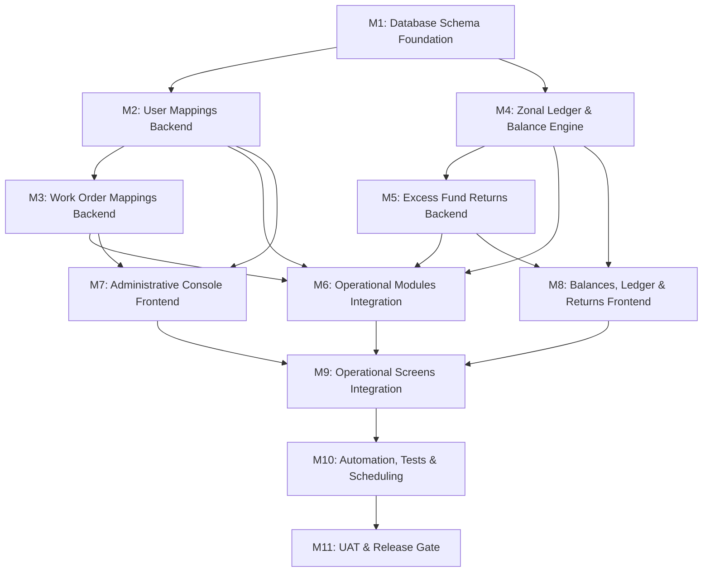

# Phase 7 — Zonal Office Restructuring & Mapping Modules
# Milestone-Driven Execution Plan

> **Status:** Implementation Plan approved and frozen. This document converts it into a sequential,
> dependency-ordered execution plan for AI-assisted development.
>
> **Stack:** Supabase/PostgreSQL · Node.js/Express backend · React/Vite frontend
> **Assumed existing:** Phase 1 (auth, fund reports) + Phase 2 (estimates) + Phase 3 (fund requests) + Phase 4 (requisitions) + Phase 5 (daily progress reports)
> **Process flow source:** Modifications.pdf + Approved Phase 7 Implementation Decisions

---

## Role Authorization Matrix

| Action / Module | Admin | HO (Head Office) | ZO (Zonal Office) | JE (Junior Engineer) | Staff |
|---|---|---|---|---|---|
| **User Mappings** | View / Create / Edit / Transfer / Delete | View / Create / Edit / Transfer | View (Own ZO only) | View (Own mapping only) | No Access |
| **Work Order Mappings** | View / Create / Edit / Deactivate | View / Create / Edit / Deactivate | View (Own ZO only) | View (Own WO only) | No Access |
| **Zonal Balances** | View All / Reconcile | View All | View Own | No Access | No Access |
| **Fund Ledger Logs** | View All | View All | View Own | No Access | No Access |
| **Payment Requisitions** | View All | View All | View & Approve (Mapped JEs only) | Create (Mapped WOs only) | No Access |
| **Fund Requests (ZO→HO)** | View All | View & Approve All | Create & View Own | No Access | No Access |
| **Daily Work Progress** | View All | View All | View & Evaluate (Mapped JEs only) | Create (Mapped WOs only) | No Access |
| **Cost Estimates** | View All | View All | View (Mapped JEs only) | Create & Edit (Own only) | No Access |
| **RA & Final Bills** | View All | View All | Create & View (Mapped WOs only) | No Access | No Access |
| **Excess Fund Returns** | View All | Create / Edit / Cancel | Accept / Modify / Reject | No Access | No Access |
| **Analytical Reports** | Full Access (All data) | Full Access (All data) | Filtered (Own ZO data) | Filtered (Own WO data) | No Access |

---

## Known Design Decisions & Constraints

1. **Explicit Zonal Work Order Ownership:** Every project (`projects_master`) stores its owning ZO mobile number (`zo_user_id`) directly in the database.
2. **Work Order Assignments:** Multiple JEs can be assigned to a Work Order, but their active ZO mapping must match the Work Order's `zo_user_id`.
3. **Trigger Balance Initialization:** `zo_balances` rows are automatically created when a user with `role = 'zo'` is added to the system.
4. **Ledger Uniqueness & Reference Types:** `zo_fund_ledger` logs references with a mandatory type (`'FUND_REQUEST'`, `'REQUISITION'`, `'RETURN'`) and uses a unique index on `(reference_type, reference_id)` to prevent duplicate postings.
5. **Auto de-allocation on Transfer:** When a JE is transferred, their active assignments in `work_order_mappings` on the old ZO's projects are automatically deactivated with `reason = 'Transferred'`.
6. **Optimistic Concurrency on Returns:** Excess return requests verify their `updated_at` timestamp during ZO acceptance to prevent stale approvals.
7. **Reconciliation Cron:** The system reconciliation endpoint runs nightly at **2:00 AM** and is also manually triggerable.

---

## Milestone Overview

| # | Milestone | Primary Layer | Depends On |
|---|---|---|---|
| M1 | Database Schema Foundation | Database | Phase 5 Migrations Applied |
| M2 | User Mappings (JE-ZO) Backend | Backend API | M1 |
| M3 | Work Order Mappings Backend | Backend API | M2 |
| M4 | Zonal Ledger & Balance Engine | Backend API | M1 |
| M5 | Excess Fund Returns Backend | Backend API | M4 |
| M6 | Operational Modules Integration | Backend API | M2, M3, M4, M5 |
| M7 | Administrative Console Frontend | Frontend UI | M2, M3 |
| M8 | Balances, Ledger & Returns Frontend | Frontend UI | M4, M5 |
| M9 | Operational Screens Integration | Frontend UI | M6, M7, M8 |
| M10| Automation, Tests & Scheduling | QA / Cron | M1–M9 |
| M11| UAT & Release Gate | QA / Operations | M10 |

---

## M1 — Database Schema Foundation

### Objective
Deploy the PostgreSQL migration script containing new tables, column additions, unique indices, role verification constraints, auto-balance triggers, and audit logging triggers.

### Scope
- Apply migration `22_zonal_office_mapping_and_ledger.sql`.
- Create new tables: `je_zo_mappings`, `work_order_mappings`, `zo_balances`, `zo_fund_ledger`, `excess_fund_returns`.
- Update tables: `projects_master`, `requisitions`, `daily_progress_reports`, `fund_requests`.

### Files Created or Modified
* `backend/src/db/migrations/22_zonal_office_mapping_and_ledger.sql` **[NEW]**

### Database Work
```sql
-- Migration 22: Zonal Office Mapping, Ledgers, and Returns
-- DB: PostgreSQL (Supabase)

CREATE TABLE IF NOT EXISTS public.je_zo_mappings (
    id             UUID PRIMARY KEY DEFAULT gen_random_uuid(),
    je_user_id     VARCHAR NOT NULL REFERENCES public.authorised_users(mobile_number) ON DELETE RESTRICT,
    zo_user_id     VARCHAR NOT NULL REFERENCES public.authorised_users(mobile_number) ON DELETE RESTRICT,
    is_active      BOOLEAN DEFAULT true NOT NULL,
    assigned_at    TIMESTAMPTZ DEFAULT now() NOT NULL,
    assigned_by    VARCHAR NOT NULL REFERENCES public.authorised_users(mobile_number) ON DELETE RESTRICT,
    deactivated_at TIMESTAMPTZ,
    deactivated_by VARCHAR REFERENCES public.authorised_users(mobile_number) ON DELETE RESTRICT
);

CREATE UNIQUE INDEX IF NOT EXISTS idx_je_zo_mappings_active_unique 
    ON public.je_zo_mappings (je_user_id) 
    WHERE (is_active = true);

CREATE TABLE IF NOT EXISTS public.zo_balances (
    zo_user_id        VARCHAR PRIMARY KEY REFERENCES public.authorised_users(mobile_number) ON DELETE RESTRICT,
    available_balance NUMERIC(18,2) DEFAULT 0.00 NOT NULL,
    updated_at        TIMESTAMPTZ DEFAULT now() NOT NULL,
    CONSTRAINT chk_zo_balance_positive CHECK (available_balance >= 0.00)
);

ALTER TABLE public.projects_master 
ADD COLUMN IF NOT EXISTS zo_user_id VARCHAR REFERENCES public.authorised_users(mobile_number) ON DELETE RESTRICT;

CREATE TABLE IF NOT EXISTS public.work_order_mappings (
    id             UUID PRIMARY KEY DEFAULT gen_random_uuid(),
    work_order_no  VARCHAR NOT NULL REFERENCES public.projects_master(work_order_no) ON DELETE RESTRICT,
    je_user_id     VARCHAR NOT NULL REFERENCES public.authorised_users(mobile_number) ON DELETE RESTRICT,
    is_active      BOOLEAN DEFAULT true NOT NULL,
    reason         VARCHAR NOT NULL CHECK (reason IN ('Assigned', 'Transferred', 'Removed', 'Project Closed')),
    assigned_at    TIMESTAMPTZ DEFAULT now() NOT NULL,
    assigned_by    VARCHAR NOT NULL REFERENCES public.authorised_users(mobile_number) ON DELETE RESTRICT,
    deactivated_at TIMESTAMPTZ,
    deactivated_by VARCHAR REFERENCES public.authorised_users(mobile_number) ON DELETE RESTRICT
);

CREATE UNIQUE INDEX IF NOT EXISTS idx_work_order_mappings_active_unique
    ON public.work_order_mappings (work_order_no, je_user_id)
    WHERE (is_active = true);

CREATE TABLE IF NOT EXISTS public.zo_fund_ledger (
    ledger_id        UUID PRIMARY KEY DEFAULT gen_random_uuid(),
    zo_user_id       VARCHAR NOT NULL REFERENCES public.authorised_users(mobile_number) ON DELETE RESTRICT,
    transaction_type VARCHAR NOT NULL CHECK (transaction_type IN ('ALLOCATION', 'REQUISITION_APPROVAL', 'RETURN', 'TRANSFER')),
    reference_type   VARCHAR NOT NULL CHECK (reference_type IN ('FUND_REQUEST', 'REQUISITION', 'RETURN')),
    reference_id     UUID NOT NULL, 
    amount           NUMERIC(18,2) NOT NULL,
    work_order_no    VARCHAR REFERENCES public.projects_master(work_order_no) ON DELETE RESTRICT,
    created_at       TIMESTAMPTZ DEFAULT now() NOT NULL,
    created_by       VARCHAR NOT NULL REFERENCES public.authorised_users(mobile_number) ON DELETE RESTRICT
);

CREATE UNIQUE INDEX IF NOT EXISTS idx_zo_fund_ledger_ref_unique 
    ON public.zo_fund_ledger (reference_type, reference_id);

CREATE TABLE IF NOT EXISTS public.excess_fund_returns (
    id               UUID PRIMARY KEY DEFAULT gen_random_uuid(),
    zo_user_id       VARCHAR NOT NULL REFERENCES public.authorised_users(mobile_number) ON DELETE RESTRICT,
    work_order_no    VARCHAR NOT NULL REFERENCES public.projects_master(work_order_no) ON DELETE RESTRICT,
    requested_amount NUMERIC(18,2) NOT NULL CHECK (requested_amount > 0.00),
    status           VARCHAR NOT NULL CHECK (status IN ('Requested', 'Completed', 'Awaiting HO Review', 'Rejected', 'Cancelled')),
    remarks_ho       TEXT,
    remarks_zo       TEXT,
    requested_by     VARCHAR NOT NULL REFERENCES public.authorised_users(mobile_number) ON DELETE RESTRICT,
    actioned_by      VARCHAR REFERENCES public.authorised_users(mobile_number) ON DELETE RESTRICT,
    created_at       TIMESTAMPTZ DEFAULT now() NOT NULL,
    updated_at       TIMESTAMPTZ DEFAULT now() NOT NULL
);

ALTER TABLE public.requisitions ADD COLUMN IF NOT EXISTS zo_user_id VARCHAR REFERENCES public.authorised_users(mobile_number) ON DELETE RESTRICT;
ALTER TABLE public.daily_progress_reports ADD COLUMN IF NOT EXISTS zo_user_id VARCHAR REFERENCES public.authorised_users(mobile_number) ON DELETE RESTRICT;
ALTER TABLE public.fund_requests ADD COLUMN IF NOT EXISTS work_order_no VARCHAR REFERENCES public.projects_master(work_order_no) ON DELETE RESTRICT;

-- Triggers for Roles
CREATE OR REPLACE FUNCTION public.fn_validate_je_zo_mapping_roles()
RETURNS TRIGGER AS $$
DECLARE
    v_je_role VARCHAR;
    v_zo_role VARCHAR;
BEGIN
    SELECT role INTO v_je_role FROM public.authorised_users WHERE mobile_number = NEW.je_user_id;
    SELECT role INTO v_zo_role FROM public.authorised_users WHERE mobile_number = NEW.zo_user_id;
    IF v_je_role != 'je' THEN
        RAISE EXCEPTION 'Target user (%) is not a Junior Engineer.', NEW.je_user_id;
    END IF;
    IF v_zo_role != 'zo' THEN
        RAISE EXCEPTION 'Target user (%) is not a Zonal Office user.', NEW.zo_user_id;
    END IF;
    RETURN NEW;
END;
$$ LANGUAGE plpgsql;

CREATE TRIGGER trg_validate_je_zo_mapping_roles
    BEFORE INSERT OR UPDATE ON public.je_zo_mappings
    FOR EACH ROW EXECUTE FUNCTION public.fn_validate_je_zo_mapping_roles();

-- Auto-Initialize Balance on ZO Creation
CREATE OR REPLACE FUNCTION public.fn_init_zo_balance_on_user_creation()
RETURNS TRIGGER AS $$
BEGIN
    IF NEW.role = 'zo' THEN
        INSERT INTO public.zo_balances (zo_user_id, available_balance)
        VALUES (NEW.mobile_number, 0.00)
        ON CONFLICT (zo_user_id) DO NOTHING;
    END IF;
    RETURN NEW;
END;
$$ LANGUAGE plpgsql;

CREATE OR REPLACE TRIGGER trg_init_zo_balance_on_user_creation
    AFTER INSERT OR UPDATE OF role ON public.authorised_users
    FOR EACH ROW EXECUTE FUNCTION public.fn_init_zo_balance_on_user_creation();

-- Zonal Consistency Trigger for Work Order Mapping
CREATE OR REPLACE FUNCTION public.fn_validate_work_order_mapping_zonal_consistency()
RETURNS TRIGGER AS $$
DECLARE
    v_je_zo   VARCHAR;
    v_wo_zo   VARCHAR;
BEGIN
    SELECT zo_user_id INTO v_je_zo FROM public.je_zo_mappings WHERE je_user_id = NEW.je_user_id AND is_active = true;
    SELECT zo_user_id INTO v_wo_zo FROM public.projects_master WHERE work_order_no = NEW.work_order_no;
    IF v_je_zo IS NULL THEN
        RAISE EXCEPTION 'Junior Engineer % is not assigned to any active Zonal Office.', NEW.je_user_id;
    END IF;
    IF v_wo_zo IS NULL THEN
        RAISE EXCEPTION 'Work Order % has no assigned owning Zonal Office.', NEW.work_order_no;
    END IF;
    IF v_wo_zo != v_je_zo THEN
        RAISE EXCEPTION 'Mismatched ZO assignment. Junior Engineer belongs to ZO %, but Work Order belongs to ZO %.', v_je_zo, v_wo_zo;
    END IF;
    RETURN NEW;
END;
$$ LANGUAGE plpgsql;

CREATE TRIGGER trg_validate_work_order_mapping_zonal_consistency
    BEFORE INSERT OR UPDATE ON public.work_order_mappings
    FOR EACH ROW EXECUTE FUNCTION public.fn_validate_work_order_mapping_zonal_consistency();

-- Audit logging trigger function
CREATE OR REPLACE FUNCTION public.fn_audit_zonal_modules()
RETURNS TRIGGER AS $$
BEGIN
    INSERT INTO public.audit_log (user_id, action, module_name, record_identifier, old_value, new_value)
    VALUES (
        COALESCE(NEW.assigned_by, NEW.requested_by, 'SYSTEM'),
        TG_OP,
        TG_TABLE_NAME,
        COALESCE(NEW.id::VARCHAR, NEW.zo_user_id),
        CASE WHEN TG_OP = 'UPDATE' THEN to_jsonb(OLD) ELSE NULL END,
        to_jsonb(NEW)
    );
    RETURN NEW;
END;
$$ LANGUAGE plpgsql;

CREATE TRIGGER trg_audit_je_zo_mappings AFTER INSERT OR UPDATE ON public.je_zo_mappings FOR EACH ROW EXECUTE FUNCTION public.fn_audit_zonal_modules();
CREATE TRIGGER trg_audit_work_order_mappings AFTER INSERT OR UPDATE ON public.work_order_mappings FOR EACH ROW EXECUTE FUNCTION public.fn_audit_zonal_modules();
CREATE TRIGGER trg_audit_excess_fund_returns AFTER INSERT OR UPDATE ON public.excess_fund_returns FOR EACH ROW EXECUTE FUNCTION public.fn_audit_zonal_modules();
```

### Acceptance Criteria
- [x] All 5 tables created and schema matches specifications.
- [x] Constraints on `zo_balances` available_balance $\ge 0$ active.
- [x] Column alterations on `projects_master`, `requisitions`, `daily_progress_reports`, and `fund_requests` successful.
- [x] All triggers compile and mount.

---

## M2 — User Mappings (JE-ZO) Backend

### Objective
Build Express APIs for creating, listing, and retrieving user mappings, containing the service-layer validation transaction for de-allocation and transfer checks.

### Files Created or Modified
* `backend/src/validation/userMappings.schema.js` **[NEW]**
* `backend/src/controllers/userMappings.controller.js` **[NEW]**
* `backend/src/routes/userMappings.routes.js` **[NEW]**
* `backend/src/app.js` **[MODIFY]**

### Backend Work

#### Validation Schema: `userMappings.schema.js`
* Standard Zod schema enforcing `je_mobile_number` and `zo_mobile_number` strings.

#### Controller logic: `userMappings.controller.js`
* **`createOrUpdateUserMapping(req, res)`**
  ```javascript
  1. Validate request body against schema.
  2. Check auth: req.user.role must be 'admin' or 'ho'.
  3. Start Supabase/PostgreSQL Transaction:
     a. Check active mapping: SELECT * FROM je_zo_mappings WHERE je_user_id = je_mobile_number AND is_active = true FOR UPDATE
     b. If active mapping exists:
        - Check if JE has any requisitions with status IN ('Pending', 'Hold'):
          SELECT COUNT(*) FROM requisitions WHERE requester_user_id = je_mobile_number AND requisition_status IN ('Pending', 'Hold')
        - If count > 0: ROLLBACK, return 400: "Cannot transfer JE. Uncompleted requisitions remain."
        - Deactivate old mapping:
          UPDATE je_zo_mappings SET is_active = false, deactivated_at = now(), deactivated_by = req.user.mobile_number WHERE id = old_mapping.id
        - Deallocate active work order assignments belonging to the old ZO:
          UPDATE work_order_mappings 
             SET is_active = false, reason = 'Transferred', deactivated_at = now(), deactivated_by = req.user.mobile_number 
           WHERE je_user_id = je_mobile_number AND is_active = true 
             AND work_order_no IN (SELECT work_order_no FROM projects_master WHERE zo_user_id = old_mapping.zo_user_id)
     c. Insert new active mapping row:
        INSERT INTO je_zo_mappings (je_user_id, zo_user_id, is_active, assigned_by) 
        VALUES (je_mobile_number, zo_mobile_number, true, req.user.mobile_number)
     d. COMMIT.
  4. Return 201 Created.
  ```
* **`getUserMappings(req, res)`**
  - Allow listing of mappings. If user is ZO, filter mapping query by `zo_user_id = req.user.mobile_number`.

#### Route registration: `userMappings.routes.js`
- Mount routes: `POST /` (restricted to admin/ho), `GET /` (accessible to admin, ho, zo).

### Acceptance Criteria
- [x] Creating a mapping for a JE with open/hold requisitions fails with a 400 error.
- [x] Transfers automatically set `is_active = false` on old mappings and deactivate related Work Order assignments with `reason = 'Transferred'`.
- [x] Non-admin/HO users get 403 Forbidden on create.

---

## M3 — Work Order Mappings Backend

### Objective
Create APIs to manage Work Order assignments for JEs, validating that assignments match the project's owning Zonal Office.

### Files Created or Modified
* `backend/src/validation/workOrderMappings.schema.js` **[NEW]**
* `backend/src/controllers/workOrderMappings.controller.js` **[NEW]**
* `backend/src/routes/workOrderMappings.routes.js` **[NEW]**

### Backend Work

#### Controller logic: `workOrderMappings.controller.js`
* **`createWorkOrderMapping(req, res)`**
  - Validation: Ensure `work_order_no` and `je_mobile_number` exist.
  - Verification logic:
    - Look up `projects_master.zo_user_id` for the project.
    - Look up active `je_zo_mappings.zo_user_id` for the JE.
    - If `je_zo_mappings.zo_user_id != projects_master.zo_user_id`, reject with 400: "Junior Engineer belongs to ZO X, but Work Order belongs to ZO Y."
    - Insert into `work_order_mappings` with `reason = 'Assigned'`.
* **`deactivateWorkOrderMapping(req, res)`**
  - Deactivate active assignment by ID.
  - Require a body parameter `reason` check (`reason IN ('Removed', 'Project Closed')`).

#### Route registration: `workOrderMappings.routes.js`
- Mount routes: `POST /` (admin/ho only), `DELETE /:id` or `PATCH /:id/deactivate` (admin/ho only), `GET /` (admin, ho, zo).

### Acceptance Criteria
- [x] Mapping a JE to a Work Order owned by a different ZO fails.
- [x] Deactivation requires a valid audit `reason`.

---

## M4 — Zonal Ledger & Balance Engine

### Objective
Build APIs to fetch Zonal Office credit balances and transaction logs, including reconciliation routines.

### Files Created or Modified
* `backend/src/controllers/zoBalances.controller.js` **[NEW]**
* `backend/src/routes/zoBalances.routes.js` **[NEW]**

### Backend Work

#### Controller logic: `zoBalances.controller.js`
* **`getZonalBalances(req, res)`**
  - Restricted to admin, ho, zo. If role is zo, enforce `WHERE zo_user_id = req.user.mobile_number`.
* **`getZonalLedger(req, res)`**
  - Return transactional history from `zo_fund_ledger`.
* **`reconcileZonalBalances(req, res)`**
  - Calculate active ledger sums for a ZO:
    $$\text{Balance} = \sum(\text{Allocations}) - \sum(\text{Spent}) - \sum(\text{Returned})$$
  - Perform `SELECT available_balance FROM zo_balances WHERE zo_user_id = $1 FOR UPDATE`.
  - Update `available_balance = calculated_value` if discrepancies are detected. Log an audit event.

### Acceptance Criteria
- [x] Ledgers return transaction details including reference type and Work Order mappings.
- [x] ZO role can only query their own balance.

---

## M5 — Excess Fund Returns Backend

### Objective
Develop the Excess Fund Return state machine, validating Zonal balance thresholds and protecting against stale modifications with optimistic concurrency locking.

### Files Created or Modified
* `backend/src/validation/fundReturns.schema.js` **[NEW]**
* `backend/src/controllers/fundReturns.controller.js` **[NEW]**
* `backend/src/routes/fundReturns.routes.js` **[NEW]**

### Backend Work

#### Controller logic: `fundReturns.controller.js`
* **`createReturnRequest(req, res)`** (HO only)
  - Create row in `excess_fund_returns` with status `'Requested'`, store `requested_amount` and `remarks_ho`.
* **`acceptReturnRequest(req, res)`** (ZO only)
  - Validation: Ensure `client_updated_at` matches database `updated_at`.
  - Transactional logic:
    ```javascript
    1. Lock return request row: SELECT * FROM excess_fund_returns WHERE id = $1 FOR UPDATE
    2. Compare return_request.updated_at.toISOString() with client_updated_at.
       - If mismatch -> rollback, return 409 Conflict: "Stale acceptance request."
    3. Lock ZO Balance: SELECT available_balance FROM zo_balances WHERE zo_user_id = return_request.zo_user_id FOR UPDATE
    4. If available_balance < return_request.requested_amount -> return 422: "Insufficient available balance."
    5. Deduct: UPDATE zo_balances SET available_balance = available_balance - return_request.requested_amount WHERE zo_user_id = return_request.zo_user_id
    6. Write to ledger: INSERT INTO zo_fund_ledger (zo_user_id, transaction_type, reference_type, reference_id, amount, work_order_no, created_by) VALUES (return_request.zo_user_id, 'RETURN', 'RETURN', return_request.id, -return_request.requested_amount, return_request.work_order_no, req.user.mobile_number)
    7. Update request status to 'Completed'.
    ```
* **`modifyReturnRequest(req, res)`** / **`rejectReturnRequest(req, res)`** (ZO only)
  - Change status to `'Awaiting HO Review'` / `'Rejected'`, remarks mandatory.
* **`hoActionOnReturn(req, res)`** (HO only)
  - Handle modifications (Revise status, cancel, or reissue).

### Acceptance Criteria
- [x] Accepting a return request with stale `client_updated_at` returns 409.
- [x] Accepting returns without sufficient balance fails with 422.

---

## M6 — Operational Modules Integration

### Objective
Update existing transactional endpoints (Requisitions, Daily Progress, Estimates, Fund Requests, RA/Final Bills) to implement Zonal restrictions and ledger debit/credit postings.

### Files Created or Modified
* `backend/src/controllers/requisitions.controller.js` **[MODIFY]**
* `backend/src/controllers/fundRequests.controller.js` **[MODIFY]**
* `backend/src/controllers/dailyProgress.controller.js` **[MODIFY]**
* `backend/src/controllers/projects.controller.js` **[MODIFY]**
* `backend/src/controllers/raFinalBill.controller.js` **[MODIFY]**

### Backend Integration Work

#### 1. Payment Requisitions (`requisitions.controller.js`)
* **Creation (`POST /`)**:
  - Verify that the creator (JE) is actively mapped to the selected `work_order_no` in `work_order_mappings`.
  - Lookup the JE's active `zo_user_id` from `je_zo_mappings` and write it to `requisitions.zo_user_id`.
* **Approval (`PATCH /:id/action`)**:
  - If role is ZO, verify `requisition.zo_user_id == req.user.mobile_number`.
  - On Approve action:
    - Lock balance: `SELECT available_balance FROM zo_balances WHERE zo_user_id = requisition.zo_user_id FOR UPDATE`
    - Verify `available_balance >= approved_amount`, else reject with 422.
    - Decrement balance, post to `zo_fund_ledger` (reference_type: `'REQUISITION'`).
* **Listing (`GET /`)**:
  - If role is ZO, append `WHERE zo_user_id = req.user.mobile_number`.

#### 2. Fund Requests (`fundRequests.controller.js`)
* **Creation (`POST /`)**:
  - Require `work_order_no` and validate that the work order's owning ZO matches the requesting ZO user.
* **Approval (`PATCH /:id/action`)**:
  - On Approve action:
    - Lock balance: `SELECT available_balance FROM zo_balances WHERE zo_user_id = fund_request.zo_user_id FOR UPDATE`
    - Increment available balance, post allocation log to `zo_fund_ledger` (reference_type: `'FUND_REQUEST'`).

#### 3. Daily Work Progress (`dailyProgress.controller.js`)
* **Creation (`POST /`)**:
  - Retrieve active ZO for the JE, write it to `daily_progress_reports.zo_user_id`.
* **Listing (`GET /`)**:
  - If role is ZO, filter by `zo_user_id = req.user.mobile_number`.

#### 4. Cost Estimates (`projects.controller.js` / estimates routes)
* **Listing (`GET /`)**:
  - If role is ZO, filter estimates where the estimate's JE matches JEs actively mapped to the ZO.

#### 5. RA & Final Bills (`raFinalBill.controller.js`)
* **Creation & List**:
  - Restrict ZO to only view and submit bills for Work Orders mapped to JEs under their ZO.

### Acceptance Criteria
- [x] ZO users are completely blocked from viewing requisitions, estimates, progress, and bills belonging to other ZOs.
- [x] Approving a requisition reduces Zonal Balance; approving a fund request increases it.
- [x] Duplicate approvals fail via database-level unique constraint on the ledger.

---

## M7 — Administrative Console Frontend

### Objective
Create User Mapping and Work Order Mapping control screens under the Admin/Management console.

### Files Created or Modified
* `frontend/src/pages/UserMappings.jsx` **[NEW]**
* `frontend/src/pages/WorkOrderMappings.jsx` **[NEW]**
* `frontend/src/App.jsx` **[MODIFY]**

### Frontend UI Work

#### User Mappings Screen
- Admin/HO view: A grid listing JEs and their current ZOs. Includes a search bar and a "Transfer/Assign JE" modal.
- Validation warning: Display a list of open requisitions if the API returns transfer validation failures.

#### Work Order Mappings Screen
- Displays all Work Orders, the owning Zonal Office, and assigned JEs.
- Includes a "Map JEs" modal enforcing the Zonal Consistency rule.

### Acceptance Criteria
- [x] Frontend successfully creates/updates mappings for Admin/HO.
- [x] Forms display validation errors thrown by the backend.

---

## M8 — Balances, Ledger & Returns Frontend

### Objective
Build dashboards for Zonal Balances, Ledger tracking, and Excess Return flows.

### Files Created or Modified
* `frontend/src/pages/ZonalBalances.jsx` **[NEW]**
* `frontend/src/pages/ExcessFundReturns.jsx` **[NEW]**

### Frontend UI Work

#### Zonal Balances & Ledger Screen
- Displays the available credit balance. Shows ZO's own balance, or a list of all ZOs for HO/Admin.
- Contains the tabular log of `zo_fund_ledger` transactions.

#### Excess Fund Returns Screen
- Displays active return requests.
- Clicking a return opens a drawer:
  - Shows HO request details, current available balance.
  - Buttons: **Accept** (checks balance, disabled if balance < request), **Request Modification** (shows textbox), **Reject** (shows textbox).
  - Uses the return request's `updated_at` value in the submission payload for optimistic concurrency protection.

### Acceptance Criteria
- [x] Stale page states display conflict messages upon return actions.
- [x] Balance and ledger data loads correctly based on user roles.

---

## M9 — Operational Screens Integration

### Objective
Enforce filter criteria and navigation card accessibility across operational views on the frontend.

### Files Created or Modified
* `frontend/src/pages/Dashboard.jsx` **[MODIFY]**
* `frontend/src/pages/Requisitions.jsx` **[MODIFY]**
* `frontend/src/pages/DailyProgress.jsx` **[MODIFY]**
* `frontend/src/pages/Estimates.jsx` **[MODIFY]**
* `frontend/src/pages/RaFinalBills.jsx` **[MODIFY]**

### Frontend Integration Work
- Restricted access control: ZOs cannot navigate to pages or see items belonging to other zones.
- Card limits: Add new navigation options for user mapping, work order mapping, balances, and returns on the dashboard for authorized roles.

### Acceptance Criteria
- [x] Dashboard cards show only features matching the user's role authorization matrix.
- [x] Filter queries are appended dynamically to all resource fetch calls.

---

## M10 — Automation, Tests & Scheduling

### Objective
Deploy tests and configure cron tasks for automated nightly reconciliation.

### Files Created or Modified
* `backend/tests/milestones/test_milestone_p7_db.js` **[NEW]**
* `backend/tests/milestones/test_milestone_p7_api.js` **[NEW]**
* `backend/package.json` **[MODIFY]**
* `backend/src/services/reconciliation.service.js` **[NEW]**

### Backend Work
- Schedule the `reconcileZonalBalances` function using a cron library (e.g. `node-cron` or pg_cron) to execute nightly at **2:00 AM**.
- Add test triggers to `package.json`: `"test:p7:all": "node tests/milestones/test_milestone_p7_db.js && node tests/milestones/test_milestone_p7_api.js"`.

### Acceptance Criteria
- [x] All database and API integration tests execute and pass successfully.
- [x] The nightly sync scheduler correctly boots.

---

## M11 — UAT & Release Gate

### Objective
Validate end-to-end operational scenarios across all four roles prior to deployment.

### Exit Criteria
1. All milestone tests pass.
2. No active P1 (Critical/High) security defects.
3. Successful completion of the User Acceptance Testing (UAT) checklists.

---

## Exit Criteria & Verification Plan

### Database & API Tests
- **Test Case DB-1 (Zonal Consistency Constraint):** Map a JE under ZO1 to a Work Order owned by ZO2. Expected: Raise trigger exception.
- **Test Case DB-2 (Unique Ledger Postings):** Attempt to insert two ledger entries for the same requisition ID. Expected: Unique key violation.
- **Test Case API-1 (Balance Double Spending):** Spawn concurrent requests to approve requisitions exceeding available balance. Expected: Balance remains positive, one request fails with 422.
- **Test Case API-2 (Optimistic Concurrency Return Acceptance):** Trigger acceptance sending a stale `updated_at` value. Expected: 409 Conflict.
- **Test Case API-3 (JE Transfer Rule):** Map a JE with an active/hold requisition to a new ZO. Expected: Validation fails, de-allocation is aborted.
- **Test Case API-4 (Auto WO De-allocation on Transfer):** Transfer JE1 (assigned to WO-A owned by ZO1) to ZO2. Verify: Mapping for WO-A is deactivated with `reason = 'Transferred'`.

---

## User Acceptance Testing (UAT) Checklist

### Scenario 1: User Mapping & Work Order Mappings Setup
- **Actor:** Admin
- **Step 1:** Whitelist new ZO (ZO-1) and JE (JE-1).
- **Step 2:** Map JE-1 to ZO-1 in User Mappings.
- **Step 3:** Assign WO-100 to ZO-1, then assign JE-1 to WO-100 in Work Order Mappings.
- **Verification:** Assignment succeeds. Try to assign JE-2 (unmapped) to WO-100; verify system blocks it.

### Scenario 2: Fund Allocation and Requisition Flow
- **Actor:** ZO-1, HO, JE-1
- **Step 1:** ZO-1 raises Fund Request for WO-100 to HO for ₹1,00,000.
- **Step 2:** HO approves Fund Request for ₹1,00,000.
- **Verification:** ZO-1's available balance is now ₹1,00,000. Ledger logs `'ALLOCATION'`.
- **Step 3:** JE-1 submits Payment Requisition for WO-100 for ₹60,000.
- **Step 4:** ZO-1 approves Payment Requisition for ₹60,000.
- **Verification:** Requisition approved successfully. ZO-1's balance drops to ₹40,000. Ledger logs `'REQUISITION_APPROVAL'` for -₹60,000.

### Scenario 3: Insufficient Balance Requisition Block
- **Actor:** JE-1, ZO-1
- **Step 1:** JE-1 submits another requisition for WO-100 for ₹50,000.
- **Step 2:** ZO-1 attempts to approve the requisition.
- **Verification:** Approval fails with "Insufficient available balance. Available: ₹40,000, Required: ₹50,000". Balance remains ₹40,000.

### Scenario 4: Excess Fund Return Workflow
- **Actor:** HO, ZO-1
- **Step 1:** HO requests returns of ₹30,000 from ZO-1 for WO-100.
- **Step 2:** ZO-1 accepts the return request.
- **Verification:** ZO-1 available balance drops to ₹10,000. Return request status is `'Completed'`. Zonal ledger logs `'RETURN'` for -₹30,000.

### Scenario 5: JE Transfer and Work Order De-allocation
- **Actor:** HO, JE-1
- **Step 1:** HO attempts to transfer JE-1 to ZO-2 while they have a requisition on `'Hold'`.
- **Verification:** Transfer fails.
- **Step 2:** Complete/cancel the requisition, then transfer JE-1 to ZO-2.
- **Verification:** Transfer succeeds. JE-1's mapping to WO-100 is automatically deactivated with `reason = 'Transferred'`.

---

## Security Summary

| ID | Vulnerability Risk | Severity | Mitigation Control |
|---|---|---|---|
| SEC-P7-1 | **Zonal Balance Double Spending:** Concurrent approvals exceeding remaining balance. | **CRITICAL** | Row-level locking (`FOR UPDATE`) on balance fetches during requisition approvals and return acceptances. |
| SEC-P7-2 | **Duplicate Ledger Entries:** Repeated approval triggers causing duplicate credit/debit logs. | **HIGH** | Unique index `idx_zo_fund_ledger_ref_unique` on `(reference_type, reference_id)` prevents writing duplicate transactions. |
| SEC-P7-3 | **Stale Return Acceptance:** Accepting return requests while HO has edited the amount in another window. | **HIGH** | Optimistic concurrency checking using the request's `updated_at` timestamp. |
| SEC-P7-4 | **Zonal Bypass on Read Endpoint:** ZO viewing or editing data from another zone. | **HIGH** | Server-side role-based filters enforced directly in backend controllers. |
| SEC-P7-5 | **Mapping Integrity Failures:** JEs assigned to Work Orders owned by different ZOs. | **HIGH** | Database trigger `trg_validate_work_order_mapping_zonal_consistency` checks zonal alignment. |
| SEC-P7-6 | **Transfer Validation Bypass:** Transferring a JE with uncompleted requisitions. | **HIGH** | Service-layer database transaction checks open requisitions before executing transfer queries. |

---

## Migration Sequence

1. **Prerequisites:** Confirm migrations `01_init.sql` through `21_create_daily_progress_reports.sql` are applied.
2. **Apply Phase 7 Database Schema:** Deploy `22_zonal_office_mapping_and_ledger.sql` to execute schema updates, create tables, triggers, and indices.
3. **Reconcile Existing Data:** Run `/api/v1/auth/zo-balances/reconcile` to build balance baselines for Zonal Offices based on historical ledger aggregates.

---

## File Inventory

| File | Action | Component | Purpose |
|---|---|---|---|
| `backend/src/db/migrations/22_zonal_office_mapping_and_ledger.sql` | **NEW** | Database | Creates user mappings, WO mappings, balance, ledger, and return tables, triggers, and column alterations. |
| `backend/src/routes/userMappings.routes.js` | **NEW** | Backend | Mappings management routes. |
| `backend/src/controllers/userMappings.controller.js` | **NEW** | Backend | Transactional user mapping, checking, and transfers. |
| `backend/src/routes/workOrderMappings.routes.js` | **NEW** | Backend | WO mappings management routes. |
| `backend/src/controllers/workOrderMappings.controller.js` | **NEW** | Backend | Handles WO assignment validations and mappings. |
| `backend/src/routes/zoBalances.routes.js` | **NEW** | Backend | Balances, ledger, and reconciliation routes. |
| `backend/src/controllers/zoBalances.controller.js` | **NEW** | Backend | Handles balance checks, ledgers, and 2:00 AM nightly sync. |
| `backend/src/routes/fundReturns.routes.js` | **NEW** | Backend | Returns management routes. |
| `backend/src/controllers/fundReturns.controller.js` | **NEW** | Backend | Handles HO requests and ZO acceptances. |
| `backend/src/app.js` | **MODIFY** | Backend | Register new mapping, ledger, and return routes. |
| `backend/src/controllers/requisitions.controller.js` | **MODIFY** | Backend | Log `zo_user_id` and check available balances on approval. |
| `backend/src/controllers/fundRequests.controller.js` | **MODIFY** | Backend | Require `work_order_no` and update balances on approval. |
| `backend/src/controllers/dailyProgress.controller.js` | **MODIFY** | Backend | Filter progress reports by ZO user mapping, log `zo_user_id` at creation. |
| `backend/src/controllers/projects.controller.js` | **MODIFY** | Backend | Filter/restrict projects based on Work Order and User Mappings. |
| `frontend/src/pages/UserMappings.jsx` | **NEW** | Frontend | Administrative User mapping panel. |
| `frontend/src/pages/WorkOrderMappings.jsx` | **NEW** | Frontend | Administrative Work Order mapping panel. |
| `frontend/src/pages/ZonalBalances.jsx` | **NEW** | Frontend | Balance indicator and ledger panel. |
| `frontend/src/pages/ExcessFundReturns.jsx` | **NEW** | Frontend | Returns and modification requests management dashboard. |
| `frontend/src/App.jsx` | **MODIFY** | Frontend | Register new routes for mappings, balances, and returns. |
| `backend/tests/milestones/test_milestone_p7_db.js` | **NEW** | Testing | Database trigger and index unit tests. |
| `backend/tests/milestones/test_milestone_p7_api.js` | **NEW** | Testing | API security and transaction integration tests. |

---

## Dependency Graph


