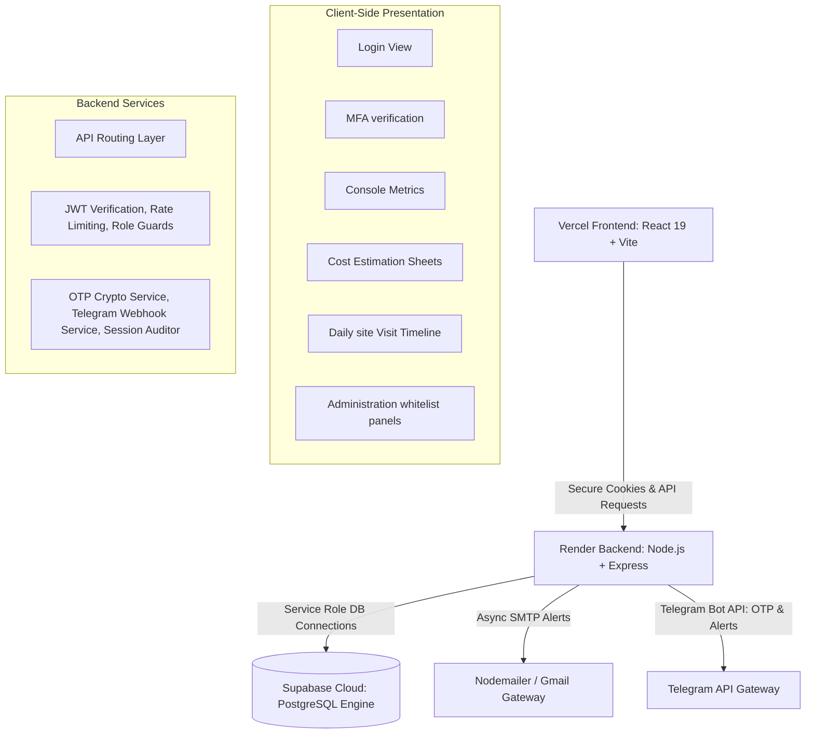
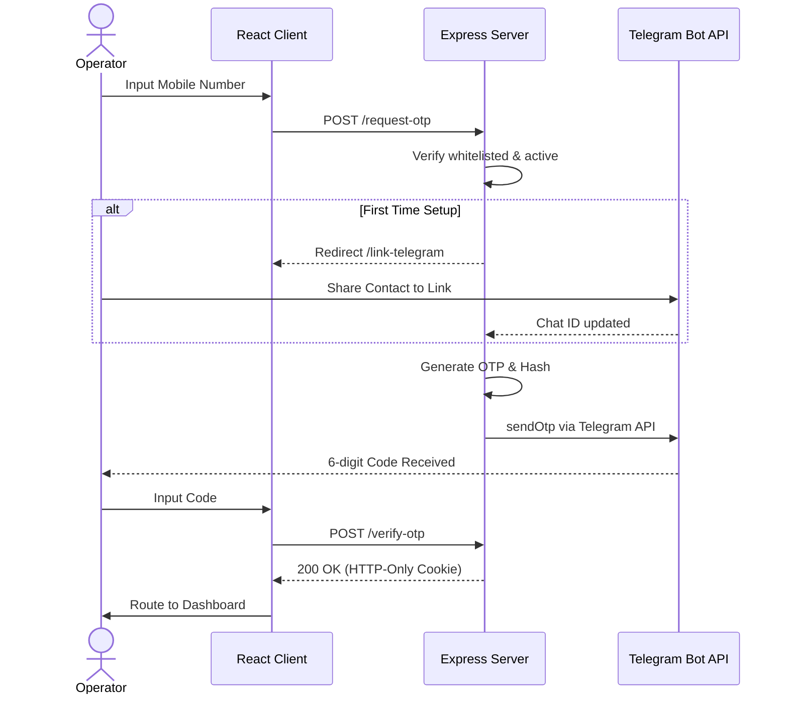

# COMPREHENSIVE PROJECT & ENGINEERING REPORT
## Integrated Digital Business Platform (IDBP) | S.N. Polymers Pvt. Ltd.

### Project Development Team - Shreyan Ghosh, Aswint Guha , Aryak Pal

---

## Acknowledgement

We express our sincere gratitude to the management at **S.N. Polymers Pvt. Ltd.** for their invaluable support, guidance, and feedback throughout the design, development, and testing phases of the Integrated Digital Business Platform (IDBP). We also extend our appreciation to all our peers, advisors, and mentors who provided technical insights and reviews that helped shape this project into an enterprise-grade digital solution.

---

## 1. Executive Summary

This report serves as the definitive engineering documentation and final hand-over report for the **Integrated Digital Business Platform (IDBP)** developed for **S.N. Polymers Pvt. Ltd.** 

S.N. Polymers Pvt. Ltd. operates complex civil engineering and chemical manufacturing projects. Historically, these projects suffered from delays, coordination bottlenecks, and errors due to manual data tracking using paper ledgers and disconnected spreadsheets. The IDBP was commissioned to centralize operations, establish granular accountability, enforce strict financial constraints, and track physical progress in real-time.

### Core System Goals
1. **Multi-Actor Workflow Automation**: Unify Junior Engineers (JEs), Zonal Offices (ZOs), and the Head Office (HO) into a single, cohesive workflow.
2. **Strict Financial Controls**: Enforce estimates boundaries, sequential Running Account (RA) billing, and budget allocations programmatically.
3. **On-Site Operational Audits**: Provide photographic progress proofs and verification of daily logs directly from construction sites.
4. **Hardened Security Posture**: Eliminate public registrations through a whitelist system, utilizing Telegram OTP multi-factor authentication.
5. **Decoupled Architecture**: Build a scalable foundation (React 19 + Node.js/Express + Supabase PostgreSQL) designed to grow with minimal infrastructure overhead.

---

## 2. High-Level System Architecture

The application is built on a decoupled, three-tier architecture that guarantees data isolation, rapid client-side rendering, and secure database operations:



### 2.1 Tier 1: Presentation Layer (React 19 + Vite SPA)
Compiled with Vite and styled with Tailwind CSS, the frontend is deployed as a static Single Page Application (SPA).
* **State Management**: Context-based global `AuthContext` checks user roles, handles cookie lifecycles, and maintains session state.
* **Component Design**: Heavy use of glassmorphism UI elements to create a premium, clean design. UI elements automatically hide or toggle active controls based on user role configurations.
* **Routing**: Secured using `react-router-dom` v6 route guards that intercept non-authenticated users and redirect them to authorization gates.

### 2.2 Tier 2: Application Layer (Node.js + Express REST API)
Serves as the central API gateway. It runs on a Node.js event loop, processing client API requests, validating payload structures, checking credentials, and communicating with external systems.
* **Zod Schemas**: Every route uses a Zod validation schema to reject malformed JSON structures before database operations.
* **Service Integrations**: Contains Nodemailer triggers for instant security email notifications and the Telegram Bot API client for MFA validation and system notifications.

### 2.3 Tier 3: Database Engine (Supabase / PostgreSQL)
Hosted on Supabase cloud servers, it runs on PostgreSQL. Direct table access is blocked. The backend communicates using a service role key, with strict checks and constraints enforced via SQL triggers, views, and stored database functions (RPCs).

---

## 3. Relational Database Design

The database schema is designed around strict relationships, data types, and transactional triggers. Physical deletion of key records (such as projects or bills) is restricted; the system utilizes soft deletes and immutability controls to ensure audit compliance.

```
       +--------------------+
       |  authorised_users  |<---+
       +----------+---------+    |
                   |              |
                   | 1:N          | 1:N
                   v              |
       +----------+---------+    |
       |      sessions      |    |
       +--------------------+    |
                                 |
       +--------------------+    |
       |    projects_master |<---+
       +----------+---------+    |
                   |              |
                   | 1:N          | 1:N
                   v              |
       +----------+---------+    |
       |    fund_reports    |----+
       +--------------------+
```

### 3.1 Table Specifications

#### 1. `authorised_users` (Access Whitelist)
Stores mobile numbers allowed to access the system, acting as the primary authorization barrier.
* **Columns**: `id` (UUID, PK), `mobile_number` (VARCHAR, Unique, formatted E.164), `display_name` (VARCHAR), `role` (VARCHAR), `permissions` (JSONB), `is_active` (BOOLEAN), `telegram_chat_id` (VARCHAR), `created_at` (TIMESTAMPTZ).
* **Constraints**: Role must satisfy `role IN ('je', 'zo', 'ho', 'admin')`.
* **Business Rules**: `is_active` toggling to `false` immediately blocks API session refreshes.

#### 2. `otp_requests` (MFA Ledger)
Maintains cryptographic hashes of verification passcodes.
* **Columns**: `id` (UUID, PK), `mobile_number` (VARCHAR), `otp_hash` (TEXT, bcrypt hash), `expires_at` (TIMESTAMPTZ), `is_used` (BOOLEAN), `attempts` (INTEGER), `created_at` (TIMESTAMPTZ).
* **Business Rules**: Blocks verification attempts if `attempts >= 3` or if the 5-minute expiry limit is exceeded.

#### 3. `sessions` (Session Audit Log)
Tracks user activity, duration, and client details.
* **Columns**: `id` (UUID, PK), `user_id` (UUID, FK), `jwt_jti` (VARCHAR, Unique), `ip_address` (VARCHAR), `user_agent` (TEXT), `login_at` (TIMESTAMPTZ), `logout_at` (TIMESTAMPTZ), `duration_seconds` (INTEGER), `is_active` (BOOLEAN).

#### 4. `projects_master` (Project Directory)
Maintains contracted project details and contract values.
* **Columns**: `work_order_no` (VARCHAR, PK), `estimate_no` (VARCHAR), `work_order_value` (NUMERIC), `site_details` (TEXT), `state` (VARCHAR), `district` (VARCHAR), `zone` (VARCHAR), `department` (VARCHAR), `status` (VARCHAR), `created_by` (VARCHAR), `created_at` (TIMESTAMPTZ), `edited_by` (VARCHAR), `edited_at` (TIMESTAMPTZ).
* **Constraints**: `work_order_value >= 0`. Status must be `Running`, `Closed`, or `Complete Under Maintenance`.

#### 5. `fund_reports` (Financial Disbursements)
Logs disbursements and account entries.
* **Columns**: `fund_report_id` (UUID, PK), `work_order_no` (VARCHAR, FK), `amount` (NUMERIC), `remarks` (TEXT), `is_deleted` (BOOLEAN), `created_by` (VARCHAR, FK), `created_at` (TIMESTAMPTZ), `edited_by` (VARCHAR), `edited_at` (TIMESTAMPTZ), `deleted_by` (VARCHAR), `deleted_at` (TIMESTAMPTZ).

#### 6. `project_cost_estimates` (Project Budget Sheets)
Contains detailed, multi-item cost estimations.
* **Columns**: `estimate_id` (UUID, PK), `work_order_no` (VARCHAR, FK), `estimate_no` (VARCHAR, Unique), `gross_estimate_amount` (NUMERIC), `status` (VARCHAR), `je_remarks` (TEXT), `revision_deadline` (TIMESTAMPTZ), `created_by` (VARCHAR), `created_at` (TIMESTAMPTZ).
* **Line Items table link**: Connected to child line items containing item categories, sub-heads, quantity, rate, amount, and source of purchase.

#### 7. `fund_requests` (Funding Requisitions)
Tracks Zonal Office requests for capital.
* **Columns**: `request_id` (UUID, PK), `work_order_no` (VARCHAR, FK), `amount_requested` (NUMERIC), `request_status` (VARCHAR), `zonal_remarks` (TEXT), `disbursed_from` (VARCHAR), `ho_remarks` (TEXT), `created_by` (VARCHAR), `created_at` (TIMESTAMPTZ).
* **Constraints**: Disbursed account type must satisfy `disbursed_from IN ('CC', 'OD', 'CR')`.

#### 8. `requisitions` (Procurement Log)
Tracks contractor and procurement invoices against estimate budgets.
* **Columns**: `requisition_id` (UUID, PK), `work_order_no` (VARCHAR, FK), `material_head` (VARCHAR), `invoice_ref` (VARCHAR), `quantity` (NUMERIC), `rate` (NUMERIC), `net_amount` (NUMERIC), `gst_declared` (BOOLEAN), `invoice_file_path` (VARCHAR), `created_by` (VARCHAR), `created_at` (TIMESTAMPTZ).

#### 9. `daily_progress_reports` (Physical Construction Log)
Daily site visit reports logging physical completion metrics.
* **Columns**: `report_id` (UUID, PK), `work_order_no` (VARCHAR, FK), `physical_work_progress` (NUMERIC), `work_progress_details` (TEXT), `daily_site_photo_url` (VARCHAR), `authority_remarks` (TEXT), `created_by` (VARCHAR), `created_at` (TIMESTAMPTZ).

#### 10. `ra_final_bills` (Contractor Billing Ledger)
Tracks sequential project invoicing.
* **Columns**: `bill_id` (UUID, PK), `work_order_no` (VARCHAR, FK), `bill_index` (INTEGER), `bill_type` (VARCHAR), `net_bill_amount` (NUMERIC), `bill_file_path` (TEXT), `created_by` (VARCHAR), `created_at` (TIMESTAMPTZ).
* **Constraints**: `bill_type IN ('RA', 'Final')`.

---

## 4. Database Controls & Compliance Logic

To ensure absolute integrity of project financials and operational audit trails, the IDBP implements several database-level controls and automated validation constraints:

### 4.1 Project Work Order Immutability
To maintain strict consistency across the estimation, funding, and billing modules, the system enforces a rule that once a project's Work Order Number is registered in the database, it cannot be modified or deleted. Any attempt to update the work order identifier is programmatically blocked at the database layer. This ensures that historical records remain accurate and prevents billing mismatches across the project life cycle.

### 4.2 Automated Audit Logging
The platform includes an automated auditing mechanism. Any modifications to financial allocations (such as budget adjustments or fund disbursements) are captured in a dedicated audit log. Whenever a record is inserted, updated, soft-deleted, or restored, the database automatically logs the action, the user who performed the operation, and a comparison of the old and new values. This audit trail is write-only, guaranteeing a reliable history for compliance reviews.

---

## 5. Functional Module Walkthrough

### Phase 1 — Access Controls & Auth Gateway
Direct user registration is completely disabled. System Administrators add users to the whitelist.
1. The user inputs their mobile number. The system verifies it against the whitelist.
2. If whitelisted but not linked to the Telegram Bot, the interface guides the user to start a chat with `@snpolymers_bot` and press **Share Contact** to link their account.
3. Once linked, the backend generates a cryptographically secure 6-digit OTP, hashes it using bcrypt, stores it in the database with a 5-minute expiration window, and sends the raw code to the user via Telegram.
4. Correct entry of the code generates a secure, HTTP-only JWT token, creating a login record in the `sessions` audit ledger.
5. Node-mailer sends an email alert to the system administrator detailing the login event (IP address, timestamp, device).



### Phase 2 — Project Cost Estimation
Enables Junior Engineers to draft itemized budgets for whitelisted projects.
* **Cascading Dropdowns**: Dropdowns dynamically filter Material categories, sub-heads, and standard units, preventing input errors.
* **Estimate Form Lifecycle**:
  * JEs draft the estimate. JEs can save draft sheets without locking editing.
  * JEs click **Submit Estimate**. This locks the sheet and sends it to the Zonal Office (ZO).
  * The ZO reviews the draft. ZOs can **Approve** (sends it to the Head Office), **Reject**, or **Request Revision**.
  * If revision is requested, the ZO sets a **Revision Deadline**. The JE must resubmit the sheet before the countdown timer expires, or the system locks the estimate form.
  * The Head Office performs the final review, either approving it (marking it *Final Approved*) or requesting further revisions.

### Phase 3 — Fund Requests
Before purchasing materials or dispersing cash, Zonal Officers submit fund requests mapping financial needs directly to active projects.
* **Accounts Mappings**: Head Office reviews requests and designates the disbursement source: Credit Control (CC), Overdraft (OD), or Cash Credit (CR).
* **Dynamic Visualizations**: The interface provides progress gauges and status pie-charts showing requested, approved, and pending funds to help HO directors balance cash flows.

### Phase 4 — Payment Requisition Management
Tracks procurement invoices against active project limits.
* **Budget Verification Gate**: A database-level constraint prevents payment requisitions from exceeding the remaining balance of the project's approved cost estimate.
* **Invoice Uploads**: JEs upload vendor invoices (PDF, PNG, JPG). The backend checks the file header magic bytes to verify file integrity and prevent extension tampering, uploading the file to a secure Supabase storage bucket (`ra-bill-copies`) with a 1-hour time-to-live (TTL) download URL.

### Phase 5 — Daily Work Progress Log
Tracks daily physical construction progress.
* **On-Site Logs**: JEs submit daily logs, physical completion percentages, and site photos.
* **Upload Controls**: Images are limited to 10MB and validated at the server level.
* **Interactive Timeline**: Timeline logs display site reports in reverse chronological order, allowing ZOs and HOs to review photos and append compliance evaluations.

### Phase 6 — Running Account (RA) & Final Bill Entry
Tracks sequential contractor billing.
* **Sequential Verification**: The system enforces billing order: Bill $N$ cannot be submitted if Bill $N-1$ is missing.
* **Billing Statistics**: Automatically calculates the previous bill amount, current bill amount, total billed, and remaining balance.
* **Immutability Protection**: To maintain audit compliance, database rules prevent any user (including Administrators) from modifying or deleting billing records once entered.

---

## 6. Role Permissions Matrix

The platform filters UI menus and enforces API access controls based on four primary roles:

| Module & Functional Actions | Junior Engineer (JE) | Zonal Office (ZO) | Head Office (HO) | Administrator (Admin) |
| :--- | :---: | :---: | :---: | :---: |
| **Authentication & Profile Setup** | | | | |
| Mobile number entry & OTP authentication | ✅ | ✅ | ✅ | ✅ |
| Telegram notification linkage setup | ✅ | ✅ | ✅ | ✅ |
| Change color theme (Dark/Light mode) | ✅ | ✅ | ✅ | ✅ |
| **Console Dashboard** | | | | |
| View Project Status metrics | ✅ | ✅ | ✅ | ✅ |
| View Cost Estimates statistics | ✅ | ✅ | ✅ | ✅ |
| View Recent Activity feed | ✅ | ✅ | ✅ | ✅ |
| **Material Master** | | | | |
| Browse material categories & list catalog | ✅ | ✅ | ✅ | ✅ |
| Search, filter, and sort materials | ✅ | ✅ | ✅ | ✅ |
| Export catalog items to Excel sheet | ✅ | ✅ | ✅ | ✅ |
| Create, edit, or toggle status of materials | ❌ | ❌ | ❌ | ✅ |
| **Cost Estimates** | | | | |
| View estimates list & individual sheets | ✅ | ✅ | ✅ | ✅ |
| Create new estimate draft & submit for review | ✅ | ❌ | ❌ | ✅ |
| Edit own draft or revision-requested sheets | ✅ | ❌ | ❌ | ✅ |
| Review & intermediate approve (ZO stage) | ❌ | ✅ | ❌ | ✅ |
| Review & final approve (HO stage) | ❌ | ❌ | ✅ | ✅ |
| Request revision (from ZO or HO stage) | ❌ | ✅ | ✅ | ✅ |
| **Payment Requisitions** | | | | |
| View requisition records & invoices | ✅ | ✅ | ✅ | ✅ |
| Create payment requisition & upload invoice PDF | ✅ | ✅ | ✅ | ✅ |
| Delete requisition record | ❌ | ❌ | ❌ | ✅ |
| **Daily Work Progress** | | | | |
| View daily progress reports & site history | ✅ | ✅ | ✅ | ✅ |
| Log new site visit, progress %, and upload photo | ✅ | ❌ | ❌ | ✅ |
| Edit/add authority evaluation remarks | ❌ | ✅ | ✅ | ✅ |
| **Fund Requests** | | | | |
| View fund requests ledger & charts | ❌ | ✅ | ✅ | ✅ |
| Create new fund request for a project | ❌ | ✅ | ❌ | ✅ |
| Cancel own pending fund request | ❌ | ✅ | ❌ | ✅ |
| Review, approve, or place request on Hold | ❌ | ❌ | ✅ | ✅ |
| **RA & Final Bills** | | | | |
| View running bills ledger & summary statistics | ❌ | ✅ | ✅ | ✅ |
| Create, calculate, and submit sequential bills | ❌ | ✅ | ❌ | ✅ |
| Upload final/signed copies of billing files | ❌ | ✅ | ❌ | ✅ |
| **Fund Reports** | | | | |
| View active reports & stats dashboard | ✅ | ✅ | ✅ | ✅ |
| Create, view details, or edit report logs | ✅ | ✅ | ✅ | ✅ |
| Soft-delete report (Admin only) | ❌ | ❌ | ❌ | ✅ |
| View deleted list & restore reports (Admin only) | ❌ | ❌ | ❌ | ✅ |
| **Administration Console** | | | | |
| Access Admin Panel dashboard & menu links | ❌ | ❌ | ❌ | ✅ |
| Add new users to authorized whitelist | ❌ | ❌ | ❌ | ✅ |
| Edit user roles, display names, and active status | ❌ | ❌ | ❌ | ✅ |
| Reset user Telegram webhook link | ❌ | ❌ | ❌ | ✅ |
| Manage global Master Data & Purchase Options | ❌ | ❌ | ❌ | ✅ |
| Inspect global System Audit Logs (Audit Trail) | ❌ | ❌ | ❌ | ✅ |

---

## 7. Security & Hardening Controls

To protect sensitive financial and project datasets, the IDBP implements several security controls:

### 7.1 JWT Session Cookie Hardening
Upon authentication, the Express backend generates a JWT token containing a session JTI linked to the `sessions` audit ledger. This token is returned as a cookie configured with production-hardened flags:
* `httpOnly: true`: Prevents client-side scripts from reading the token, neutralizing Cross-Site Scripting (XSS) session hijack vectors.
* `secure: true`: Restricts cookie transmission to HTTPS protocols only.
* `sameSite: 'none'`: Enables cross-origin request sharing between the Vercel frontend domain and the Render backend.

### 7.2 Safe Mutability Gates
To prevent modification of closed projects:
* API routes for writes (`POST`, `PUT`, `PATCH`, `DELETE`) inspect the project's status in the database.
* If the project status is `Closed`, the request is blocked, returning an HTTP `403 Forbidden` response.

### 7.3 Rate Limiting Algorithm (Fixed Window Counter)
The system uses `express-rate-limit` to prevent brute-force attacks on OTP endpoints:
* Limits are tracked by phone number (E.164 format) rather than client IP. This prevents blocking entire offices operating behind a single NAT IP.
* OTP requests are limited to **5 attempts per 15 minutes** in production. Over-limit triggers result in an HTTP `429 Too Many Requests` response.

---

## 8. Infrastructure Deployment

The production deployment of the platform uses high-performance cloud providers configured for S.N. Polymers' operational scale (~30 whitelisted users, with peak concurrent usage of 5 to 10 operators):

```
+------------------------------------------------------------+
| Presentation (Vercel Global CDN Edge Networks)             |
|   - Serves React SPA files securely over HTTPS             |
+------------------------------------------------------------+
                             |
                             v [HTTP API Requests]
+------------------------------------------------------------+
| Application Web Server (Render Starter Instance)            |
|   - Runs Node.js Express server process                    |
+------------------------------------------------------------+
                             |
                             v [Supabase Service Role Connection]
+------------------------------------------------------------+
| Database & File Engine (Supabase PostgreSQL & Storage)     |
|   - Enforces Constraints, RLS, & Triggers                 |
+------------------------------------------------------------+
```

---

## 9. Engineering Validation & Quality Controls

### 9.1 Automated Integration Tests
To guarantee functional correctness before go-live, the codebase includes **22 integration test scripts** located under `backend/tests/milestones/`:
* **Execution**: Run directly via npm scripts: `npm run test:all` or `npm run test:p6:all`.
* **Testing Scope**: Tests cover OTP generation, bcrypt hashing limits, project mutability blocks, sequential Running Account billing index checks, PDF upload mime validations, and Zonal Office estimate draft submissions.

### 9.2 Production Audit & Resolved Code Gaps
A codebase security audit identified and resolved several critical operational issues:
1. **Telegram Webhook Migration (Resolved)**: Originally, the Telegram service used long-polling. In production rolling deploys, multiple instances would poll simultaneously, causing webhook conflicts. The service was refactored to use a Webhook architecture in production, with long-polling preserved only for local development.
2. **Requisition Concurrency Lock (Resolved)**: Implemented `create_requisition_secure` as a database-level transaction using `SELECT ... FOR UPDATE` row-level locks on `projects_master` to serialize budget calculations and prevent double-spend requisition race conditions.
3. **Sensitive Logs Cleared (Resolved)**: Plaintext logging of OTP codes to production stdout was disabled, wrapping developer console logs in a non-production environment guard.
4. **JSON Body Limits (Resolved)**: Configured a size limit of `100kb` on Express JSON body parses (`app.use(express.json({ limit: '100kb' }))`) to protect API routes against memory exhaustion DoS vectors.

---

## 10. Platform Documentation & Onboarding Guides

To facilitate smooth transitions, standard operations, and rapid onboarding for new personnel, a comprehensive documentation suite has been compiled and created under the `documentation/` directory:

1. **User Manual ([USER_MANUAL.md](file:///Users/aryakpal/SNPolymers/documentation/USER_MANUAL.md))**: A comprehensive, step-by-step operator handbook detailing authentication, theme customization, step-by-step role-specific workflows (Junior Engineer, Zonal Office, Head Office, and Administrator), and functional guide directories for every system module.
2. **User Onboarding Guide ([USER_ONBOARDING_GUIDE.md](file:///Users/aryakpal/SNPolymers/documentation/USER_ONBOARDING_GUIDE.md))**: A quick-start manual aimed at new operators to help them complete one-time accounts setup (whitelisting and Telegram Bot linkage), first logins, system navigation, and initial validation checklists.
3. **Role Permissions Matrix ([ROLE_PERMISSIONS_MATRIX.md](file:///Users/aryakpal/SNPolymers/documentation/ROLE_PERMISSIONS_MATRIX.md))**: An administrative reference outlining active access controls, field visibility parameters, and backend route protections.
4. **Technical Documentation Suite**: Dev-focused guides mapping API endpoint schemas, backend directory structures, service implementations, and Supabase database constraints to assist with future engineering enhancements.

---

## 11. Conclusion

The **Integrated Digital Business Platform (IDBP)** delivers a complete solution for **S.N. Polymers Pvt. Ltd.** to automate operations, track project estimations, and secure financial disbursements. 

By utilizing modern technologies (React, Express, and Supabase) alongside business workflow constraints (sequential billing verification and mutability locks), the developers (**Shreyan Ghosh, Aryak Pal, and Aswint Guha**) have built a low-cost, secure, and extensible system. The platform is ready for cloud deployment and provides a solid foundation for future modules (such as payroll, chemical formulation pipelines, or logistics tracking).
