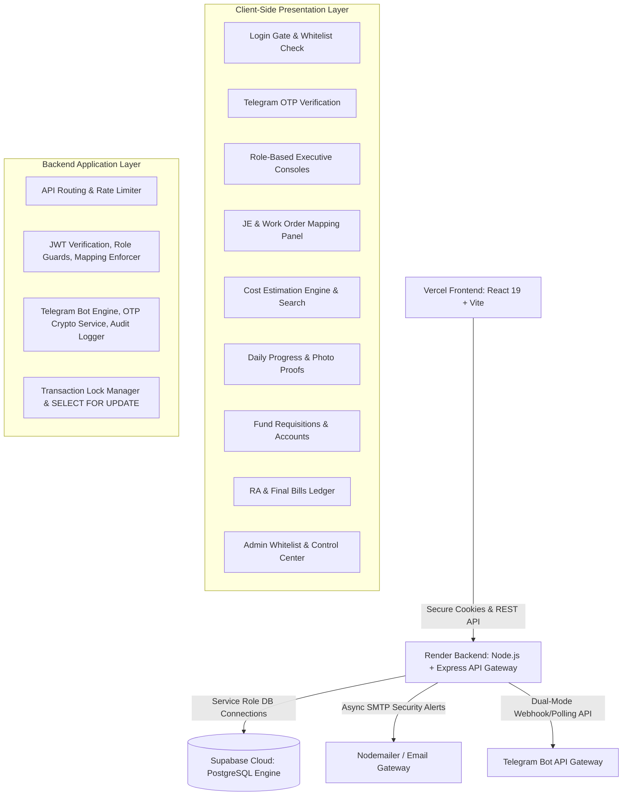
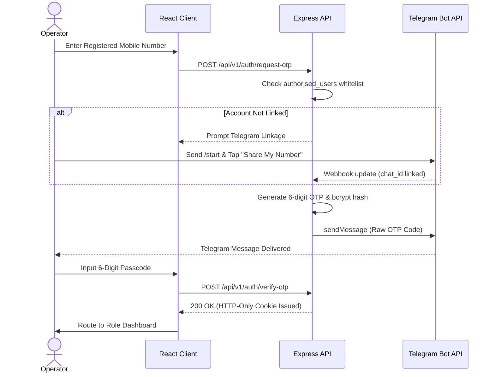

# COMPREHENSIVE PROJECT & ENGINEERING REPORT
## Integrated Digital Business Platform (IDBP) | S.N. Polymers Pvt. Ltd.

### Project Development Team - Shreyan Ghosh, Aswint Guha, Aryak Pal

---

## Acknowledgement

We express our sincere gratitude to the management and executive leadership at **S.N. Polymers Pvt. Ltd.** for their invaluable support, operational insights, and active guidance throughout the architectural design, development, security hardening, and field testing phases of the Integrated Digital Business Platform (IDBP). We also extend our appreciation to all site engineers, zonal managers, and administrative staff whose real-world feedback helped shape this platform into an enterprise-grade digital solution for modern construction and chemical project engineering.

---

## 1. Executive Summary

This report serves as the definitive engineering documentation and final handover report for the **Integrated Digital Business Platform (IDBP)** developed for **S.N. Polymers Pvt. Ltd.** 

S.N. Polymers Pvt. Ltd. operates complex civil engineering projects and specialized chemical manufacturing operations across multiple geographic zones. Historically, project execution suffered from delays, coordination bottlenecks, and material discrepancies due to manual record-keeping using physical ledgers and fragmented spreadsheets. The IDBP was commissioned to digitize end-to-end field operations, establish strict role-based accountability, enforce programmatic financial constraints, govern organizational access through mapping controls, and automate real-time notifications across field and executive teams.

### Core System Goals
1. **Multi-Actor Workflow Automation**: Unify Field Junior Engineers (JEs), Zonal Offices (ZOs), and the Head Office (HO) into a seamless, multi-stage approval pipeline governed by explicit hierarchy mappings.
2. **Strict Financial Controls & Immutability**: Enforce estimate budget ceilings, item-level approval locks, sequential Running Account (RA) billing rules, and explicit bank account disbursement allocations (CC/OD/CR).
3. **Granular Organizational & Work Order Governance**: Programmatically map Junior Engineers to supervising Zonal Officers (`je_zo_mappings`) and restrict site actions strictly to assigned active work orders (`work_order_mappings`).
4. **Automated Real-Time Telegram Pipeline**: Eliminate communication delays via instantaneous Telegram alerts for estimate submissions, revision requests, fund approvals, and interactive account linkage.
5. **Hardened Access Security**: Eliminate unverified registrations through an administrative whitelist system, utilizing Telegram multi-factor authentication (MFA) with bcrypt OTP passcodes.
6. **Decoupled & Resilient Architecture**: Build a high-performance, responsive architecture (React 19 + Node.js/Express + Supabase PostgreSQL) designed for cloud deployment with minimal infrastructure overhead.

---

## 2. High-Level System Architecture & Tech Stack

The IDBP application is built on a decoupled, three-tier architecture that guarantees strict data isolation, high client performance, and secure, transaction-safe database operations:



### 2.1 Tier 1: Presentation Layer (React 19 + Vite SPA)
Compiled with Vite and styled using Vanilla CSS with Tailwind utility extensions, the frontend is deployed as a static Single Page Application (SPA).
* **State & Authentication**: Context-based global `AuthContext` checks user role privileges, manages session token lifecycles, and maintains state across views.
* **Component & Design Aesthetics**: Utilizes custom glassmorphism panels for dark mode and high-contrast opaque cards (`tooltip-popover`) for light mode, ensuring visual accessibility. UI elements dynamically adapt active controls based on user role permissions.
* **Consolidated Navigation**: Features a unified sidebar menu with an integrated cost estimate search widget for rapid work order lookups across all management pages.
* **Client-Side Routing**: Protected using `react-router-dom` v6 route guards that intercept unauthenticated access and enforce role authorization boundaries.

### 2.2 Tier 2: Application Layer (Node.js + Express REST API)
Serves as the central API gateway running on Node.js. It handles incoming HTTP requests, validates request payloads, enforces business logic, manages concurrency, and interfaces with external notification services.
* **Validation & Schemas**: Every endpoint utilizes Zod schemas (`estimate.schema.js`, `fundRequest.schema.js`, etc.) to sanitize and validate JSON payloads before executing backend operations.
* **Service Integrations**: Contains Nodemailer triggers for instant security email notifications, alongside the Telegram Bot API engine supporting both Webhook mode (production) and Long Polling mode (development).
* **Concurrency Locking**: Uses row-level transaction locks (`SELECT ... FOR UPDATE`) during requisition and budget calculations to guarantee multi-user data consistency.

### 2.3 Tier 3: Database Engine (Supabase / PostgreSQL)
Hosted on Supabase cloud infrastructure running PostgreSQL. Direct client access is restricted. The backend communicates via a service-role connection, enforcing integrity using triggers, strict check constraints, soft deletes, and server-side RPC functions.

### 2.4 Software Stack & Dependencies Specification

The table below outlines all third-party libraries, frameworks, and system dependencies powering the platform:

| Component Category | Technology / Library | Version | Core Engineering Purpose |
| :--- | :--- | :--- | :--- |
| **Frontend Core** | React | `^19.2.6` | Component-based user interface framework |
| | React DOM | `^19.2.6` | DOM rendering engine for React |
| | Vite | `^8.0.12` | High-performance SPA bundler & development server |
| **Frontend Routing & State** | React Router DOM | `^6.23.1` | Client-side routing, navigation, & auth guards |
| | TanStack React Query | `^5.101.0` | Server state management, caching, & auto-refetching |
| | Axios | `^1.7.2` | HTTP client for REST API request handling |
| **Frontend UI & Styling** | Tailwind CSS | `^3.4.4` | Utility-first CSS styling & layout system |
| | PostCSS & Autoprefixer | `^8.4.38` | CSS vendor prefixing & processing |
| | Motion (Framer) | `^12.42.2` | Glassmorphism micro-animations & UI transitions |
| **Frontend Exports & PDF** | html2pdf.js | `^0.14.0` | Client-side PDF document generation for estimates |
| | XLSX (SheetJS) | `^0.18.5` | Excel spreadsheet parsing & data catalog exporting |
| **Backend Core Server** | Node.js | `>= 18.x` | Asynchronous JavaScript runtime engine |
| | Express | `^4.19.2` | Core HTTP REST API framework & routing engine |
| **Backend Database SDK** | @supabase/supabase-js | `^2.43.4` | Supabase PostgreSQL client & Storage Bucket SDK |
| **Backend Security & Auth** | JSONWebToken (jsonwebtoken) | `^9.0.2` | HTTP-Only JWT token generation & signature verification |
| | bcrypt | `^6.0.0` | Password & 6-digit OTP salt hashing |
| | Helmet | `^8.2.0` | Security headers middleware (HSTS, CSP, XSS protection) |
| | express-rate-limit | `^7.3.1` | Fixed-window rate limiting keyed by E.164 phone numbers |
| | Cookie Parser | `^1.4.6` | Signed HTTP-Only cookie parsing middleware |
| | CORS | `^2.8.5` | Cross-Origin Resource Sharing security controls |
| **Backend Validation & Uploads**| Zod | `^4.4.3` | Server-side schema validation for request payloads |
| | Multer | `^1.4.5` | Multipart form-data parser & file upload stream handler |
| **Backend Alerts & Utils** | Nodemailer | `^9.0.1` | SMTP gateway for automated security alert emails |
| | UUID | `^14.0.0` | Cryptographic UUID v4 identifier generation |
| **Testing & Tooling** | Vitest & @vitest/ui | `^4.1.9` | Automated unit & integration testing framework |
| | Nodemon | `^3.1.2` | Live-reloading server process manager for development |

---

## 3. Relational Database Design

The relational database schema is structured to ensure transactional integrity, audit compliance, and strict foreign key relationships. Soft deletes are used for transactional logs to maintain full operational traceability.

```
       +--------------------+
       |  authorised_users  |<-----------------+
       +----+----------+----+                  |
            |          |                       |
        1:N |      1:N |                       | 1:N
            v          v                       |
+-----------+---+  +---+----------------+      |
| sessions      |  | je_zo_mappings     |      |
+---------------+  +--------------------+      |
                                               |
       +--------------------+                  |
       |    projects_master |<-----------------+
       +----+----------+----+                  |
            |          |                       |
        1:N |      1:N |                       |
            v          v                       |
+-----------+---+  +---+----------------+      |
|work_order_    |  |fund_requests       |      |
|mappings       |  +--------------------+      |
+---------------+                              |
            |                                  |
            | 1:N                              | 1:N
            v                                  v
+-----------+------------+            +--------+---------------+
|project_cost_estimates  |            |daily_progress_reports  |
+-----------+------------+            +------------------------+
            | 1:N
            v
+-----------+-----------------+
|project_cost_estimate_items  |
+-----------------------------+
```

### 3.1 Core Table Specifications

#### 1. `authorised_users` (System Whitelist & Access Control)
Maintains the master index of mobile numbers authorized to log into the platform.
* **Columns**: `id` (UUID, PK), `mobile_number` (VARCHAR, Unique, formatted E.164 e.g. `+91XXXXXXXXXX`), `display_name` (VARCHAR), `role` (VARCHAR), `permissions` (JSONB), `is_active` (BOOLEAN), `telegram_chat_id` (VARCHAR), `created_at` (TIMESTAMPTZ).
* **Constraints**: Role must satisfy `role IN ('je', 'zo', 'ho', 'admin', 'staff')`.
* **Business Rule**: Setting `is_active` to `false` immediately revokes API authorization and terminates active user sessions.

#### 2. `je_zo_mappings` (JE-to-ZO Hierarchy Mapping)
Establishes the active managerial mapping connecting Junior Engineers to their supervising Zonal Office manager.
* **Columns**: `id` (UUID, PK), `je_user_id` (VARCHAR, FK to `authorised_users.mobile_number`), `zo_user_id` (VARCHAR, FK to `authorised_users.mobile_number`), `is_active` (BOOLEAN), `assigned_at` (TIMESTAMPTZ), `assigned_by` (VARCHAR, FK), `deactivated_at` (TIMESTAMPTZ), `deactivated_by` (VARCHAR, FK).
* **Constraints**: Unique index `idx_je_zo_mappings_active_unique` on `je_user_id` where `is_active = true` (enforces strictly one active ZO supervisor per JE).
* **Business Rule**: Used by the Telegram Notification Engine to route estimate submission alerts, revision notifications, and daily progress reviews directly to the assigned ZO supervisor.

#### 3. `work_order_mappings` (JE-to-Work Order Assignment Mapping)
Controls project-level operational access by explicitly assigning active civil work orders to Junior Engineers.
* **Columns**: `id` (UUID, PK), `work_order_no` (VARCHAR, FK to `projects_master.work_order_no`), `je_user_id` (VARCHAR, FK to `authorised_users.mobile_number`), `is_active` (BOOLEAN), `reason` (VARCHAR), `assigned_at` (TIMESTAMPTZ), `assigned_by` (VARCHAR, FK), `deactivated_at` (TIMESTAMPTZ), `deactivated_by` (VARCHAR, FK).
* **Constraints**: `reason IN ('Assigned', 'Transferred', 'Removed', 'Project Closed')`. Unique index `idx_work_order_mappings_active_unique` on (`work_order_no`, `je_user_id`) where `is_active = true`.
* **Business Rule**: Enforces data isolation; Junior Engineers can strictly create estimate drafts, upload payment requisitions, and log daily site visits only for work orders mapped to them.

#### 4. `projects_master` (Project Directory & Contract Master)
Stores contracted civil work order details, contract values, site locations, and timeline constraints.
* **Columns**: `work_order_no` (VARCHAR, PK), `estimate_no` (VARCHAR), `work_order_value` (NUMERIC), `site_details` (TEXT), `state` (VARCHAR), `district` (VARCHAR), `zone` (VARCHAR), `department` (VARCHAR), `status` (VARCHAR), `zo_user_id` (VARCHAR, FK), `project_start_date` (DATE), `project_end_date` (DATE), `created_by` (VARCHAR), `created_at` (TIMESTAMPTZ).
* **Constraints**: `work_order_value >= 0`. Status must be `Running`, `Closed`, or `Complete Under Maintenance`.

#### 5. `zo_balances` & `zo_fund_ledger` (Zonal Financial Account Ledger)
Manages cash allocations and balance ledgers disbursed to Zonal Officers.
* **`zo_balances` Columns**: `zo_user_id` (VARCHAR, PK, FK), `available_balance` (NUMERIC(18,2)), `updated_at` (TIMESTAMPTZ).
* **`zo_fund_ledger` Columns**: `ledger_id` (UUID, PK), `zo_user_id` (VARCHAR, FK), `transaction_type` (VARCHAR: `ALLOCATION`, `REQUISITION_APPROVAL`, `RETURN`, `TRANSFER`), `reference_type` (VARCHAR: `FUND_REQUEST`, `REQUISITION`, `RETURN`), `reference_id` (UUID), `amount` (NUMERIC(18,2)), `work_order_no` (VARCHAR, FK), `created_at` (TIMESTAMPTZ).
* **Constraints**: Unique index `idx_zo_fund_ledger_ref_unique` on (`reference_type`, `reference_id`) prevents double-crediting or duplicate ledger transactions.

#### 6. `otp_requests` (MFA Code Ledger)
Stores cryptographically hashed verification passcodes generated during authentication.
* **Columns**: `id` (UUID, PK), `mobile_number` (VARCHAR), `otp_hash` (TEXT, bcrypt hash), `expires_at` (TIMESTAMPTZ), `is_used` (BOOLEAN), `attempts` (INTEGER), `created_at` (TIMESTAMPTZ).
* **Business Rule**: Automatically invalidates requests after 3 failed verification attempts or upon reaching the 5-minute expiration timestamp.

#### 7. `sessions` (Session Audit Trail)
Tracks active operator sessions, device details, and session durations.
* **Columns**: `id` (UUID, PK), `user_id` (UUID, FK), `jwt_jti` (VARCHAR, Unique), `ip_address` (VARCHAR), `user_agent` (TEXT), `login_at` (TIMESTAMPTZ), `logout_at` (TIMESTAMPTZ), `duration_seconds` (INTEGER), `is_active` (BOOLEAN).

#### 8. `project_cost_estimates` & `project_cost_estimate_items` (Estimate Header & Line Items)
Tracks multi-item cost estimation sheets created by Junior Engineers and reviewed by ZO/HO.
* **Header Columns**: `estimate_id` (UUID, PK), `work_order_no` (VARCHAR, FK), `estimate_no` (VARCHAR, Unique), `estimate_amount` (NUMERIC), `estimate_status` (VARCHAR), `revision_cycle` (INTEGER), `revision_deadline` (TIMESTAMPTZ), `je_user_id` (VARCHAR), `zo_approved_by` (VARCHAR), `ho_approved_by` (VARCHAR), `created_at` (TIMESTAMPTZ).
* **Line Item Columns**: `item_id` (UUID, PK), `estimate_id` (UUID, FK), `material_main_head` (VARCHAR), `material_sub_head` (VARCHAR), `item_description` (TEXT), `unit` (VARCHAR), `quantity` (NUMERIC), `rate` (NUMERIC), `amount` (NUMERIC), `source_of_purchase` (VARCHAR), `zo_office_approve` (VARCHAR), `zo_remarks` (TEXT), `ho_office_approve` (VARCHAR), `ho_remarks` (TEXT).

#### 9. `fund_requests` (Zonal Capital Requisitions)
Tracks funding requests submitted by Zonal Offices to the Head Office.
* **Columns**: `fund_request_id` (UUID, PK), `work_order_no` (VARCHAR, FK), `zo_fr_no` (VARCHAR, Unique), `zo_fr_amount` (NUMERIC), `approve_ho_amount` (NUMERIC), `request_status` (VARCHAR), `zo_remarks` (TEXT), `transfer_from_account` (VARCHAR), `ho_remarks` (TEXT), `zo_user_id` (VARCHAR), `approve_ho_user_id` (VARCHAR), `created_at` (TIMESTAMPTZ).
* **Constraints**: `transfer_from_account IN ('CC', 'OD', 'CR')`. Remarks are compulsory upon ZO submission.

#### 10. `requisitions` (Payment & Procurement Ledger)
Tracks vendor invoices against approved estimate item budgets.
* **Columns**: `requisition_id` (UUID, PK), `work_order_no` (VARCHAR, FK), `material_main_head` (VARCHAR), `invoice_ref` (VARCHAR), `quantity` (NUMERIC), `rate` (NUMERIC), `approved_amount` (NUMERIC), `invoice_file_path` (VARCHAR), `requisition_status` (VARCHAR), `created_by` (VARCHAR), `created_at` (TIMESTAMPTZ).

#### 11. `daily_progress_reports` (Physical Construction Log)
Daily site visit reports logging physical progress percentages and photo proof links.
* **Columns**: `report_id` (UUID, PK), `work_order_no` (VARCHAR, FK), `physical_work_progress` (NUMERIC), `work_progress_details` (TEXT), `daily_site_photo_url` (VARCHAR), `login_date` (DATE), `authority_remarks` (TEXT), `created_by` (VARCHAR), `created_at` (TIMESTAMPTZ).

#### 12. `ra_final_bills` (Contractor Billing Ledger)
Tracks sequential contractor invoices submitted against work orders.
* **Columns**: `bill_id` (UUID, PK), `work_order_no` (VARCHAR, FK), `bill_index` (INTEGER), `bill_type` (VARCHAR), `gross_bill` (NUMERIC), `bill_file_path` (TEXT), `created_by` (VARCHAR), `created_at` (TIMESTAMPTZ).
* **Constraints**: `bill_type IN ('RA', 'Final')`.

---

## 4. Database Controls, Compliance Logic & Immutability

To guarantee strict financial discipline and bulletproof audit trails, IDBP enforces database-level compliance rules and immutability controls:

### 4.1 Work Order & Mapping Immutability
Once registered in `projects_master`, a project's Work Order Number cannot be modified or deleted by any application role. Historical mapping records in `work_order_mappings` and `je_zo_mappings` maintain full assignment histories using `is_active` flags and timestamped deactivation logs, ensuring audit integrity.

### 4.2 Granular Row-Level Approval Locks
To prevent unauthorized modifications during multi-stage estimate reviews:
1. **Permanent Lock on Final Approved Rows**: Any line item with `ho_office_approve = 'Approved'` is permanently locked. No user—including System Administrators—can edit or delete final approved rows.
2. **HO Decision Lock (ZOs & JEs)**: Line items evaluated by the Head Office (`Approved` or `Rejected`) cannot have their fields, quantities, or approvals modified by Zonal or Junior Engineers.
3. **ZO Decision Lock (JEs)**: Line items marked as `Approved` by the Zonal Office are locked to Junior Engineers during revision cycles.
4. **Estimate Reopened Constraints**: When an estimate is placed in `Estimate Reopened` status, existing line items cannot be deleted or modified by non-administrators; only new line items may be added. Historical decisions and remarks are strictly preserved.

### 4.3 Automated Audit Logging
The `audit_log` table captures write operations across financial, project, mapping, and whitelist tables. Triggers record the action (`INSERT`, `UPDATE`, `DELETE`), the operating user, the client IP address, and a JSON diff of old versus new field values. The audit table is write-only, providing an immutable record for regulatory compliance.

### 4.4 Transactional Concurrency Control
Payment requisition submissions and budget checks execute inside explicit database transactions using `SELECT ... FOR UPDATE` row locks on `projects_master`. This eliminates race conditions and double-spending vulnerabilities during simultaneous procurement entries.

---

## 5. Functional Module Walkthrough

### Phase 1 — Access Controls & Auth Gateway
Direct self-registration is disabled. Access is governed by the administrative whitelist:
1. **Mobile Whitelist Check**: The user enters their mobile number. The system verifies if it is present and active in `authorised_users`.
2. **Telegram Account Linkage**: If active but missing a `telegram_chat_id`, the interface prompts the user to open `@snpolymers_bot` in Telegram and press the native **"📲 SHARE MY NUMBER → Link Account"** button to securely associate their chat ID.
3. **OTP Generation & Verification**: The backend generates a 6-digit OTP, computes its bcrypt hash, stores it with a 5-minute expiry window, and delivers the raw passcode to the user's Telegram chat.
4. **Session Token Issuance**: Validating the passcode issues an HTTP-Only, secure JWT cookie and records session metadata in the `sessions` ledger.
5. **Security Email Notification**: Nodemailer dispatches an instant login alert to administrators containing timestamp, IP address, and device headers.



### Phase 2 — Organizational Governance & User Mapping Engine
System Administrators manage organizational structure and field assignments through the User & Work Order Mapping modules:
* **JE-ZO Hierarchy Mapping (`je_zo_mappings`)**:
  * Administrators map each Junior Engineer to a designated Zonal Office manager.
  * The system enforces a strict constraint guaranteeing that a JE can have only one active ZO supervisor at a time.
  * Re-assigning a JE automatically deactivates the previous mapping and updates routing for Telegram alerts and approval tasks.
* **Work Order Assignment Mapping (`work_order_mappings`)**:
  * Administrators assign active civil work orders to Junior Engineers.
  * Every assignment change records an explicit audit reason (`Assigned`, `Transferred`, `Removed`, or `Project Closed`).
  * API route guards automatically filter workspace views; Junior Engineers can strictly view, draft estimates, or upload payment requisitions only for work orders explicitly mapped to them.

### Phase 3 — Project Cost Estimation Engine
Enables Junior Engineers to draft itemized estimates with standard purchase rates and material heads.
* **Cascading Selectors**: Material categories, sub-heads, and standard unit drop-downs filter dynamically, preventing data entry errors.
* **Multi-Stage Workflow Lifecycle**:
  * **JE Draft**: Junior Engineers draft cost lines and save working sheets without locking.
  * **ZO Review**: Submitting the estimate locks JE editing and routes the sheet to the Zonal Office mapped in `je_zo_mappings`. ZOs review line items individually, approving, rejecting, or adding remarks. ZOs can **Approve** (advance to HO) or **Request Revision** (with mandatory deadline timer).
  * **HO Review**: Head Office performs final evaluation. HO can grant **Final Approved** status, **Request Revision**, or trigger **Reopen Estimate**.
* **Consolidated Sidebar Search**: An integrated search panel in the sidebar enables operators to search estimate numbers and work order codes from any platform page.

### Phase 4 — Fund Requests & Financial Disbursements
Zonal Officers submit formal fund requisitions mapping financial requirements directly to active projects.
* **Mandatory Justification**: Submitting a fund request requires entering detailed ZO remarks explaining operational justification.
* **Explicit Account Allocations**: Head Office reviews requests and designates the explicit bank account source for disbursement: Credit Control (CC), Overdraft (OD), or Cash Credit (CR).
* **Automated Telegram Notifications**: Dispatches automated HTML alerts to Zonal and Head Office managers upon request submission and approval.

### Phase 5 — Payment Requisitions Management
Tracks material purchases and vendor invoices against approved project estimate lines.
* **Budget Limit Verification**: Server-side checks verify that total requisition amounts do not exceed the remaining approved balance for the designated material head.
* **File Upload Validation**: Vendor invoice uploads (PDF, PNG, JPG) undergo binary magic-byte header validation on the server to prevent extension spoofing before upload to secure Supabase storage buckets (`ra-bill-copies`).

### Phase 6 — Daily Work Progress Log
Enforces daily on-site physical construction reporting.
* **On-Site Proof Uploads**: Field JEs upload daily site photos (validated up to 10MB) alongside physical progress percentages for mapped work orders.
* **Timeline Feed & Authority Review**: Progress reports render in reverse chronological order, allowing Zonal and Head Office supervisors to inspect site images and attach authority evaluation remarks.

### Phase 7 — Running Account (RA) & Final Bill Entry
Manages sequential contractor invoicing.
* **Sequential Verification**: Programmatically blocks bill index $N$ submission if bill $N-1$ has not been recorded.
* **Automated Billing Balance**: Automatically computes previous bill totals, current gross bill amount, cumulative billed value, and remaining unbilled contract balance.
* **Permanent Immutability**: Billing records cannot be updated or deleted once submitted, ensuring audit integrity.

---

## 6. Automated Telegram Notification Engine

The IDBP features an automated notification engine integrated directly with the Telegram Bot API (`@snpolymers_bot`).

### 6.1 Dual-Mode Operation (Webhook & Polling)
* **Production Webhook Mode**: Automatically registers backend webhook endpoints (`/api/v1/telegram-webhook`) with Telegram on server startup, supporting seamless multi-instance horizontal scaling on cloud platforms.
* **Development Polling Mode**: Clears active webhooks on launch and runs a non-blocking long-polling loop (`startPolling()`), enabling full developer debugging without exposing public endpoints.

### 6.2 Real-Time Event Triggers
1. **New Estimate Submitted**: Delivers an HTML alert to the mapped ZO user (fetched via `je_zo_mappings`) detailing Estimate No, Work Order, Site Location, Total Amount, and Submitting JE Name.
2. **Estimate Approved by ZO**: Notifies Head Office executives that an estimate has passed Zonal review and is ready for final approval.
3. **Revision Requested / Estimate Reopened**: Sends an alert to the JE containing revision cycle count, reviewer display name, unapproved row count, and the exact IST countdown deadline.
4. **Fund Request Submitted**: Alerts Head Office directors when a Zonal Office submits a capital fund request.
5. **Fund Request Approved**: Notifies ZO requesters and HO managers with approved amounts, designated transfer account (CC/OD/CR), and HO approval remarks.

### 6.3 Telegram Account Linkage Bot Flow
Users link their Telegram chat ID by tapping `/start` in `@snpolymers_bot`. The bot renders a native custom keyboard:
```
📲  SHARE MY NUMBER  →  Link Account
```
Tapping the button transmits the user's verified contact card to the webhook, which normalizes the mobile number (`+91XXXXXXXXXX`), verifies it against `authorised_users`, updates `telegram_chat_id`, and removes the keyboard upon successful linkage.

---

## 7. Role Permissions Matrix

The system enforces strict field visibility and functional action controls based on five primary roles:

| Module & Functional Actions | Junior Engineer (JE) | Zonal Office (ZO) | Head Office (HO) | Administrator (Admin) | Staff / Viewer |
| :--- | :---: | :---: | :---: | :---: | :---: |
| **Authentication & Profile** | | | | | |
| Whitelist verification & Telegram OTP auth | Yes | Yes | Yes | Yes | Yes |
| Native Telegram account contact linking | Yes | Yes | Yes | Yes | Yes |
| Profile theme toggle (Dark / Light mode) | Yes | Yes | Yes | Yes | Yes |
| **Organizational & Work Order Governance** | | | | | |
| View assigned work orders & ZO supervisor | Yes | Yes | Yes | Yes | Yes |
| Manage JE-ZO supervisor mappings (`je_zo_mappings`) | No | No | No | Yes | No |
| Assign JEs to work orders (`work_order_mappings`) | No | No | No | Yes | No |
| **Console Dashboards** | | | | | |
| View Role-Specific Metrics & Recent Feed | Yes | Yes | Yes | Yes | Yes |
| View Consolidated Estimates Search Card | Yes | Yes | Yes | Yes | Yes |
| **Project Cost Estimates** | | | | | |
| View estimates list & individual sheets | Yes | Yes | Yes | Yes | Yes |
| Draft new estimate sheet & submit to ZO | Yes | No | No | Yes | No |
| Edit own draft / revision-requested sheets | Yes | No | No | Yes | No |
| Review & row-level approval (ZO stage) | No | Yes | No | Yes | No |
| Final review & row-level approval (HO stage) | No | No | Yes | Yes | No |
| Request estimate revision (ZO or HO) | No | Yes | Yes | Yes | No |
| Trigger Reopen Estimate (preserves decisions) | No | No | Yes | Yes | No |
| **Fund Requests & Disbursement** | | | | | |
| View fund requests ledger & balance charts | No | Yes | Yes | Yes | No |
| Create fund request (with mandatory remarks) | No | Yes | No | Yes | No |
| Review, approve, & assign account (CC/OD/CR) | No | No | Yes | Yes | No |
| **Payment Requisitions** | | | | | |
| View requisitions & download invoice files | Yes | Yes | Yes | Yes | Yes |
| Create requisition & upload magic-byte file | Yes | Yes | Yes | Yes | No |
| **Daily Work Progress Log** | | | | | |
| View site progress timeline & photos | Yes | Yes | Yes | Yes | Yes |
| Log daily progress %, upload site photo | Yes | No | No | Yes | No |
| Attach authority evaluation remarks | No | Yes | Yes | Yes | No |
| **RA & Final Bills** | | | | | |
| View running bills ledger & stats | No | Yes | Yes | Yes | Yes |
| Submit sequential RA / Final bills | No | Yes | No | Yes | No |
| **Administration Console** | | | | | |
| Manage user whitelist & telegram reset | No | No | No | Yes | No |
| Manage Master Data catalog items | No | No | No | Yes | No |
| Inspect System Audit Logs (Audit Trail) | No | No | No | Yes | No |

---

## 8. Security & Hardening Controls

### 8.1 JWT Session Cookie Hardening
Upon authentication, the Express backend generates a JWT containing a unique session JTI linked to `sessions`. The token is returned as an HTTP-Only cookie with production flags:
* `httpOnly: true`: Blocks client-side JavaScript access, neutralizing Cross-Site Scripting (XSS) token theft.
* `secure: true`: Restricts cookie transmission to HTTPS encrypted connections.
* `sameSite: 'none'`: Enables secure cross-origin API calls between Vercel and Render domains.

### 8.2 Safe Mutability Gates
* API write operations (`POST`, `PUT`, `PATCH`, `DELETE`) check the target project's status in `projects_master`.
* If a project status is `Closed`, the backend rejects modifications with an HTTP `403 Forbidden` error.

### 8.3 Mobile-Based Fixed Window Rate Limiting
Endpoint protection uses `express-rate-limit` keyed by E.164 mobile numbers:
* OTP request endpoints are restricted to **5 requests per 15-minute window** in production, preventing brute-force attacks while preserving access for multiple users operating behind shared office IP addresses.

---

## 9. UI/UX & Visual Accessibility System

### 9.1 Dual-Theme Support (Dark Glassmorphism & High-Contrast Light Mode)
The user interface supports seamless theme toggling.
* **Dark Mode**: Features translucent glassmorphism panels, subtle glowing borders, and dark backdrops.
* **Light Mode**: Standardized high-contrast styling using solid, opaque backgrounds (`tooltip-popover`), crisp border styling, and dark text tokens to eliminate visual bleed in bright environments.

### 9.2 Standardized Feedback Modals
The platform incorporates dedicated success and error validation popups across key forms (`EstimateForm.jsx`, `FundRequests.jsx`, etc.), replacing browser alerts with consistent, high-contrast modal cards.

---

## 10. Infrastructure Deployment

The platform is deployed on cloud infrastructure scaled for S.N. Polymers' operational load (~30-50 active whitelisted users across field sites, zonal offices, and head office):

```
+------------------------------------------------------------+
| Presentation Layer (Vercel Global Edge CDN)                |
|   - Delivers compiled React 19 SPA static assets over HTTPS |
+------------------------------------------------------------+
                             |
                             v [Encrypted REST API Calls]
+------------------------------------------------------------+
| Application Web Server (Render Node.js API Service)        |
|   - Express REST API Gateway & Webhook Event Engine        |
+------------------------------------------------------------+
                             |
                             v [Service Role Database Connection]
+------------------------------------------------------------+
| Database & File Engine (Supabase Cloud PostgreSQL Engine)  |
|   - Manages RLS, Database Triggers, RPCs & File Storage    |
+------------------------------------------------------------+
```

---

## 11. Engineering Validation & Quality Controls

### 11.1 Automated Integration Test Suite
The codebase includes **22 integration test scripts** (`backend/tests/milestones/`) executed via npm:
* `npm run test:all` or `npm run test:p6:all`
* **Test Coverage**: Verifies OTP generation, bcrypt hash validation, project mutability blocks, sequential RA billing index checks, file header magic-byte verification, JE-ZO mapping enforcement, work order mapping constraints, and row-level estimate approval immutability.

### 11.2 Resolved Production Code Gaps
1. **Telegram Polling Conflict Resolution**: Implemented automatic webhook deregistration during long-polling startup and auto-registration in production webhook mode.
2. **Requisition Concurrency Locking**: Introduced `SELECT ... FOR UPDATE` locks on `projects_master` during requisition processing to eliminate double-spend race conditions.
3. **Production Log Sanitization**: Wrapped OTP terminal outputs in non-production environment guards to keep sensitive passcodes out of cloud logging tools.
4. **Express Payload Size Guard**: Configured a `100kb` body parsing limit (`express.json({ limit: '100kb' })`) to prevent JSON buffer memory exhaustion vector attacks.

---

## 12. Platform Documentation & Onboarding Guides

To support seamless operations, comprehensive user and technical documentation is maintained under the `documentation/` directory:

1. **User Manual ([USER_MANUAL.md](file:///Users/aryakpal/SNPolymers/documentation/USER_MANUAL.md))**: Detailed operational guide explaining authentication, theme selection, role workflows, and functional walkthroughs for every system module.
2. **User Onboarding Guide ([USER_ONBOARDING_GUIDE.md](file:///Users/aryakpal/SNPolymers/documentation/USER_ONBOARDING_GUIDE.md))**: Quick-start guide for onboarding new operators, covering whitelist verification, Telegram bot linkage, and initial system navigation.
3. **Role Permissions Matrix ([ROLE_PERMISSIONS_MATRIX.md](file:///Users/aryakpal/SNPolymers/documentation/ROLE_PERMISSIONS_MATRIX.md))**: Reference guide mapping active permissions, field access, and route security policies across all system roles.
4. **Technical Documentation Suite**: Engineering guides detailing API route schemas, database table definitions, service layer implementations, and Supabase triggers to support future system extensions.

---

## 13. Conclusion

The **Integrated Digital Business Platform (IDBP)** delivers a complete, secure solution for **S.N. Polymers Pvt. Ltd.** to digitize field operations, manage cost estimation workflows, enforce strict financial discipline, govern field operations through user and work order mappings, and automate communication workflows.

By combining modern web technologies (React 19, Node.js/Express, and Supabase PostgreSQL) with real-world business constraints (item-level approval locks, mandatory justification remarks, sequential billing rules, organizational hierarchy mappings, and automated Telegram notifications), the development team (**Shreyan Ghosh, Aryak Pal, and Aswint Guha**) has created a scalable, secure foundation for S.N. Polymers' enterprise growth.
