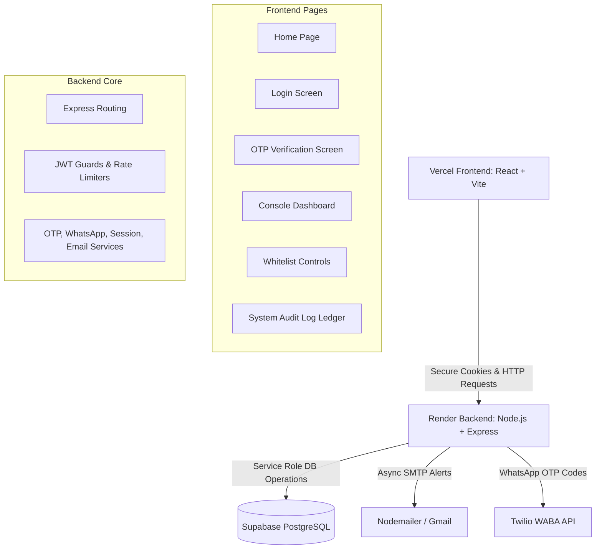

# Phase 1 Documentation — Authentication & Access Control
## Integrated Digital Business Platform (IDBP) | S.N. Polymers

This document provides a comprehensive technical overview of the architecture, database schema, backend services, API contracts, frontend interfaces, security posture, and deployment configuration delivered in **Phase 1** of S.N. Polymers' Integrated Digital Business Platform (IDBP).

---

## 1. Executive Summary

Phase 1 establishes a secure, modular authentication and access control layer designed to serve as the foundational gateway for the S.N. Polymers Enterprise Resource Planning (ERP) platform. The primary goal is to restrict access to the internal "Office Use" system to a whitelist of authorized mobile numbers managed exclusively by system administrators.

### Core Objectives Delivered:
1. **Whitelisted OTP Login:** A login system requiring OTP code verification via WhatsApp, rejecting any unauthorized mobile number.
2. **Live Session Auditing:** Complete tracing of active operator sessions, storing IP addresses, user agents, login/logout timestamps, and total active durations.
3. **Admin Controls:** Real-time administrative CRUD interface to add new users, deactivate access tokens, hard-delete users, and inspect historical audit ledgers.
4. **Instant Security Notifications:** Real-time, asynchronous email notifications sent to the system administrator upon operator login and logout events.
5. **Decoupled Architecture:** An API-first architecture designed to authenticate future business modules (Manufacturing, Project Management) without database schema modifications or auth service refactoring.

---

## 2. High-Level System Architecture

The application is architected as a decoupled, three-tier system:



* **Tier 1 (Presentation):** React SPA compiled with Vite, styled with Tailwind CSS, utilizing React Router DOM for route guarding, and Axios for HTTP requests.
* **Tier 2 (Application/Business Logic):** Node.js and Express REST API. Mediums session verification, interacts with third-party providers (Twilio, Nodemailer), and manages access policy execution.
* **Tier 3 (Database / Persistence):** Supabase (PostgreSQL) storing whitelists, active tokens, and session audit trails.

---

## 3. Database Schema

All database operations are hosted on Supabase (PostgreSQL) with Row Level Security (RLS) policies configured to lock down direct table modification.

### 3.1 `authorised_users` (User Whitelist)
Stores mobile numbers authorized by the administrator to access the ERP platform.

| Column | Type | Constraint | Description |
|:---|:---|:---|:---|
| `id` | `uuid` | PRIMARY KEY, Default: `gen_random_uuid()` | Unique user identifier |
| `mobile_number` | `varchar(15)` | UNIQUE, NOT NULL | Format: E.164 (e.g., `+919876543210`) |
| `display_name` | `varchar(100)` | Nullable | Readable label or user name |
| `role` | `varchar(50)` | DEFAULT `'staff'` | Permission level: `'staff'` or `'admin'` |
| `permissions` | `jsonb` | DEFAULT `'{}'` | Flexible permissions for future modules |
| `created_at` | `timestamptz` | DEFAULT `now()` | Record creation timestamp |
| `is_active` | `boolean` | DEFAULT `true` | Access toggle; deactivation locks login |

### 3.2 `otp_requests` (Multi-Factor Codes Ledger)
Maintains cryptographic hashes of active and expired OTP validation requests.

| Column | Type | Constraint | Description |
|:---|:---|:---|:---|
| `id` | `uuid` | PRIMARY KEY, Default: `gen_random_uuid()` | Unique OTP transaction ID |
| `mobile_number` | `varchar(15)` | NOT NULL, INDEX | Target mobile for delivery |
| `otp_hash` | `text` | NOT NULL | bcrypt hash of the 6-digit OTP code |
| `expires_at` | `timestamptz` | NOT NULL | 5 minutes expiration limit |
| `is_used` | `boolean` | DEFAULT `false` | Prevents replay attacks once verified |
| `attempts` | `integer` | DEFAULT `0` | Lock trigger; increments on invalid inputs |
| `created_at` | `timestamptz` | DEFAULT `now()` | Record generation timestamp |

### 3.3 `sessions` (Session Audit Logs)
Records user logins, active statuses, logout events, network addresses, and active session durations.

| Column | Type | Constraint | Description |
|:---|:---|:---|:---|
| `id` | `uuid` | PRIMARY KEY, Default: `gen_random_uuid()` | Session reference (matches JWT `jti`) |
| `user_id` | `uuid` | REFERENCES `authorised_users(id)` | Associated user |
| `jwt_jti` | `varchar(100)` | UNIQUE | Token ID tracking for active/blacklist checks |
| `ip_address` | `varchar(45)` | Nullable | Client IP address for auditing |
| `user_agent` | `text` | Nullable | Browser and OS header information |
| `login_at` | `timestamptz` | DEFAULT `now()` | Login event timestamp |
| `logout_at` | `timestamptz` | Nullable | Logout event timestamp |
| `duration_seconds`| `integer` | Nullable | Computed duration upon logout (seconds) |
| `module` | `varchar(50)` | DEFAULT `'office'` | Module target accessed |
| `is_active` | `boolean` | DEFAULT `true` | Flag toggled to `false` on logout or revocation |

---

## 4. Backend Architecture & API Contracts

### 4.1 Endpoints Specification

All API endpoints are version-controlled under `/api/v1/auth`.

| Method | Endpoint | Authorization | Request Body / Query Params | Description |
|:---|:---|:---|:---|:---|
| **POST** | `/request-otp` | Public | `{ "mobileNumber": "+91XXXXXXXXXX" }` | Validates whitelist, generates secure 6-digit OTP, bcrypt-hashes it, stores it, and triggers WhatsApp dispatch. |
| **POST** | `/verify-otp` | Public | `{ "mobileNumber": "+91XXXXXXXXXX", "otp": "XXXXXX" }` | Validates OTP hash, marks it used, creates a session, issues a JWT token in an httpOnly cookie, and alerts the admin. |
| **POST** | `/logout` | JWT (Cookie) | None | Invalidates the session JTI in the database, clears the httpOnly token cookie, computes duration, and notifies the admin. |
| **GET** | `/me` | JWT (Cookie) | None | Decodes the active cookie and returns user profile, role, permissions, and status. |
| **GET** | `/admin/users` | Admin JWT | None | Lists all whitelisted users, including their total session count and last login timestamp. |
| **POST** | `/admin/users` | Admin JWT | `{ "mobileNumber": "+91X", "displayName": "X", "role": "staff/admin" }` | Adds a new user to the whitelist. |
| **PATCH** | `/admin/users/:id` | Admin JWT | `{ "displayName": "X", "role": "staff/admin", "isActive": true/false }` | Modifies user settings. Deactivating a user immediately closes all active sessions in the database. |
| **DELETE**| `/admin/users/:id` | Admin JWT | None | Deletes user from whitelist and closes all active sessions immediately. |
| **GET** | `/admin/sessions`| Admin JWT | Query: `userId`, `dateFrom`, `dateTo` | Retrieves historical session logs including IP addresses, user agents, and formatted durations. |

---

### 4.2 Core Services

#### 4.2.1 OTP Service ([otp.service.js](file:///home/zenoguy/Desktop/SNPolymers/backend/src/services/otp.service.js))
* **Generation:** Uses Node's native `crypto.randomInt(100000, 999999)` to generate high-entropy 6-digit numeric strings.
* **Hashing:** Hashes OTP values with `bcrypt` (10 salt rounds) before storing to protect user credentials against DB compromise.
* **Verification Logic:**
  1. Finds the latest unused OTP request for the mobile number.
  2. Confirms the current timestamp is within `expires_at` (5 minutes limit).
  3. Verifies that cumulative verification attempts on this OTP are less than 3.
  4. Increments the database counter on failure, or marks `is_used = true` on success.

#### 4.2.2 WhatsApp Service ([whatsapp.service.js](file:///home/zenoguy/Desktop/SNPolymers/backend/src/services/whatsapp.service.js))
* **Twilio API:** Communicates with the Twilio WhatsApp Business API.
* **Console Fallback:** If `TWILIO_ACCOUNT_SID` or `TWILIO_AUTH_TOKEN` is missing (such as in local development), it automatically logs the raw OTP in a formatted console message instead of crashing.

#### 4.2.3 Session & Token Service ([session.service.js](file:///home/zenoguy/Desktop/SNPolymers/backend/src/services/session.service.js))
* **JWT Issuance:** Encodes user data (`id`, `mobile_number`, `role`, `permissions`) and a unique session ID (`jti`) into a token signed with `HS256` (configured for a 24-hour expiry).
* **Auditing:** Inserts a row containing `ip_address`, `user_agent`, and `jwt_jti` on creation. On logout, calculates elapsed time (`logout_at` - `login_at`) and records total seconds.

#### 4.2.4 Notification Email Service ([email.service.js](file:///home/zenoguy/Desktop/SNPolymers/backend/src/services/email.service.js))
* **Nodemailer:** Connects to Gmail SMTP utilizing secure Google App Passwords.
* **Asynchronous Execution:** Fired in parallel execution threads to avoid blocking client HTTP responses during login or logout.
* **Templates:** Rich HTML emails detailing network configurations, browser metadata, login events, and elapsed operator session durations.

---

### 4.3 Middlewares

1. **`verifyJwt.js`:** Extracts the JWT token from the secure cookie, verifies signature, decodes properties, and checks the database `sessions` table to confirm the JTI is still active (`is_active = true`). If the user was deactivated or logged out, access is denied and the cookie is cleared.
2. **`requireAdmin.js`:** Rejects requests if `req.user.role !== 'admin'` with a `403 Forbidden` response.
3. **`rateLimiter.js`:** Prevents brute-force attacks:
   * **OTP Requests:** Limits to maximum 3 requests per mobile/IP per 15-minute window.
   * **OTP Verifications:** Limits to maximum 5 verification requests per mobile/IP per 5-minute window.

---

## 5. Frontend Architecture & Views

The React application is architected around a unified auth provider.

### 5.1 Auth Context ([AuthContext.jsx](file:///home/zenoguy/Desktop/SNPolymers/frontend/src/components/AuthContext.jsx))
* Wraps the application inside an `<AuthProvider>` component, storing global `user` and `loading` variables.
* Intercepts application mount to trigger a `GET /me` request, verifying if the browser holds a valid HTTP cookie.
* Exposes `login()` (updates state) and `logout()` (calls API and flushes state).

### 5.2 Axios Client Configuration ([authApi.js](file:///home/zenoguy/Desktop/SNPolymers/frontend/src/api/authApi.js))
* Points requests to the configured backend.
* Sets `withCredentials: true` globally to guarantee the browser automatically transmits the secure, signed `token` cookie on all API requests.

### 5.3 Application Pages

#### 5.3.1 Home Page ([Home.jsx](file:///home/zenoguy/Desktop/SNPolymers/frontend/src/pages/Home.jsx))
* A modern landing page reflecting the S.N. Polymers corporate identity.
* Showcases the division information (Manufacturing & Government Infrastructure).
* Features an "Office Use Log-in" action redirecting operators to the credential portal.

#### 5.3.2 Login Page ([Login.jsx](file:///home/zenoguy/Desktop/SNPolymers/frontend/src/pages/Login.jsx))
* Features phone number input validation.
* Automatically formats standard 10-digit Indian mobile numbers by appending the default `+91` prefix before submission.
* Alerts users if they attempt authorization with unregistered numbers.

#### 5.3.3 OTP Verification Page ([OtpVerify.jsx](file:///home/zenoguy/Desktop/SNPolymers/frontend/src/pages/OtpVerify.jsx))
* Implements a 6-box OTP code layout with automated focus shifting and clipboard paste parsing.
* Renders a 5-minute (300 seconds) security countdown.
* Enforces a 30-second resend button lock to prevent request flooding.

#### 5.3.4 Console Dashboard ([Dashboard.jsx](file:///home/zenoguy/Desktop/SNPolymers/frontend/src/pages/Dashboard.jsx))
* The landing page for authenticated staff and administrators.
* Displays status panels for Manufacturing and Project Management modules (placeholders showing access restricted for Phase 2).
* Renders a navigation button to the Whitelist Admin Panel for verified system administrators.

#### 5.3.5 Whitelist Admin Panel ([AdminPanel.jsx](file:///home/zenoguy/Desktop/SNPolymers/frontend/src/pages/admin/AdminPanel.jsx))
* Provides administrators with full user control:
  * Shows a table of all whitelisted users, their credentials, roles, login counts, and last login dates.
  * Includes an "Add User" modal to add new numbers with roles (`staff`/`admin`).
  * Features real-time activation toggle buttons.
  * Features immediate access revocation (deletes the user and invalidates active sessions in real time).

#### 5.3.6 System Audit Logs ([AuditLog.jsx](file:///home/zenoguy/Desktop/SNPolymers/frontend/src/pages/admin/AuditLog.jsx))
* Displays a detailed history ledger of all authenticated sessions.
* Shows operator names, mobile tokens, login/logout timestamps, session durations, client IPs, and user agents.
* Provides date range filters and a filter dropdown of whitelisted operators.

---

## 6. Security Posture Summary

| Threat / Risk | Implemented Countermeasure | Location |
|:---|:---|:---|
| **OTP Brute-Forcing** | Hard limit of 3 failed attempts per OTP code, followed by database locking of that code. | `otp.service.js` |
| **OTP Request Flooding** | Rate limit of 3 requests per 15 minutes per phone/IP; Resend button throttled in UI. | `rateLimiter.js`, `OtpVerify.jsx` |
| **Unencrypted OTP Storage** | OTP values are salted and hashed with `bcrypt` before database insertion. Plaintext codes are never stored. | `otp.service.js` |
| **Session hijacking (XSS)** | JWT is stored in an `httpOnly`, `Secure` cookie, meaning client-side scripts cannot access it. | `auth.controller.js` |
| **CSRF / Cross-Site requests** | Cookies are configured with `SameSite=Strict` (or `None` with `Secure` in production CORS environments). | `auth.controller.js` |
| **Token Reuse after Logout** | On logout, the token JTI is deactivated in the DB. The middleware verifies active JTI status on every API call. | `verifyJwt.js`, `session.service.js` |
| **Deactivated User Access** | Deactivating or deleting a user instantly deactivates all active sessions matching their ID. | `admin.controller.js` |
| **Credential/Secret Leaks** | All database keys, JWT secrets, Twilio credentials, and mail passwords are isolated in environment variables. | `.env` |

---

## 7. Deployment Configuration

### 7.1 Production Environment

* **Frontend Hosting:** Vercel (Production URL: [sn-polymers.vercel.app](https://sn-polymers.vercel.app/))
* **Backend API Hosting:** Render (Production URL: [snpolymers.onrender.com](https://snpolymers.onrender.com/))
* **Database Hosting:** Supabase (PostgreSQL with RLS policy locks)
* **API Health Check Route:** [snpolymers.onrender.com/health](https://snpolymers.onrender.com/health)

### 7.2 Backend Environment Variables Checklist (`.env`)

```env
# Server Configuration
PORT=5000
NODE_ENV=production
FRONTEND_URL=https://sn-polymers.vercel.app

# Database Connection (Supabase)
SUPABASE_URL=https://your-project-id.supabase.co
SUPABASE_SERVICE_ROLE_KEY=your-service-role-key

# JWT Properties
JWT_SECRET=your-secure-256-bit-random-secret
JWT_EXPIRY=24h

# Twilio WhatsApp API Credentials
TWILIO_ACCOUNT_SID=ACXXXXXXXXXXXXXXXXXXXXXXXXXXXXXXXX
TWILIO_AUTH_TOKEN=your_auth_token
TWILIO_WHATSAPP_FROM=whatsapp:+14155238886

# Mail SMTP Alerts (Nodemailer)
GMAIL_USER=alerts@yourdomain.com
GMAIL_APP_PASSWORD=your_gmail_app_password
ADMIN_EMAIL=admin@yourdomain.com
```

---

*Documentation compiled for S.N. Polymers | Intern Development Batch 2026*
