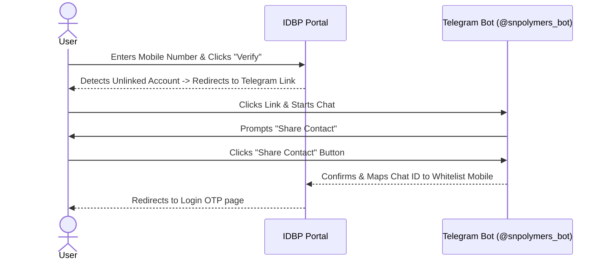
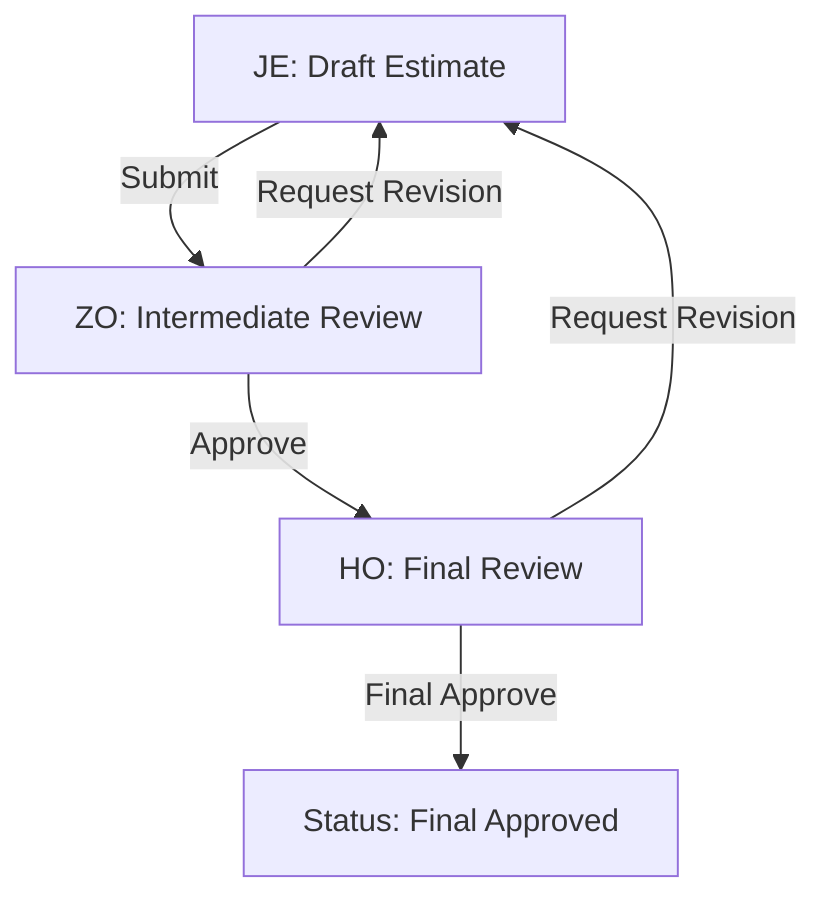

# S.N. Polymers Pvt. Ltd. — Integrated Digital Business Platform (IDBP) User Manual

Welcome to the official, comprehensive **User Manual and Operations Guide** for the **Integrated Digital Business Platform (IDBP)** of **S.N. Polymers Pvt. Ltd.** 

This manual provides complete step-by-step guidance, detailed screen references, field validation rules, and role-based workflows to help you navigate and operate the platform effectively. The software is designed to streamline infrastructure costing, daily progress tracking, material master catalogs, fund requests, payment requisitions, and sequential contractor billing, all under a highly secure, role-based security framework.

---

## Table of Contents
1. [PART I — Core Security & User Onboarding](#part-i-core-security-user-onboarding)
2. [PART II — Common Navigation & Themes](#part-ii-common-navigation-themes)
3. [PART III — Module Reference & Field Directories](#part-iii-module-reference-field-directories)
   - [1. Console Dashboard](#1-console-dashboard)
   - [2. Material Master Catalog](#2-material-master-catalog)
   - [3. Project Cost Estimates](#3-project-cost-estimates)
   - [4. Payment Requisitions (Procurement Tracking)](#4-payment-requisitions-procurement-tracking)
   - [5. Daily Work Progress Log](#5-daily-work-progress-log)
   - [6. Project Fund Requests](#6-project-fund-requests)
   - [7. Running Account (RA) & Final Bills](#7-running-account-ra-final-bills)
   - [8. Project Fund Reports](#8-project-fund-reports)
4. [PART IV — Step-by-Step Role Workflows](#part-iv-step-by-step-role-workflows)
   - [Junior Engineer (JE) Workflow](#junior-engineer-je-workflow)
   - [Zonal Office (ZO) Workflow](#zonal-office-zo-workflow)
   - [Head Office (HO) Workflow](#head-office-ho-workflow)
   - [Administrator (Admin) Workflow](#administrator-admin-workflow)
5. [PART V — Administrative Console](#part-v-administrative-console)
6. [PART VI — Troubleshooting & Frequently Asked Questions](#part-vi-troubleshooting-frequently-asked-questions)

---

## PART I — Core Security & User Onboarding

S.N. Polymers Pvt. Ltd. enforces a strict security perimeter. Direct sign-up or registration is completely disabled. To access the platform, you must follow the whitelisting and verification process detailed below.

### 1. The Whitelisting Process
Before logging in, a System Administrator must register your credentials in the platform's security whitelist. You must provide:
* **Full Name**: Used for system display and digital signature logs.
* **10-Digit Mobile Number**: Your active phone number.
* **Role**: Select one of the four active roles:
  * `je` (Junior Engineer)
  * `zo` (Zonal Office Manager)
  * `ho` (Head Office Director)
  * `admin` (System Administrator)

### 2. Setting Up the Telegram Bot Linkage (One-Time Setup)
Authentication codes are delivered via Telegram to ensure zero transmission delays and enhanced security over standard SMS.

1. Navigate to the IDBP login portal: [https://sn-polymers.vercel.app/](https://sn-polymers.vercel.app/)
2. Enter your whitelisted 10-digit mobile number and click **Verify Whitelist & Send OTP**.
3. If your account is not yet linked, the screen will display the **Telegram Setup** screen.
4. Click the link to open Telegram and search for [@snpolymers_bot](t.me/snpolymers_bot).
5. Click **Start** (or type `/start`) in the chat.
6. The bot will request your contact details. Click the **Share Contact** button in the chat menu. This allows the bot to securely verify your whitelisted mobile number.
7. Return to the web portal and proceed with your login.

### 3. Verification & Login Flow
1. Enter your mobile number on the login page. The system strips non-digit characters and automatically prefixes it with India's country code (`+91`).
2. Click **Verify Whitelist & Send OTP**.
3. Check Telegram for a message from **S.N. Polymers Bot**. You will receive a secure 6-digit numeric verification code.
4. Enter the 6-digit code on the verification screen in your browser.
5. Click **Verify Code** to access the dashboard.

> [!IMPORTANT]
> **OTP Rules & Restrictions**:
> * **Expiration**: Each OTP code is valid for exactly **5 minutes**.
> * **Attempt Lock**: You are allowed a maximum of **3 validation attempts**. If you enter an incorrect code 3 times, the OTP is invalidated. You must wait for the timer to reset or click **Resend Code** to generate a new passcode.
> * **Rate Limiting**: To prevent abuse, requests are restricted to **5 OTP codes per 15 minutes** per mobile number.

---

## PART II — Common Navigation & Themes

The portal features a modern, responsive layout that adapts to laptops, tablets, and mobile devices.

### 1. Desktop Sidebar Navigation
* **Sidebar Menu**: Located on the left side of the screen. Items are automatically filtered based on your active role.
* **Collapse Button**: Click the arrow icon (`<` or `>`) at the top of the sidebar to shrink it into icon-only mode, maximizing screen space. The sidebar state is remembered by your browser.
* **Theme Toggle**: Located at the bottom of the sidebar. You can switch between:
  * **Dark Mode**: Optimized for low-light office environments.
  * **Light Mode**: Optimized for high-visibility outdoor site visits.
* **Operator Profile Card**: Displays your active role, initials, and full name. Click the **Sign Out** button here to safely terminate your session and clear secure cookie tokens.

### 2. Mobile Header Navigation
* On mobile screens, the navigation sidebar collapses into a hidden drawer.
* Tap the **Menu Icon** (three lines) in the top-left corner of the header to open the navigation drawer.
* Quick action metrics and theme controls are accessible directly from the mobile header bar.

---

## PART III — Module Reference & Field Directories

---

### 1. Console Dashboard

The **Console Dashboard** is the landing screen upon login, presenting a visual overview of system metrics and project operations.

#### UI Controls and Features:
* **Operator Info Panel**: Confirms your whitelisted phone number, display name, and active authorization role.
* **Project Status Metric Cards**:
  * **Total Projects**: Cumulative count of whitelisted projects.
  * **Running Projects**: Active projects currently under construction.
  * **Closed / Under Maintenance**: Projects in warranty or administrative closure.
  * **Last Project Updated**: Displays the Work Order ID and time elapsed since the last modification.
* **Estimates Snapshot Card**:
  * Displays the total number of cost estimates in the system and sheets currently pending review.
  * **New Estimate Button**: Quick-launch button (hidden for ZOs and JEs, visible to Admin).
* **Recent Activity Feed**:
  * Displays a live stream of the last 4 project modifications (e.g., "Aswint approved Estimate EST-2026-042").
  * Automatically refreshes/polls the server every **30 seconds** to keep logs up-to-date.

---

### 2. Material Master Catalog

The **Material Master** serves as the central directory for materials, labor categories, transport costs, and miscellaneous services.

#### Screen Elements:
* **Debounced Search Bar**: Real-time keyword filter. Type any keyword (e.g., "Cement", "Labour"); the list filters automatically after a **400ms delay** to prevent lag on slower devices.
* **Category Filters**:
  * **Main Head Filter**: Select *Labour*, *Materials*, *Transport*, or *Miscellaneous*.
  * **Sub Head Filter**: Refines the list based on sub-category selection.
  * **Status Filter**: Toggle between *Active* and *Inactive* items (visible to Administrators only).
* **Export Button**: Click **Export to Excel** to download the filtered catalog list directly as an `.xlsx` file.

#### Material Data Grid Parameters:

| Field Name | Description | Visibility / Edit Permissions |
| :--- | :--- | :--- |
| **Material Main Head** | Primary category division (e.g., Labour, Materials). | All Roles (Read-Only) / Admin (Edit) |
| **Material Sub Head** | Sub-category of the main division (e.g., Steel, Cement, Carpenter). | All Roles (Read-Only) / Admin (Edit) |
| **Material Details** | Precise name and technical grade of the material. | All Roles (Read-Only) / Admin (Edit) |
| **Unit** | Standard Unit of Measurement (e.g., MT, Bags, Cum, Nos, Days). | All Roles (Read-Only) / Admin (Edit) |
| **Status Badge** | Green (Active) or Red (Inactive). Inactive items are hidden from new estimate drafting. | All Roles (Read-Only) / Admin (Edit) |

---

### 3. Project Cost Estimates

This module allows Junior Engineers to draft civil engineering cost estimates, which are then routed to Zonal and Head Offices for verification and approval.

#### UI Workflows:

#### A. Estimates Directory Table
Lists all system estimates with columns for Work Order Number, Auto-Generated Estimate Number, Zonal Area Code, Status Badge (color-coded by state), Gross Estimate Amount, and Action Details.
* Use the **My Sheets Sidebar** to switch between **All Sheets** and **Draft Sheets**.
* Click **New Sheet** (visible to JEs and Admins) to initialize a new estimate form.

#### B. The Estimate Drafting and Edit Form

##### 1. Project Selection & Header Block
* **Work Order Number**: Dropdown menu showing all active projects. Select a project to populate the read-only metadata block:
  * **State / District** (e.g., West Bengal / Kolkata)
  * **Area Code / Zone** (e.g., Zone 2 / ZO-04)
  * **Client Department** (e.g., PWD, Irrigation)
  * **Site Details** (Project description)
  * **Contract Value** (Maximum project budget)
* **JE Remarks**: Text box to record rate assumptions, site notes, or instructions.

##### 2. Estimate Line Items Table
Click **Add Item** to insert a new line. Enter the following parameters:

* **Main Category** (Dropdown): Select from *Labour*, *Materials*, *Transport*, or *Miscellaneous*.
* **Sub Head** (Dropdown): Cascades dynamically. Only displays sub-heads matching your selected Main Category.
* **Material Details** (Dropdown): Cascades dynamically. Displays specific materials belonging to your selected Sub Head.
* **Unit** (Read-Only Input): Automatically displays the standard unit of measurement for the selected material.
* **Quantity (Qty)** (Numeric Input): Enter the quantity needed. Must be a decimal value greater than **0.00**.
* **Rate (₹)** (Numeric Input): Enter the unit price. Must be a decimal value greater than **0.00**.
* **Rate Reference** (Text Input): Record the pricing source (e.g., "CSR 2026", "Local Quote").
* **Source of Purchase** (Dropdown): Select CC, OD, CR, or local. Disabled for JEs; only editable by ZO, HO, and Admin roles.
* **Amount (₹)** (Read-Only Metric): Automatically calculates `Quantity * Rate`.

##### 3. Form Action Buttons
* **Save as Draft**: Saves your progress without submitting it for review. JEs can reopen and edit drafts at any time.
* **Submit Estimate**: Performs final validations and submits the sheet to the Zonal Office. Once submitted, editing is locked for the JE.

> [!WARNING]
> **Revision Expiry Deadlines**:
> When a ZO or HO reviewer requests a revision, they must specify a revision reason and set a revision deadline. 
> * The system will display a live countdown timer banner at the top of the form.
> * If the countdown reaches zero, the estimate locks immediately.
> * Only a System Administrator can extend an expired revision deadline.

#### C. Review and Workflow Details Screen
Reviewers (ZO and HO) can view the submitted estimate, read individual line items, and access the **Review Panel**:
* **Remarks/Comments**: Required input when requesting a revision or rejecting a sheet.
* **Revision Deadline Picker**: Set the date and time limit for the JE to submit corrections.
* **Action Buttons**: Click **Approve**, **Reject**, or **Request Revision**.
* **Audit Trail Timeline**: Located at the bottom of the page, listing every state transition, user, comment, and timestamp for audit tracking.

---

### 4. Payment Requisitions (Procurement Tracking)

Payment Requisitions track procurement invoices against approved project budgets.

#### UI Components and Actions:
* **Project Folder View**: Projects are displayed as clickable folders. Click a folder to display its payment requisitions.
* **Requisitions Grid**: Displays Serial ID, Date, Description, Quantity, Rate, Net Amount, GST Status, and Uploaded Invoice attachment.
* **Create Requisition Button**: Opens the step-by-step requisition wizard.

#### Step-by-Step Requisition Creation Wizard:

##### Step 1: User Verification
Displays your logged-in username and the current server timestamp. Click **Next** to proceed.

##### Step 2: Project Mapping
* **Work Order No.**: Dropdown listing all active work orders with approved estimates. Select a project to display its metadata: State, District, Area Code, Department, Site Details, and Approved Estimate Limit. Click **Next** to proceed.

##### Step 3: Requisition Detail Entries
Enter the following parameters:

* **Requisition Number** (Text Input): Input your unique requisition reference.
  > [!NOTE]
  > The Requisition Number field restricts input to alphanumeric characters, hyphens, underscores, and dots (`A-Z`, `0-9`, `-`, `_`, `.`). Space character is blocked. Once you upload an invoice PDF, this field locks to prevent mismatch errors.
* **Material Main Head** (Dropdown): Select the category of expenditure.
* **Requisition Amount (₹)** (Numeric Input): Enter the invoice amount. Must be greater than **0.00**.
  * **Advisory Balance Indicator**: The wizard displays the approved Estimate Limit and remaining budget. Requisitions exceeding this balance will be blocked by the server.
* **GST Bill Included?** (Dropdown Selection): Select **Yes** or **No**.
* **Upload Requisition PDF** (File Input): Select your requisition file. Only PDF files are accepted.
* **Upload GST Invoice PDF** (File Input - visible only if GST Bill is Yes): Select the official GST invoice file. Only PDF files are accepted.
  > [!CAUTION]
  > **File Integrity Checking**: The backend validates files by inspecting their header "magic bytes" rather than relying on file extensions. Attempting to rename image files (e.g., renaming `.png` to `.pdf`) will result in upload errors.
* **Bank Details** (Text Area): Enter the payee's bank details: Name, Branch, Account Number, and IFSC Code.
* **Remarks** (Optional Text Area): Input additional notes.
* Click **Submit Requisition** to save.

---

### 5. Daily Work Progress Log

This module records daily physical work progress and visual site proofs.

#### Form Parameters & Validation:

* **Site Visit Date** (Date Selector): Select the date of the site inspection. Future dates are blocked.
* **Physical Work Progress (%)** (Numeric Input): Enter the cumulative progress percentage. Must be a value between **0.0%** and **100.0%**.
* **Work Progress Details** (Text Input): Provide a description of the work completed during the visit.
* **Site Photo Upload** (File Input): Attach photographic proof from the site.
  > [!IMPORTANT]
  > **Site Photo Rules**:
  > * A photo upload is **mandatory** for Junior Engineers to submit progress logs.
  > * Supported Formats: `.jpg`, `.jpeg`, and `.png` images.
  > * Maximum File Size: **10 MB**.
* Click **Log Progress** to save.

#### The Progress Timeline:
* Displays entries in reverse chronological order.
* Click on a site photo thumbnail to open a high-resolution image viewer.
* **Authority Evaluation Remarks**: ZOs, HOs, and Admins can append compliance remarks and evaluation notes directly onto a progress entry.

---

### 6. Project Fund Requests

This module allows Zonal Offices to request cash transfers, which are reviewed and disbursed by the Head Office.

#### UI Dashboard Components:
* **Disbursement Analytics Panel**:
  * **Status Chart**: Pie chart displaying the ratio of Pending, Approved, and On Hold requests.
  * **Disbursement Balances**: Bar chart displaying remaining credit limits across S.N. Polymers' active accounts: Credit Control (CC), Overdraft (OD), and Cash Credit (CR).
  * **Metrics Header**: Summarizes Total Requested, Total Approved, and Total Pending funds.
* **Quick Filters Sidebar**:
  * Filter by **My Requests**, **Pending Only**, **Approved This Month**, **On Hold**, or **Large Amount** (> ₹5,00,000).
* **Create Request Button**: Opens the request window.

#### Fund Request Form Parameters:
* **Target Project**: Dropdown list of running projects.
* **Request Reference Number**: Text input for the request identifier.
* **Amount Requested (₹)**: Numeric value. Must be greater than **0.00**.
* **Zonal Remarks**: Enter the purpose of the funds.

#### Review and Approval Actions (HO & Admin):
1. Click a request in the directory table to open the detailed panel.
2. Select the funding source:
   * **CC** (Credit Control)
   * **OD** (Overdraft)
   * **CR** (Cash Credit)
3. Enter **HO Remarks**.
4. Click **Approve** to release funds or **Place on Hold** to pause the request.

---

### 7. Running Account (RA) & Final Bills

This module tracks contractor payments and running accounts.

#### UI Panels:
* **Sequential Invoice Table**: Lists projects and their billing history. Select a project to view its billing timeline.
* **Create Bill Button**: Opens the billing form.
* **Live Summary Ledger**: Displays project financials: Total Work Order Value, Previous Bill Cumulative Amount, Current Bill Amount, Total Billed, and remaining Balance.

#### Billing Entry Parameters:

* **Work Order No** (Dropdown): Select the target project. Disabled for closed projects.
* **Type of Payment** (Dropdown): Select the billing step (e.g., RA Bill 1, RA Bill 2, ..., Final Bill).
  > [!IMPORTANT]
  > **Sequential Billing Rule**: The system enforces sequential billing. You cannot submit Bill $N$ unless Bill $N-1$ has been registered in the database.
* **Bill Date** (Date Selector): Date of billing.
* **Bill No** (Text Input): Input the bill reference.
* **Gross Bill (Field 1)** (Numeric Input): Enter the gross billing amount.
* **Breakdown Deduction Fields** (All fields are optional; blank fields default to 0):
  * *Agency Payment*
  * *Security Deposit Amt*
  * *Special Security Amt*
  * *Other Retention*
  * *IT TDS*
  * *SGST*
  * *CGST*
  * *SD*
* **Signed Copy Upload** (File Input): Attach the signed billing document (PDF, PNG, or JPG).
* **Remarks** (Text Input): Input notes.

#### Live Breakdown Validation Banner:
When entering breakdown values, the system displays a validation banner verifying:
$$\text{Gross Bill} = \text{Sum of the 8 Breakdown Fields}$$
* **Green (Match)**: The values match, and the bill can be submitted.
* **Red (Mismatch)**: Displays a mismatch error showing the gross bill and breakdown sum. The submit button is disabled until the mismatch is resolved.

> [!CAUTION]
> **Financial Record Immutability**:
> Once submitted, billing records are **immutable**. Triggers block all edit, update, or delete attempts on the database, including requests from Administrators. Double-check all billing entries before submitting.

---

### 8. Project Fund Reports

This module tracks and manages actual financial disbursement records linked directly to project work orders.

#### UI Controls and Features:
* **Active vs. Deleted Tabs**: Toggle between the active disbursements list and a soft-deleted archive (visible to Administrators only).
* **Project Info Auto-Fill Card**: Selecting a Work Order Number automatically loads project metadata from Master Data (Estimate No., Site Details, State, District, Zone, Department, and status).
* **Search and Filter**: Real-time keyword filter by work order, location details, or remarks.
* **Refreshed Stats Header**: Summarizes Total Disbursed amount (in INR), Active Reports, Running Projects count, and Closed Projects count.

#### Fund Report Form Parameters:
* **Work Order Number**: The alphanumeric work order identifier mapping the report to a project.
* **Disbursed Amount (₹)**: Numeric value. Must be a finite, positive decimal.
* **Payment Remarks / Reference**: Detailed transaction info (e.g., RTGS/NEFT transaction code, date, vendor details).

#### Review, Soft-Delete, and Restore Actions:
* **Edit Report**: Modify the disbursed amount and remarks for active records.
* **Soft-Delete (Admin Only)**: Soft-delete active reports. Deleted reports are moved to the "Deleted" tab.
* **Restore (Admin Only)**: Instantly restore a soft-deleted report, moving it back to the active list.

> [!CAUTION]
> **Project Closure Lock (Mutability Gate)**:
> If a project's status in the Master Data is marked as **Closed**, all linked fund reports become completely **immutable**. 
> * The system blocks any attempts to create new reports, edit details, soft-delete, or restore existing reports for that project.
> * A warning banner displays on the UI if users open details for a closed project, and backend guards enforce this restriction with a `403 Forbidden` response.

---

## PART IV — Step-by-Step Role Workflows

---

### Junior Engineer (JE) Workflow
*Goal: Initialize a project budget, log daily progress, and log material invoices.*

1. **Access the Portal**: Enter your mobile number on the login page, retrieve the OTP code from the [@snpolymers_bot](t.me/snpolymers_bot), and log in.
2. **Draft a Cost Estimate**:
   * Go to **Cost Estimates**, click **New Sheet**, and select the project's Work Order.
   * Add estimate lines. Select category, sub-head, details, enter quantities and rates, and reference the pricing source.
   * Click **Save as Draft** if you need to complete the estimate later.
   * Click **Submit Estimate** when finished. The sheet status changes to `ZO Review` and editing locks.
3. **Handle Revisions**:
   * If a revision is requested, open the estimate and look for items highlighted in orange.
   * Correct the flagged items and resubmit the sheet before the countdown timer expires.
4. **Log Daily Progress**:
   * Go to **Daily Work Progress**, select your project folder, and click **Log Progress Entry**.
   * Select the date, slide progress from 0 to 100%, write a description of the day's achievements, upload a site photo, and click **Log Progress**.
5. **Submit Invoices (Payment Requisitions)**:
   * Go to **Payment Requisitions**, select your project folder, click **Create Requisition**, and complete the 3-step wizard.
   * Enter the requisition number, main category, amount, select GST options, upload the invoice PDFs, enter bank details, and click **Submit Requisition**.
6. **Submit Disbursement Reports (Fund Reports)**:
   * Navigate directly to **Fund Reports** (at `/fund-reports`) to log disbursements.
   * Select the target project to auto-fill details, input the disbursed amount, specify NEFT/RTGS transaction reference remarks, and submit the report.

---

### Zonal Office (ZO) Workflow
*Goal: Review estimates, request zonal funds, and submit sequential bills.*

1. **Review Project Budgets**:
   * Go to **Cost Estimates** and select estimates marked `ZO Review`.
   * Review the line items. Check purchase sources and rate assumptions.
   * Select **Approve** to forward the estimate to the HO, or click **Request Revision** (requires comments and setting a revision deadline) to return it to the JE.
2. **Submit Fund Requests**:
   * Go to **Fund Requests** and click **New Request**.
   * Select the target project, enter a reference number, input the amount needed, describe the purpose, and click **Submit Request**.
3. **Register Project Billing**:
   * Open **RA & Final Bills**, select the project, and click **Create Bill**.
   * Select the next sequential bill index, enter dates, the bill reference, and gross amount.
   * Input any deductions and check that the validation banner displays a green **Match** status.
   * Upload the signed billing copy and click **Submit Bill**.
4. **Submit Disbursement Reports (Fund Reports)**:
   * Access `/fund-reports` to create transaction logs for zonal disbursements.
   * Select the work order number, fill in the amount, add transaction/remarks details, and submit.

---

### Head Office (HO) Workflow
*Goal: Finalize estimate sheets, review regional fund requests, and authorize payments.*

1. **Finalize Cost Estimates**:
   * Open **Cost Estimates** and set the queue toggle to **Active Queue** to see sheets marked `HO Review`.
   * Review the details. Select **Final Approved** to activate the estimate, or select **Request Revision** to return it.
2. **Disburse Project Funds**:
   * Open **Fund Requests** and click on a request marked `Pending`.
   * Select the funding source account: **CC** (Credit Control), **OD** (Overdraft), or **CR** (Cash Credit).
   * Enter **HO Remarks** and click **Approve** to release the funds.
3. **Monitor Project Portals**:
   * Open **Daily Progress** to view daily logs, inspect site photos, and append remarks.
   * Open **RA & Final Bills** to monitor project ledgers and download signed copies of bills.
4. **Audit and Submit Fund Reports**:
   * Navigate to `/fund-reports` to inspect the list of active disbursements or enter new executive disbursement entries for work orders.

---

### Administrator (Admin) Workflow
*Goal: Manage users, whitelist credentials, and monitor system compliance.*

1. **Manage Access Whitelist**:
   * Open the **Admin Panel** in the sidebar and select **Access Whitelist**.
   * Click **Add User** to whitelist new credentials. Enter the name, E.164 phone number, select their role, and click **Save**.
   * Click **Edit** next to an entry to update roles or toggle active status.
     > [!IMPORTANT]
     > **Deactivation Security**: Deactivating a user automatically terminates their active session, logging them out of the platform.
   * Use **Reset Telegram** to clear the chat ID webhook if a user changes their mobile device.
2. **User Deletion Safety Checks**:
   * The platform blocks user deletion if the user is linked to active records:
     * Has drafted or submitted cost estimates.
     * Has pending fund requests.
     * Has pending payment requisitions.
     * Has logged daily progress reports or approved progress evaluations.
   * Deactivate the user instead of deleting to preserve audit history.
3. **Maintain Master Catalog Data**:
   * Navigate to **Master Data** under the Admin menu.
   * Maintain category classifications, sub-heads, and units. Disable discontinued items so they cannot be selected in new estimates.
4. **Monitor System Auditing Logs**:
   * Navigate to the **Audit Trail Logs** console.
   * Filter logs by operator, date range, or action type (e.g., login, estimate approval, fund release) to review platform activity.
5. **Manage Project Fund Reports**:
   * Navigate to `/fund-reports` to oversee active and soft-deleted reports. 
   * Admins can update active reports, soft-delete records, toggle the **Deleted** tab to view deleted entries, and restore items.

---

## PART V — Administrative Console

The Administrative Console is visible only to users logged in with the `admin` role.

### 1. Access Whitelist Management
* **Add User Modal**: Enter the user's name, mobile number, and role.
* **Edit User Modal**: Update details or toggle active status.
* **Reset Telegram Webhook**: Clears the mapped Chat ID. Use this if a user changes their phone number or needs to reconnect to the Telegram bot.

### 2. Purchase Options Manager
* Maintain the database of approved vendors and funding accounts.
* Add or edit supplier source names.

### 3. System Audit Trail Logs
* Tracks every critical action in the system, including logins, estimate approvals, billing submissions, and admin changes.
* Search logs by operator name, action type, or date range.

---

## PART VI — Troubleshooting & Frequently Asked Questions

### Q: I did not receive my login OTP in Telegram.
1. Check that you entered your mobile number correctly on the login page.
2. Confirm with your Administrator that your mobile number is whitelisted and active.
3. Open Telegram and search for [@snpolymers_bot](t.me/snpolymers_bot). Send a `/start` message to verify the connection.
4. If you recently changed your device, contact your Administrator to click **Reset Telegram** on your whitelist entry.

### Q: The system says "Access Denied: Registered whitelisted credentials required."
Your mobile number is not registered in the system whitelist. Contact your Administrator to add your details.

### Q: Why can't I edit my Cost Estimate sheet?
Cost estimates are locked once submitted. If you need to make changes, contact a ZO or HO reviewer and request a revision.

### Q: Why is my estimate revision locked?
Your revision deadline has expired. Contact your Zonal Office or an Administrator to extend the deadline.

### Q: Why was my file upload rejected?
The server validates file headers. Ensure you are uploading a clean, uncorrupted PDF, PNG, or JPG file. Other file types are blocked.

### Q: Why can't I create a new RA Bill?
The system enforces sequential billing. You cannot create Bill $N$ unless Bill $N-1$ has been logged and completed.

### Q: Why can't the Admin delete a user?
The system blocks user deletion if the user is linked to active records. Deactivate the user instead to preserve audit history.

---
