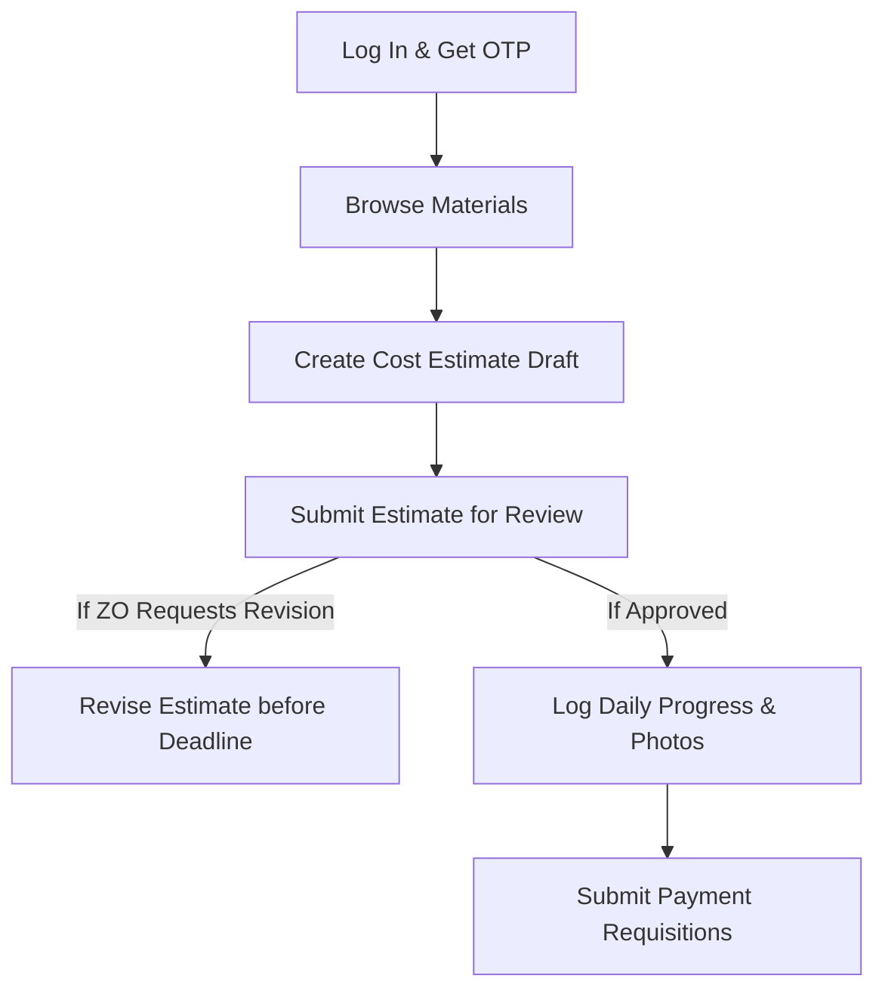
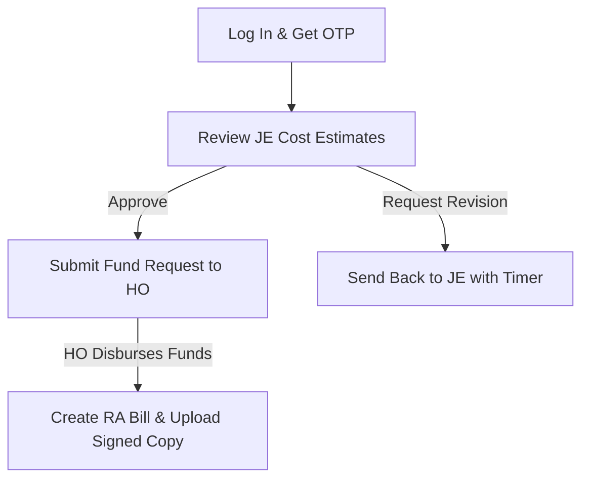
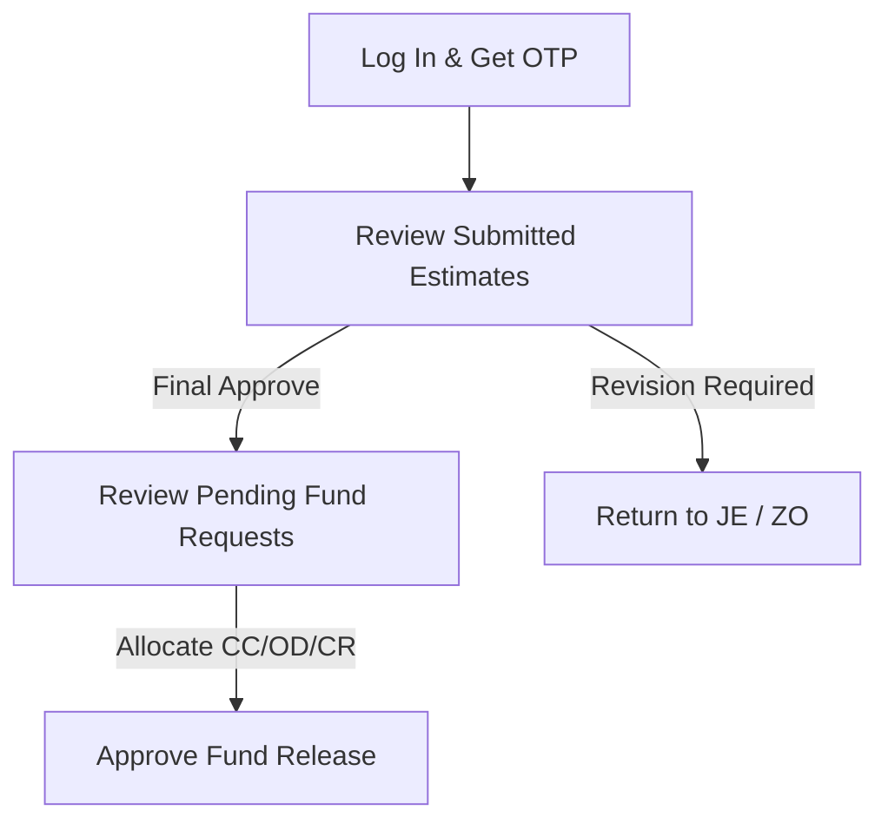
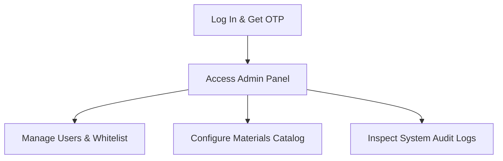

# S.N. Polymers Pvt. Ltd. — User Manual

This manual provides a detailed operational reference for the Integrated Digital Business Platform (IDBP) of **S.N. Polymers Pvt. Ltd.** It covers all user interfaces, field parameters, workflow processes, and administrative controls.

---

## PART I — Getting Started

### 1. Whitelisting and System Access
S.N. Polymers Pvt. Ltd. enforces a strict whitelisting security protocol. No user can register an account directly. Your mobile number must be registered by a System Administrator.

* **Authorization Process**: Contact your System Administrator to register your name, 10-digit mobile number, and specific organizational role.
* **Authentication Screen**: 
  1. Navigate to the IDBP URL: [https://sn-polymers.vercel.app/](https://sn-polymers.vercel.app/)
  2. Input your 10-digit mobile number.
  3. The system automatically formats your input, stripping non-digit characters and prepending the international country code `+91`.
  4. Click **Verify Whitelist & Send OTP**.

*Placeholder: Portal Login Screen showing Mobile Number field and "Verify Whitelist & Send OTP" button.*

### 2. Multi-Factor Authentication via Telegram OTP Bot
The platform delivers one-time passcodes (OTP) directly to your secure Telegram account via [@snpolymers_bot](t.me/snpolymers_bot).

* **Linking Telegram (First Login)**:
  * If your mobile number is whitelisted but not yet linked to the Telegram Bot, you will be redirected to the **Telegram Setup** page.
  * Click the provided link to open Telegram and start a chat with [@snpolymers_bot](t.me/snpolymers_bot).
  * Click **Start**, and click **Share Contact** when requested by the bot. This maps your active Telegram account ID to your whitelisted mobile number.
  * Once the link is established, return to the login screen.
* **Logging In with OTP**:
  * An OTP is sent to your Telegram chat. The code is a 6-digit numeric passcode valid for **5 minutes**.
  * Enter the code into the verification boxes on screen and click **Verify Code**.
  * If the code expires, click the **Resend Code** link to generate a new passcode.

*Placeholder: OTP Code entry page showing numeric input boxes and countdown timer.*

---

## PART II — Navigation & User Interface

The platform is designed to adapt automatically to any screen size (laptops, tablets, or mobile phones) and supports customizable viewing themes.

### 1. The Navigation Sidebar (Desktop)
* **Collapse Button**: Click the collapse arrow icon (`<` or `>`) at the top of the sidebar to shrink the navigation menu into compact icons, maximizing screen space. The collapse state is stored in your browser's local memory.
* **Dynamic Menu Items**: The sidebar automatically filters out pages that your role is not authorized to access.
* **Theme Mode Switcher**: Toggles the interface between **Dark Mode** (optimized for low-light office environments) and **Light Mode** (optimized for outdoor site visits under direct sunlight).
* **Sign Out**: The bottom panel displays your profile initial, display name, and active role. Click **Sign Out** to securely clear your authentication token.

### 2. The Mobile Header Navigation
* On mobile screens, the sidebar collapses into a compact hidden drawer.
* Tap the menu icon in the upper-left corner of the mobile header to open the drawer.
* Quick-access buttons for the **Console Dashboard** and **Admin Panel** are displayed in the header based on your permissions.

---

## PART III — Module Reference

### 1. Console Dashboard

The **Console Dashboard** is the home landing screen upon logging in.

*Placeholder: Main Dashboard Interface highlighting the navigation sidebar and key metric cards.*

#### UI Components & Actions:
* **Operator Information Card**: Lists your whitelisted mobile number and active system role.
* **Project Operations Overview**:
  * **Total Projects**: Total whitelisted projects in the system.
  * **Running**: Count of active construction projects.
  * **Closed / Under Maintenance**: Projects in administrative closure or warranty periods.
  * **Last Project Updated**: Displays the work order ID and elapsed time since the last update.
* **Estimates Overview**:
  * Displays the total cost estimate records and the count of sheets currently pending review.
  * Includes a **New Estimate** quick-launch button (for JEs and Admins).
* **Recent Activity Feed**:
  * A live log displaying the last 4 project-related actions (e.g., "Aswint closed BH_BEG_505").
  * Automatically polls the backend server every **30 seconds** to display live operational logs.

---

### 2. Material Master

The **Material Master** is our centralized catalog of construction materials, tools, and labor categories.

*Placeholder: Material Master Screen showing filtering controls, data table, and Excel export button.*

#### UI Components & Actions:
* **Search Input**: Debounced by **400ms** to prevent sluggishness. Type any keyword (e.g., "Cement") to filter the catalog.
* **Filtering Dropdowns**: 
  * **Main Category**: Select from primary heads like *Labour*, *Materials*, *Transport*, or *Miscellaneous*.
  * **Sub Head**: Filters by specific sub-categories.
  * **Status Filter**: Toggle between *Active* and *Inactive* catalog items (visible only to Administrators; standard users only see active materials).
* **Export to Excel Button**: Downloads the filtered material database directly as an `.xlsx` file.
* **Material Data Grid**: Lists:
  * Material Main Head / Sub Head
  * Material Details (Standard name and grade)
  * Unit of Measurement (e.g., MT, Bags, Cum, Nos, Days)
  * Active/Inactive Status indicator badge
* **Create/Edit Material Modal (Admin Only)**:
  * **Material Main Head**: Select or define primary category.
  * **Material Sub Head**: Select or define sub-category.
  * **Material Details**: Enter precise material name.
  * **Unit**: Select standard unit of measurement.
  * **Active Status Checkbox**: Check to make the material selectable in estimate forms.

---

### 3. Cost Estimates

The **Cost Estimates** module is used to draft, submit, review, and approve civil engineering budgets for whitelisted projects.

*Placeholder: Cost Estimates List Screen showing stats headers, active queue tabs, and filter controls.*

#### A. Estimates List Page
* **Status Metrics Header**: Quick counters displaying Total Estimates, Active Queue, and Submitted Sheets.
* **My Sheets Sidebar**: Toggles the display between **All Sheets** and **Draft Sheets**.
* **New Sheet Button**: (Visible to JEs and Admins) Initializes a new budget sheet.
* **Estimates Directory Table**: Grid display showing Work Order No, Estimate No (generated automatically upon submission), Area Code, Status Badge (color-coded by state), Gross Estimate Amount, and Action Details button.
* **Filters Toolbar**: Filter by Work Order number, Estimate number, or Status.

#### B. Estimate Creation / Edit Form (JE Console)
This form supports cascading dropdown menus to prevent input errors:

*Placeholder: Cost Estimate Form Page showing project header, interactive items grid, and total footer.*

1. **Work Order Number**: Select the target project from the whitelisted dropdown.
2. **Project Metadata Panel**: Automatically populates details like State, District, Zone, Client Department, Site Details, and contract Value.
3. **JE Remarks**: Text area for rate assumptions, comments, or special notes.
4. **Line Items Grid Table**:
   * **Main Category**: Select primary category (Labour, Materials, etc.).
   * **Sub Head**: Populates dynamically based on the Main Category.
   * **Material Details**: Populates dynamically based on the Sub Head.
   * **Unit**: Fills automatically based on the selected material (read-only).
   * **Quantity (Qty)**: Input field. Must be a positive decimal.
   * **Rate (₹)**: Input field. Enter unit rate.
   * **Rate Reference**: Text input (e.g., "CSR 2026", "Market Rate").
   * **Source of Purchase**: Dropdown (CC, OD, CR, local). Non-editable for JE/Staff.
   * **Amount**: Auto-calculates `Qty × Rate`.
   * **Remove Button**: Trashcan icon deletes the line item.
5. **Gross Estimate Total**: A large display in the footer showing the sum of all item amounts.
6. **Form Action Controls**:
   * **Save as Draft**: Saves entries without initiating review. Highly recommended for long lists.
   * **Submit Estimate**: Submits the budget for review. The sheet is locked for editing once submitted.

> [!IMPORTANT]
> **Revision Expiry Deadlines**: If a Zonal or Head Office reviewer requests a revision, the form displays a live countdown banner. If the deadline expires, the sheet automatically locks for editing. Only an Administrator can extend the deadline.

#### C. Estimate View & Workflow Details
* Displays the complete itemized cost sheet and a full **Audit and Revision History Timeline** at the bottom.
* **ZO Review Actions**: *Approve*, *Reject*, or *Request Revision* (requires remarks and setting a revision deadline).
* **HO Final Approval**: Shows final authorization buttons to change status to *Final Approved* or request revisions.

---

### 4. Payment Requisitions

Payment Requisitions track operational procurement against active projects.

*Placeholder: Payment Requisitions Screen showing project folders, invoices list, and upload panel.*

#### UI Components & Actions:
* **Project Folder Grid**: Click on a project folder to filter and display only its payment requisitions.
* **Requisition Data Table**:
  * Lists Requisition Serial ID, Date, Description, Quantity, Rate, Net Amount, and Invoice Copy.
  * **GST Declared Badge**: Displays GST status.
* **Create Requisition Panel**:
  * **Material Category / Head**: Select from whitelisted heads.
  * **Invoice Number / Reference**: Enter vendor invoice details.
  * **Quantity & Rate**: Net amounts are calculated automatically.
  * **GST Option**: Checkbox to declare if GST is included.
  * **Attachment Upload**: Click to upload an invoice copy (PDF, PNG, or JPG).
    > [!WARNING]
    > **Upload Validation**: The server inspects the file contents. Altered extensions or unsupported document types will be rejected.
* **Budget Constraint Enforcements**:
  * Requisition amounts are checked against the project's remaining estimate balance.
  * The system will block submissions that exceed remaining project funds.
* **Delete Requisition (Admin Only)**: Administrators can delete requisitions to adjust project balances.

---

### 5. Daily Work Progress

This module is used to record daily physical progress and attach photographic proof.

*Placeholder: Daily Progress Screen showing progress timeline log, photo uploader, and remarks section.*

#### UI Components & Actions:
* **Navigation Tabs**:
  * **Dashboard**: Displays a visual summary of recent site reports.
  * **Directory**: Lists all projects with quick search by Work Order, Zonal Office, or Department.
* **Log Progress Entry (JE Only)**:
  * **Site Visit Date**: Date selector.
  * **Work Progress Details**: Text area describing today's accomplishments.
  * **Physical Work Progress (%)**: Enter the cumulative completion percentage.
  * **Site Photo Upload**: Select an image file. A photo is required for submission.
* **Report Timeline Log**: Displays site logs in reverse chronological order, including logged progress %, site photos, and authority remarks.
* **Site Photo Viewer**: Click any site photo thumbnail to open a high-resolution viewer.
* **Authority Evaluation Remarks (ZO / HO / Admin)**:
  * Allows reviewers to append remarks and compliance notes to any progress entry.

---

### 6. Fund Requests

The Zonal Office uses this module to request project funds, which are then reviewed and disbursed by the Head Office.

*Placeholder: Fund Requests Screen showing status metrics, balance charts, and request table.*

#### UI Components & Actions:
* **Status Metrics Header**: Key figures showing Total Requested, Approved, and Pending funds.
* **Visual Charts Panel**:
  * **Status Chart**: Pie chart displaying the ratio of Pending, Approved, and On Hold requests.
  * **Disbursement Balances**: Bar chart showing remaining balances across Credit Control (CC), Overdraft (OD), and Cash Credit (CR) accounts.
* **Fund Requests Directory Table**: Lists Request ID, Project, Amount Requested, Status Badge, Date, and Actions.
* **Quick Filters Sidebar**:
  * Filter by **My Requests** (created by you), **Pending Only**, **Approved This Month**, **On Hold**, or **Large Amount** (> ₹5,00,000).
  * Lists recent financial activities.
* **Create Fund Request Form**:
  * Select target project, enter request number, input amount, and add Zonal Remarks.
* **Review & Disbursement Action (HO & Admin)**:
  * Click any request to open the detailed panel.
  * Reviewers can select the funding source (**CC**, **OD**, or **CR**) and click **Approve** or **Place on Hold**.

---

### 7. RA & Final Bills

Tracks sequential contractor billing and running accounts.

*Placeholder: RA / Final Bills Spreadsheet Screen showing live project balance ledger and bills history list.*

#### UI Components & Actions:
* **Live Summary Ledger Card**:
  * Displays: **Previous Bill Cumulative Amount**, **Current Bill Amount**, **Total Billed to Date**, and **Remaining Balance**.
* **Billing Directory Tab**:
  * Lists projects with search and filter controls. Select a project to view its billing history.
* **Create Bill Panel (ZO & Admin)**:
  * Select **RA Bill** or **Final Bill**.
  * Input measurements and net bill values.
  * **File Upload**: Upload the signed copy of the bill.
* **System Safeguards**:
  * **Sequential Billing**: The system blocks Bill $N$ if Bill $N-1$ is missing.
  * **Immutable Database Records**: Once saved, billing logs cannot be edited or deleted by any user profile (including Administrators) to prevent financial audits from being modified.

---

## PART IV — Step-by-Step Role Workflows

### 1. Junior Engineer (JE) Workflow
*Goal: Initialize a project budget, log daily progress, and request materials.*

1. Log in and retrieve your OTP from the [@snpolymers_bot](t.me/snpolymers_bot).
2. Go to **Cost Estimates**, click **New Sheet**, select the Work Order, add items, and click **Submit Estimate**.
3. If a revision is requested, open the estimate, update the lines highlighted in orange, and resubmit before the countdown timer expires.
4. Once the estimate is approved, log your progress daily on the **Daily Work Progress** screen, and upload a site photo.
5. Create **Payment Requisitions** as vendor invoices arrive, uploading file copies.

---

### 2. Zonal Office (ZO) Workflow
*Goal: Review estimates, request local project funds, and create billing records.*

1. Log in and go to **Cost Estimates** to review pending sheets.
2. Click **Approve** to forward the estimate to the Head Office, or click **Request Revision** to send it back to the JE with a revision deadline.
3. Once work begins, go to **Fund Requests**, click **New Request**, enter the amount, and submit it for HO approval.
4. When work stages are completed, open **RA / Final Bills**, select the project, enter the bill measurements, upload the signed copy, and submit the record.

---

### 3. Head Office (HO) Workflow
*Goal: Finalize estimate sheets, review regional fund requests, and authorize payments.*

1. Log in and check your **Active Queue** under **Cost Estimates**. Review and click **Final Approved**.
2. Go to **Fund Requests**, review pending items, select a funding source account (CC, OD, or CR), and click **Approve** to release the funds.
3. Monitor daily progress logs, photos, and RA billing history across zones.

---

### 4. Administrator (Admin) Workflow
*Goal: Manage users, catalog whitelists, and monitor system security logs.*

1. Log in and go to the **Admin Panel** in the sidebar.
2. **Access Whitelist**: Add new employees, update active status, or click **Reset Telegram** if a user changes their mobile device.
3. **Master Data**: Maintain the material categories and unit structures used in estimate forms.
4. **Audit Trail Logs**: Review audit records to track system actions.

---

## PART V — System Administration

Administrative options are accessible only to the `admin` role.

*Placeholder: Admin panel Whitelist table showing users, roles, and action buttons.*

### 1. Access Whitelist Management
* **Add User Modal**: Input user name, mobile number, and select their role.
* **Edit User Modal**: Update display names, roles, or toggle active status. Deactivating a user instantly terminates their active session.
* **Reset Telegram Webhook**: Use this button if a user changes their phone number or needs to reconnect to the Telegram bot.

### 2. Purchase Options Manager
* Manage the list of authorized vendors and funding accounts.
* Add or edit supplier source names.

### 3. Audit Trail Logs
* Tracks every critical action in the system, including logins, estimate approvals, billing submissions, and admin changes.
* Search by operator name or action type, and filter by date range.

---

## PART VI — Troubleshooting & FAQs

### Q: I did not receive my login OTP in Telegram.
1. Make sure you entered your mobile number correctly on the login screen.
2. Confirm with your Administrator that your mobile number is whitelisted.
3. Open Telegram and search for [@snpolymers_bot](t.me/snpolymers_bot). Type `/start` to verify the connection.

### Q: The system says "Access Denied: Registered whitelisted credentials required."
Your mobile number is not registered in the system whitelist. Contact your Administrator to add your details.

### Q: Why can't I edit my Cost Estimate sheet?
Cost estimates are locked once submitted. If you need to make changes, contact a ZO or HO reviewer and request a revision.

### Q: Why is my estimate revision locked?
Your revision deadline has expired. Contact your Zonal Office or an Administrator to extend the deadline.

### Q: Why was my file upload rejected?
The server validates the file contents. Make sure you upload a clean, uncorrupted PDF, PNG, or JPG file. Other file types are blocked.

### Q: Why can't I create a new RA Bill?
The system enforces sequential billing. You cannot create Bill $N$ unless Bill $N-1$ has been logged and completed.
