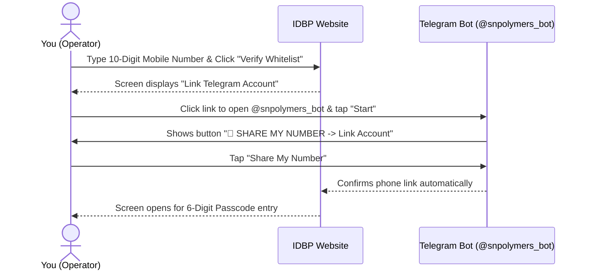
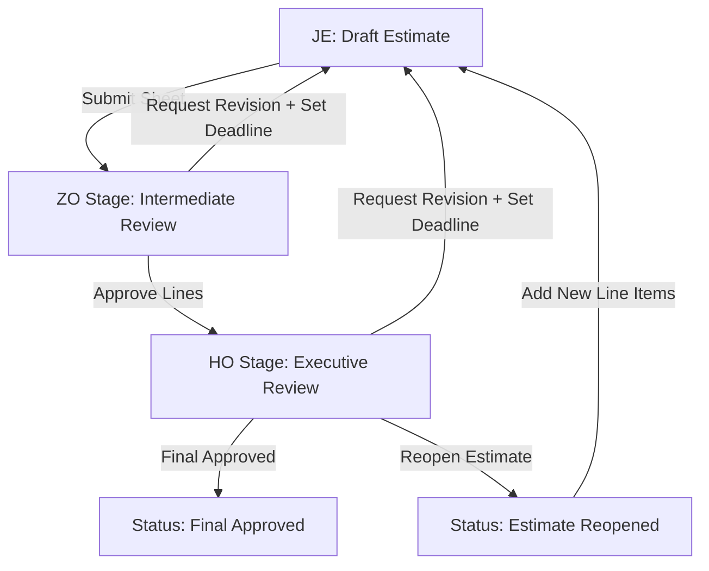
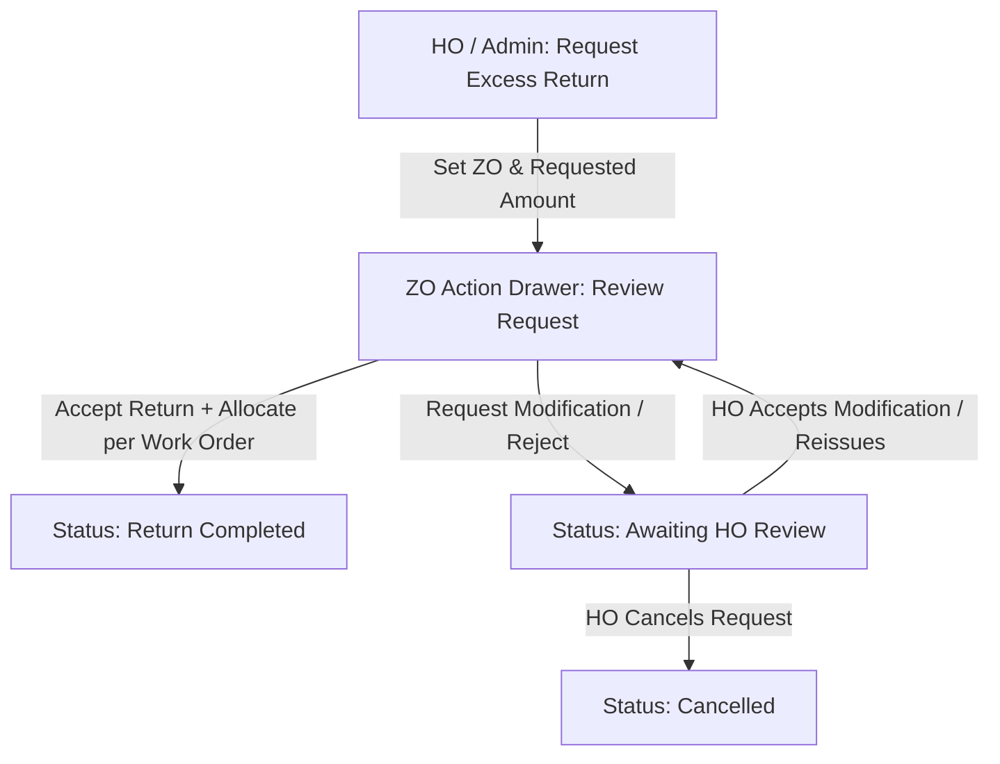

# S.N. Polymers Pvt. Ltd. — Integrated Digital Business Platform (IDBP) User Manual & Operations Guide
**Project Development Team:** Shreyan Ghosh, Aswint Guha, Aryak Pal

Welcome to the official **User Manual and Operations Guide** for the **Integrated Digital Business Platform (IDBP)** of **S.N. Polymers Pvt. Ltd.**

Developed and engineered by **Shreyan Ghosh**, **Aswint Guha**, and **Aryak Pal**, this manual is written in clear, simple language so that everyone—from site Junior Engineers to Zonal Managers, Head Office Directors, and System Administrators—can easily navigate and operate every feature of the platform.

---

## Acknowledgement

We express our sincere gratitude to the management and executive leadership at **S.N. Polymers Pvt. Ltd.** for their invaluable support, operational insights, and active guidance throughout the architectural design, development, security hardening, and field testing phases of the Integrated Digital Business Platform (IDBP). We also extend our appreciation to all site engineers, zonal managers, and administrative staff whose real-world feedback helped shape this platform into an enterprise-grade digital solution for modern construction and chemical project engineering.

---

## Table of Contents
1. [PART I — Getting Started & Logging In](#part-i--getting-started--logging-in)
2. [PART II — Top Navigation Bar, Sidebar & Themes](#part-ii--top-navigation-bar-sidebar--themes)
3. [PART III — Step-by-Step Module Reference](#part-iii--step-by-step-module-reference)
   - [1. Dashboard Console (Role-Based Views)](#1-dashboard-console-role-based-views)
   - [2. Material Master Catalog](#2-material-master-catalog)
   - [3. User & Work Order Mappings (Team & Site Assignment)](#3-user--work-order-mappings-team--site-assignment)
   - [4. Project Cost Estimates](#4-project-cost-estimates)
   - [5. Payment Requisitions (Bills & Invoices)](#5-payment-requisitions-bills--invoices)
   - [6. Daily Work Progress Log](#6-daily-work-progress-log)
   - [7. Project Fund Requests](#7-project-fund-requests)
   - [8. Zonal Office Credit Control & Balances](#8-zonal-office-credit-control--balances)
   - [9. Excess Fund Returns](#9-excess-fund-returns)
   - [10. Running Account (RA) & Final Bills](#10-running-account-ra--final-bills)
   - [11. Project Fund Reports](#11-project-fund-reports)
4. [PART IV — Step-by-Step Role Workflows](#part-iv--step-by-step-role-workflows)
   - [Junior Engineer (JE) Guide](#junior-engineer-je-guide)
   - [Zonal Office (ZO) Manager Guide](#zonal-office-zo-manager-guide)
   - [Head Office (HO) Executive Guide](#head-office-ho-executive-guide)
   - [System Administrator (Admin) Guide](#system-administrator-admin-guide)
5. [PART V — Administrative Control Center](#part-v--administrative-control-center)
6. [PART VI — Frequently Asked Questions & Troubleshooting](#part-vi--frequently-asked-questions--troubleshooting)

---

## PART I — Getting Started & Logging In

To protect project data and financial integrity, **unverified self-registration is disabled**. Your account must be approved and whitelisted by a System Administrator before you can log in.

### 1. Step 1: Whitelisting by the Administrator
Before your first login, inform your System Administrator. The Administrator will register:
* **Your Full Name**: Printed on all official reports and approval logs.
* **Your 10-Digit Mobile Number**: Used to log into the platform.
* **Your System Role**: Determines which modules and action buttons are visible to you:
  * `je` — Junior Engineer (Site Inspector / Field Officer)
  * `zo` — Zonal Office Manager (Regional Reviewer & Credit Control Manager)
  * `ho` — Head Office Executive / Director (Final Approver & Financial Disburser)
  * `admin` — System Administrator (System Control & Whitelist Manager)

---

### 2. Step 2: Connecting Telegram for Security Passcodes
Login passcodes (OTPs) are delivered instantly to your phone via **Telegram** (`@snpolymers_bot`) to avoid mobile SMS network delays.

**How to link Telegram for the first time:**
1. Open the portal: [https://sn-polymers.vercel.app/](https://sn-polymers.vercel.app/)
2. Type your whitelisted 10-digit mobile number and click **Verify Whitelist & Send OTP**.
3. If your account is not yet linked, the screen displays **Telegram Account Linkage**.
4. Click the blue link to launch Telegram and open [@snpolymers_bot](https://t.me/snpolymers_bot).
5. Tap **Start** (or type `/start`) at the bottom of the chat.
6. A button will appear at the bottom: `📲 SHARE MY NUMBER -> Link Account`. Tap this button.
7. Telegram will ask for confirmation. Tap **Share**.
8. Return to your web browser. You are now ready to receive passcodes!

---

### 3. Step 3: Logging In with Your Passcode
1. Enter your mobile number on the login page (the `+91` prefix is added automatically).
2. Click **Verify Whitelist & Send OTP**.
3. Open Telegram and check for a message from **S.N. Polymers Bot**. You will receive a **6-digit passcode**.
4. Type the 6-digit passcode into the boxes on your screen.
5. Click **Verify Code** to enter your dashboard.

> [!IMPORTANT]
> **Passcode Security Rules**:
> * **Time Limit**: Passcodes expire after **5 minutes**. Click **Resend Code** if your code expires.
> * **3 Attempts Only**: Typing an incorrect passcode 3 times invalidates it for security reasons.
> * **Rate Limit**: Maximum of 5 passcode requests per 15-minute window.

---

## PART II — Top Navigation Bar, Sidebar & Themes

The platform features a modern, responsive interface designed for desktop computers, tablets, and rugged field mobile devices.

### 1. Top Dock Navigation Bar (Macro-Modules)

Located at the top center of the screen on desktop displays, the interactive Dock Bar provides one-click access to the platform's core functional areas:

* **Overview**: Takes you to your home [Dashboard](#1-dashboard-console-role-based-views) and personal Profile page.
* **Projects**: Quick access to [Cost Estimates](#4-project-cost-estimates), [Material Catalog](#2-material-master-catalog), and [Daily Progress](#6-daily-work-progress-log).
* **Finance**: Direct links to [Payment Requisitions](#5-payment-requisitions-bills--invoices), [Fund Requests](#7-project-fund-requests), [Zonal Office Credit Control](#8-zonal-office-credit-control--balances), [Excess Fund Returns](#9-excess-fund-returns), [RA Bills](#10-running-account-ra--final-bills), and [Fund Reports](#11-project-fund-reports).
* **Mappings**: Manages [JE-to-ZO Hierarchy Mappings](#3-user--work-order-mappings-team--site-assignment) and [Work Order Site Assignments](#3-user--work-order-mappings-team--site-assignment).
* **Admin**: Access to the [Administrative Control Center](#part-v--administrative-control-center) (visible to Admins).
* **Documentation**: In-app documentation center (`/docs`) featuring interactive guides.

---

### 2. Left Sidebar & Integrated Search

* **Role-Filtered Menu**: Left-hand navigation list showing pages available to your role.
* **Integrated Estimate Search Bar**: Positioned directly inside the sidebar header. Type any Cost Estimate Number (e.g., `EST-2026-042`) or Work Order Code from **any page** on the site for instant project lookups.
* **Sidebar Collapse Button (`<` or `>`)**: Shrinks the sidebar into icon-only mode to expand your screen workspace.
* **Theme Toggle (Sun / Moon Icon)**: Switch between themes:
  * **Dark Mode**: Soft dark background with glowing borders, ideal for indoor offices.
  * **Light Mode**: High-contrast, solid white cards (`tooltip-popover`) with crisp dark text, designed for outdoor site inspections under sunlight.
* **Profile & Sign Out Card**: Located at the bottom of the sidebar. Displays your name and role. Click **Sign Out** to log off securely.

---

### 3. Status Badges & Color Guide

| Badge Color | Meaning | Action Required |
| :--- | :--- | :--- |
| **Green** | **Active / Approved / Matched** | Entry verified and ready for progress. |
| **Yellow / Orange** | **Pending Review / Revision Required** | Action needed! Review comments or check countdown timers. |
| **Red** | **Inactive / Rejected / Mismatch / Locked** | Entry rejected, locked, or calculation mismatch detected. |
| **Blue / Purple** | **Draft / In Progress** | Saved in working draft mode; not yet submitted. |

---

## PART III — Step-by-Step Module Reference

---

### 1. Dashboard Console (Role-Based Views)

The **Dashboard Console** is your landing screen, tailored specifically to your active role:

* **Operator Overview Card**: Displays your display name, mobile number, role, and session security status.
* **Project Metric Cards**:
  * **Total Projects**: Total work orders registered in the system.
  * **Running Projects**: Active construction sites currently underway.
  * **Closed Projects**: Projects completed or in warranty maintenance.
  * **Last Updated Project**: Highlights the most recently modified Work Order and time elapsed.
* **Estimates Snapshot Card**: Summarizes total drafted estimates and pending approvals. Includes a **New Estimate** button for quick drafting.
* **Recent Activity Feed**: Automatically updates every **30 seconds** to display recent team actions (e.g., "ZO Manager approved Estimate EST-2026-014").

---

### 2. Material Master Catalog

The **Material Master Catalog** serves as the central price directory for materials, labor rates, equipment transport, and services.

#### Screen Controls & Actions:
1. **Search Bar**: Type any keyword (e.g., "Cement", "Steel", "Mason", "Driver"). Filters automatically after a brief **400ms pause**.
2. **Main Head Filter**: Filter by primary category (*Labour*, *Materials*, *Transport*, *Miscellaneous*).
3. **Sub Head Filter**: Narrows items by sub-head classification.
4. **Export to Excel Button**: Click **Export to Excel** in the upper right corner to download the catalog list directly as an `.xlsx` spreadsheet.

---

### 3. User & Work Order Mappings (Team & Site Assignment)

Managed by System Administrators, this module governs team hierarchy and site permissions:

* **JE-to-ZO Hierarchy Mapping (`/user-mappings`)**:
  * Links each Junior Engineer to an assigned Zonal Office Manager.
  * Enforces a 1-to-1 active rule (a JE has exactly one active ZO supervisor).
  * Automatically routes Telegram alerts for estimate submissions, revisions, and site progress logs to the mapped ZO supervisor.
* **Work Order Site Mapping (`/work-order-mappings`)**:
  * Assigns active construction work orders to Junior Engineers.
  * Logs mandatory assignment reasons (`Assigned`, `Transferred`, `Removed`, `Project Closed`).
  * Enforces field security; Junior Engineers can strictly view, draft estimates, log progress, or upload payment requisitions for work orders assigned to them.

---

### 4. Project Cost Estimates

This module enables Junior Engineers to draft itemized civil engineering estimates, which are then evaluated by Zonal and Head Offices.

#### Multi-Stage Approval Lifecycle:

#### A. How to Draft a New Cost Estimate:
1. Click **Cost Estimates** in the sidebar or top navigation.
2. Click **New Sheet**.
3. Select your assigned **Work Order Number**. The system auto-fills project metadata:
   * State and District
   * Zonal Area Code
   * Client Department
   * Site Location Details
   * Approved Total Contract Budget
4. Type **JE Remarks** (notes on CSR rates or site observations).

#### B. Adding Cost Line Items:
1. Click **Add Line Item**.
2. Select **Main Category** (*Labour*, *Materials*, *Transport*, *Miscellaneous*).
3. Select **Sub Head** (dropdown options update dynamically).
4. Select **Material Details** (dropdown options update dynamically).
5. **Unit** auto-fills (e.g., Bags, MT, Cum, Days).
6. Type **Quantity** needed (must be > 0.00).
7. Type **Rate (₹)** per unit (must be > 0.00).
8. Type **Rate Reference** (e.g., "CSR 2026 Page 14" or "Local Vendor Quote").
9. **Amount (₹)** calculates automatically (`Quantity x Rate`).
10. Click **Save as Draft** to work incrementally, or click **Submit Estimate** to send it for review.

> [!WARNING]
> **Revision Countdown Deadlines**:
> If a ZO or HO reviewer requests corrections, they set a deadline. An orange countdown banner will display at the top of the estimate screen. You must submit corrections before the timer reaches zero, or the sheet will lock automatically.

#### C. Review, Approval Locks, & Reopen Feature:
* **Row-Level Approvals**: Reviewers approve or reject individual line items.
* **Approval Locks**:
  * Items marked **Final Approved** by HO are permanently locked against edits by all roles (including Admins).
  * Items approved by ZO are locked to JEs during revision cycles.
* **Reopen Estimate Feature**: If project scope changes after approval, HO Executives or Admins can click **Reopen Estimate**. This keeps existing approved items locked while allowing JEs to add new line items.

---

### 5. Payment Requisitions (Bills & Invoices)

Payment Requisitions allow Junior Engineers to submit material supplier invoices against approved estimate item budgets.

#### Step-by-Step 3-Step Wizard:
1. Click **Payment Requisitions** in the top bar or sidebar, and select your project folder.
2. Click **Create Requisition**:
   * **Step 1 (User Verification)**: Confirms your username and server timestamp. Click **Next**.
   * **Step 2 (Project & Limit Check)**: Select **Work Order Number**. Displays **Approved Budget Limit** and **Remaining Balance**. Click **Next**.
   * **Step 3 (Invoice Details)**:
     * **Requisition Reference Number**: Type invoice reference code (letters, numbers, hyphens, underscores, dots allowed; spaces blocked).
     * **Material Main Head**: Select expenditure category.
     * **Requisition Amount (₹)**: Type invoice amount (blocked if higher than remaining budget).
     * **GST Included?**: Select **Yes** or **No**.
     * **Upload Files**: Select invoice file (**PDF format only**).
     * **Bank Details**: Type supplier bank name, branch, account number, and IFSC code.
3. Click **Submit Requisition**.

> [!CAUTION]
> **Binary File Validation**:
> Only genuine PDF files are accepted. Renaming an image file (e.g., changing `.jpg` to `.pdf`) will be caught by server security checks and rejected.

---

### 6. Daily Work Progress Log

This module records daily physical site work completion and photographic proof.

#### How to Log Daily Site Progress:
1. Click **Daily Work Progress** in the sidebar.
2. Click **Log Progress Entry**.
3. **Site Visit Date**: Select inspection date (future dates blocked).
4. **Physical Progress (%)**: Type cumulative completion percentage (`0.0%` to `100.0%`).
5. **Progress Details**: Describe work completed on site today.
6. **Upload Site Photo**: Attach clear photographic proof (**JPG, JPEG, or PNG format; maximum file size 10 MB**). Upload is mandatory for Junior Engineers.
7. Click **Log Progress**.

#### Progress Timeline & Reviews:
* Progress entries render in reverse chronological order.
* Click any photo thumbnail to open a high-resolution viewer with zoom tools.
* Zonal and Head Office managers can type evaluation remarks directly onto entries.

---

### 7. Project Fund Requests

This module enables Zonal Offices to request capital cash transfers from Head Office for running project expenses.

#### How a Zonal Officer Requests Funds:
1. Click **Fund Requests** in the top navbar or sidebar.
2. Click **New Request**.
3. Select **Target Work Order**.
4. Type **Request Reference Number**.
5. Type **Amount Requested (₹)**.
6. Type **ZO Remarks (Mandatory Justification)**: Explain clearly what the funds will be used for. (Leaving this blank is blocked).
7. Click **Submit Request**.

#### How Head Office Approves & Disburses Funds:
1. Open **Fund Requests** and click a pending request.
2. Select the designated bank account source:
   * **CC** — Credit Control Account
   * **OD** — Overdraft Account
   * **CR** — Cash Credit Account
3. Type **HO Remarks**.
4. Click **Approve** (or **Place on Hold**). Instant Telegram alerts are sent to the Zonal Officer upon approval.

---

### 8. Zonal Office Credit Control & Balances

Located under **Finance -> Zonal Balances** (`/zonal-balances`), this module manages cash allocations and credit ledgers disbursed to Zonal Offices.

#### Key Features & Screen Elements:
* **Available Credit Control Balance Cards**: Displays real-time available credit balances, total funds approved by HO, and total funds spent across Zonal Offices.
* **ZO Officer View**: Zonal Officers see their specific active credit wallet, total allocated capital, and available balance for funding site operations.
* **HO / Admin Overview & Reconciliation**:
  * Head Office executives and Admins oversee credit balances across all Zonal Offices.
  * **Refresh & Sync Balances Button**: Click **Refresh** to trigger a real-time reconciliation check that syncs ZO balance wallets with ledger transaction logs.
* **Zonal Fund Ledger Table**: Displays an auditable log of every financial transaction:
  * **Allocations**: Capital released from HO bank accounts (CC/OD/CR).
  * **Requisitions**: Approved material invoice payments deducted from zonal balance.
  * **Returns**: Excess funds returned back to Head Office.
  * **Transfers**: Funds transferred between project accounts.

---

### 9. Excess Fund Returns

Located under **Finance -> Excess Fund Returns** (`/excess-fund-returns`), this module allows Head Office to recall unspent or excess project funds from Zonal Offices, and allows Zonal Officers to return surplus capital back to executive accounts.

#### Complete Return Request & Acceptance Workflow:

#### A. How Head Office Requests an Excess Fund Return:
1. Navigate to **Excess Fund Returns** (`/excess-fund-returns`).
2. Click **Request Excess Return**.
3. Select **Target Zonal Office** from the dropdown.
4. Type **Requested Return Amount (₹)**.
5. Type **HO Remarks** (explaining the reason for recalling excess funds).
6. Click **Send Return Request**. The request status changes to `Requested` and notifies the ZO Manager.

#### B. How a Zonal Officer Responds to a Return Request:
1. Open **Excess Fund Returns**. Select the pending request marked `Requested`.
2. Click **Action / Process Return** to open the ZO Action Drawer.
3. Review the **Requested Return Amount** against your **Available Zonal Balance**.
4. **Work Order Breakdown Allocations**: Select which active work orders the returned funds will be drawn from, typing amounts for each work order until the total allocated equals the requested return amount.
5. Choose your action:
   * **Accept Return**: Immediately returns the funds, updates your Zonal Available Balance, and logs a `RETURN` transaction in the Zonal Fund Ledger.
   * **Request Modification / Reject**: Type **ZO Remarks** explaining why the full amount cannot be returned (e.g., upcoming material payment due) and submit. The status updates to `Awaiting HO Review`.

#### C. How Head Office Reviews ZO Modifications:
1. Open requests marked `Awaiting HO Review`.
2. Review ZO remarks and proposed return modifications.
3. Click **Accept Modification & Reissue** or **Cancel Return Request**.

---

### 10. Running Account (RA) & Final Bills

This module tracks contractor payment applications, tax deduction breakdowns, and official billing ledgers.

#### How to Submit a Contractor Bill:
1. Click **RA & Final Bills** in the top bar or sidebar, and select your project.
2. Click **Create Bill**.
3. **Type of Payment**: Select bill sequence (*RA Bill 1*, *RA Bill 2*, ..., *Final Bill*).
   > [!IMPORTANT]
   > **Sequential Billing Rule**: You cannot submit Bill $N$ unless Bill $N-1$ is registered in the database.
4. **Bill Date & Reference**: Type submission date and contractor bill reference.
5. **Gross Bill Amount (₹)**: Type gross bill value.
6. **Breakdown Deduction Fields** (Leave blank if zero):
   * Agency Payment
   * Security Deposit Amt
   * Special Security Amt
   * Other Retention
   * IT TDS
   * SGST
   * CGST
   * SD
7. **Live Match Validation Banner**:
   * As you type breakdown numbers, monitor the validation banner.
   * **Green Match**: Gross Bill equals the sum of the 8 breakdown fields. Submission enabled.
   * **Red Mismatch**: Discrepancy detected. Adjust numbers until the banner turns green.
8. **Upload Signed Copy**: Attach signed bill copy (PDF, PNG, or JPG).
9. Click **Submit Bill**.

> [!CAUTION]
> **Billing Immutability**:
> Submitted bills are **permanently immutable**. Database triggers block all edit or delete attempts to preserve audit compliance.

---

### 11. Project Fund Reports

Located under **Finance -> Fund Reports** (`/fund-reports`), this module records actual bank financial disbursements linked directly to active work orders.

#### Features & Controls:
* **Work Order Metadata Auto-Fill**: Selecting a Work Order Number automatically loads project details (Estimate No., Site Location, State, District, Zone, Client Department).
* **Fill Disbursement Entry**: Type **Disbursed Amount (₹)** and **Payment Remarks / Reference** (e.g., RTGS/NEFT transaction code, payment date, vendor details).
* **Active vs. Soft-Deleted Tabs**: Admins can toggle between active records and soft-deleted archives to restore deleted entries.

> [!CAUTION]
> **Project Closure Lock**:
> If a project status in Master Data is marked as **Closed**, all linked fund reports become completely immutable. Creating, editing, soft-deleting, or restoring reports on closed projects is blocked by API security guards.

---

## PART IV — Step-by-Step Role Workflows

---

### Junior Engineer (JE) Guide
*Focus: Field estimates, daily site progress logs, and vendor payment requisitions.*

1. **Morning Check**: Log in via mobile number and Telegram OTP.
2. **Draft Cost Estimates**: Create line-by-line cost estimates for assigned work orders and click **Submit Estimate**.
3. **Log Site Progress**: Visit site, take a clear photo, input completion percentage (0-100%), and click **Log Progress**.
4. **Submit Requisitions**: Upload vendor bills under **Payment Requisitions** with PDF attachments.
5. **Process Revisions**: If a ZO manager requests corrections, update flagged items before the countdown timer expires.

---

### Zonal Office (ZO) Manager Guide
*Focus: Estimate verification, regional credit control, excess fund returns, and contractor billing.*

1. **Review Estimates**: Open **Cost Estimates**, inspect JE sheets under `ZO Review`, and click **Approve** or **Request Revision**.
2. **Credit Control**: Monitor available credit balance under **Zonal Balances** (`/zonal-balances`).
3. **Process Excess Returns**: Open **Excess Fund Returns** (`/excess-fund-returns`), inspect HO return requests, allocate breakdown amounts per work order, and click **Accept Return**.
4. **Submit Contractor Bills**: Record contractor RA bills under **RA & Final Bills**, verify green balance match, and upload signed copies.

---

### Head Office (HO) Executive Guide
*Focus: Executive estimate sanctioning, bank fund releases, credit control reconciliation, and recalling excess funds.*

1. **Sanction Estimates**: Open **Cost Estimates** (`HO Review` queue) and grant **Final Approved** status. Use **Reopen Estimate** if project scope expands.
2. **Disburse Funds**: Open **Fund Requests**, select funding bank account (**CC / OD / CR**), type HO remarks, and click **Approve**.
3. **Credit Control & Reconciliation**: Oversee regional credit balances under **Zonal Balances** and click **Refresh** to sync balances with ledgers.
4. **Recall Excess Funds**: Open **Excess Fund Returns**, click **Request Excess Return**, specify target ZO and return amount, and process ZO modifications.

---

### System Administrator (Admin) Guide
*Focus: System whitelist governance, user mappings, master data, purchase options, and audit logs.*

1. **User Whitelist**: Add or edit user credentials under **Admin Panel -> Access Whitelist**. Reset Telegram links if users switch phones.
2. **Team & Site Mappings**: Link JEs to ZO supervisors (`/user-mappings`) and assign work orders to JEs (`/work-order-mappings`).
3. **Master Data & Options**: Maintain material master items, rates, and approved purchase options.
4. **Audit Logs**: Inspect **Audit Trail Logs** (`/admin/sessions`) to review system activities.

---

## PART V — Administrative Control Center

Visible exclusively to logged-in System Administrators:

1. **Access Whitelist**: Manage mobile numbers, display names, and system role permissions.
2. **JE-to-ZO Hierarchy Manager**: Assign supervising Zonal Managers to Junior Engineers.
3. **Work Order Assignment Manager**: Assign construction projects to Junior Engineers with mapping audit reasons.
4. **Master Data Catalog**: Maintain material categories, sub-heads, unit rates, and measurement units.
5. **Purchase Options Manager**: Maintain authorized suppliers, vendors, and bank account funding sources.
6. **Audit Trail Logs**: Review audit logs showing user actions, timestamps, and IP addresses.

---

## PART VI — Frequently Asked Questions & Troubleshooting

### Q: I did not receive my login code in Telegram.
1. Check that you typed your mobile number correctly on the website login page.
2. Confirm with your Administrator that your mobile number is whitelisted.
3. Open Telegram, search for [@snpolymers_bot](https://t.me/snpolymers_bot), type `/start`, and tap `📲 SHARE MY NUMBER -> Link Account`.
4. If you changed your smartphone, ask your Administrator to click **Reset Telegram** on your whitelist profile.

### Q: The website says "Access Denied: Registered whitelisted credentials required."
Your mobile number is not whitelisted. Contact your System Administrator to add your mobile number.

### Q: How does Zonal Credit Control work?
Each Zonal Office has an active credit balance wallet (`/zonal-balances`). When HO approves a fund request, capital is added to the ZO balance. When payment requisitions are approved, funds are deducted. Excess unspent funds can be returned to HO via **Excess Fund Returns** (`/excess-fund-returns`).

### Q: Why can't I edit my Cost Estimate sheet?
Cost estimates lock once submitted. Contact your Zonal or Head Office reviewer to request a revision.

### Q: Why is my estimate revision locked?
Your revision deadline timer has expired. Contact your Zonal Manager or Administrator to extend the deadline.

### Q: Why was my invoice PDF rejected during upload?
The server checks file headers. Make sure you upload a genuine PDF file. Image files renamed to `.pdf` will be rejected.

### Q: Why can't I create RA Bill 2?
The system enforces sequential billing. You must log Bill 1 before Bill 2 can be created.

### Q: Why can't the Admin delete a user account?
Accounts linked to historical estimates, progress logs, or bills cannot be deleted to preserve financial audit compliance. Deactivate the user account instead.

---
