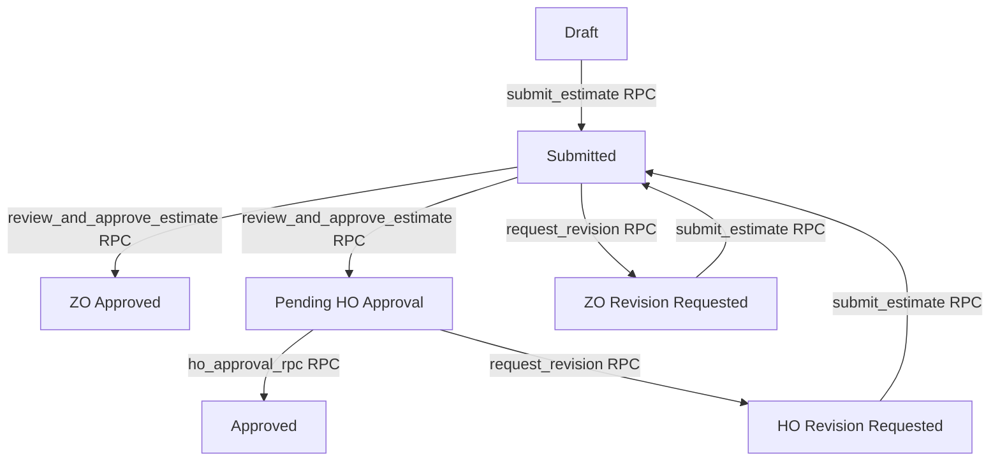

# Codebase Master Document

Welcome to the **S.N. Polymers - Integrated Digital Business Platform (IDBP)** Codebase Master Document. This document serves as the high-level map of the monorepo architecture, detailing the backend, frontend, database schema, data triggers, and the workflow state machines.

---

## 📂 Repository Layout

```
SNPolymers/                              ← Monorepo root
│
├── backend/                             ← Node.js + Express REST API
│   ├── src/
│   │   ├── app.js                       ← Express server entry point
│   │   ├── constants/                   ← App-wide constants (roles, statuses)
│   │   ├── controllers/                 ← Request routers and business logic handlers
│   │   │   ├── admin.controller.js      ← Admin whitelisting & logs
│   │   │   ├── auth.controller.js       ← JWT session, credentials, OTP
│   │   │   ├── estimates.controller.js  ← Estimate route exports aggregator
│   │   │   └── ...                      ← Controllers for projects, reports, master data
│   │   ├── db/
│   │   │   ├── migrations/              ← SQL migrations (schemas, RPCs, triggers)
│   │   │   └── supabase.js              ← Supabase client singleton
│   │   ├── middleware/                  ← JWT Verification, role checks, rate limiters
│   │   ├── routes/                      ← Express routers (auth, admin, estimates, etc.)
│   │   ├── services/                    ← Notification, OTP, session, & mail dispatches
│   │   └── workflow/                    ← State machine and estimate execution rules
│   ├── tests/                           ← Integration & Unit tests
│   └── package.json
│
├── docs/                                ← Documentation and system blueprints
│   └── codebase master file.md          ← This file
│
└── frontend/                            ← React 19 + Vite SPA (Tailwind styled)
    ├── src/
    │   ├── api/                         ← Axios wrappers with credentials
    │   ├── components/                  ← ProtectedRoute, AuthContext, generic UI elements
    │   ├── pages/                       ← Dashboard, login, audit log panel, cost estimation
    │   ├── App.jsx                      ← Root Router & context provider
    │   └── main.jsx                     ← React mount point
    └── package.json
```

---

## ⚡ Technology Stack

### Backend
* **Core**: Node.js, Express
* **Database**: Supabase (PostgreSQL engine)
* **Auth**: JSON Web Tokens (`jsonwebtoken` with `cookie-parser` for `httpOnly` transport)
* **OTP Verification**: Twilio SMS/WhatsApp + bcrypt hashes
* **Telegram Service**: Long-polling Telegram Bot for automated notifications
* **Mail Client**: Nodemailer (SMTP transport with Google App Passwords)

### Frontend
* **Core**: React 19, React Router v6
* **Bundler**: Vite
* **Styling**: Tailwind CSS
* **API Client**: Axios

---

## 🗄️ Database Schema & Active Triggers

All DB operations bypass Row-Level Security (RLS) internally using the Supabase Service Role Key. High-integrity tasks are run directly in PostgreSQL using triggers and RPC procedures.

### Core Tables
1. **`authorised_users`**: User whitelisting, containing columns for `mobile_number` (E.164), `role` (`je`, `zo`, `ho`, `admin`), `is_active`, and permissions.
2. **`sessions`**: Active JWT tracking mapping `jwt_jti` to `authorised_users`. Includes columns for logout, active status, duration, and geo-ip.
3. **`projects_master`**: Work orders and site details metadata.
4. **`project_cost_estimates` & `project_cost_estimate_items`**: Document-level headers and individual item rows for calculations.
5. **`estimate_revision_log`**: Revision cycle metadata tracking resubmission history.
6. **`audit_log`**: System-wide operation tracking.

### System Triggers (Supabase)
* **Timestamp Helpers**:
  * `trg_projects_master_edited_at`, `trg_fund_reports_edited_at`, `trg_estimate_updated_at`: Keep updated-at timestamps synchronized on rows updates.
* **Audit Logs**:
  * `trg_audit_projects_master`: Logs inserts/updates in `projects_master` to `audit_log`.
  * `trg_audit_fund_reports`: Logs CRUD actions on `fund_reports` table.
  * `trg_audit_estimate_status`: Captures all state transitions of `project_cost_estimates` and logs history in `estimate_status_history`.
* **Version Control**:
  * `trg_increment_version_material_master` & `trg_increment_version_purchase_data`: Auto-increments master data revision numbers upon catalog edits.
* **Safety Guards**:
  * `trg_projects_master_immutability`: Enforces that `work_order_no` remains completely immutable.
  * `trg_prevent_estimate_hard_delete`: Restricts hard deletions on all non-test records (`work_order_no` not starting with `TEST_WO_`).

---

## 🔄 Workflow State Machine

The Cost Estimation workflow transitions through the following states, controlled by stored procedures (RPCs) and status gates:



### Stored Procedures (RPCs)
1. **`submit_estimate`**: Advances state from `Draft` to `Submitted` or processes a resubmission. It checks for a single open revision log, resets negative approval inputs, and locks rows using `FOR UPDATE`.
2. **`review_and_approve_estimate`**: Processes Regional (ZO) evaluations. Transitions to `ZO Approved` or escalates to HO based on business boundaries.
3. **`review_and_approve_estimate_ho`**: Processes Head Office (HO) evaluations and completes approval cycle.
4. **`auto_resubmit`**: System checks for validating constraints and automating resubmissions.

---

## 🔒 Security & Import Dependency Flow

### Authentication Flow
1. User enters mobile number $\rightarrow$ Backend checks `authorised_users` for active status.
2. WhatsApp OTP is issued and bcrypt-hashed in `otp_requests`.
3. User submits verification code $\rightarrow$ Backend validates, issues a JWT with unique `jti`, writes `sessions` log, and returns an `httpOnly` cookie.
4. Protected routes run through `verifyJwt` middleware:
   ```
   Request -> verifyJwt -> Check Session Active -> Check User Active -> Role Gate -> Controller Action
   ```

### Code Dependency Flow
```
[Routes] --> (verifyJwt / requireRole Middleware) --> [Controllers] --> [Services] --> [Supabase Client]
```
All routes, controllers, and services run under a modular design where controllers act as router callbacks, services execute business logic, and migrations run PostgreSQL logic.
